# Novedades en Analysis Workspace

Para acceder a las Notas de la versión de Adobe Experience Cloud en su conjunto, vaya [aquí](https://docs.adobe.com/content/help/es-ES/release-notes/experience-cloud/current.html).

## Octubre de 2020

Nuevas funciones lanzadas en octubre de 2020

| Función | Descripción |
| --- | --- |
| Visualización de líneas: [opción de línea de tendencia promedio móvil](https://docs.adobe.com/content/help/es-ES/analytics/analyze/analysis-workspace/visualizations/line.html) | **[!UICONTROL El promedio móvil]** se ha agregado a la configuración de línea de tendencia de visualización de línea. Un promedio móvil utiliza una cantidad determinada de puntos de datos (definida por una selección de **[!UICONTROL Periodos]**), los promedia y utiliza el promedio como punto en la línea. |
| [Página de ayuda de rendimiento](https://docs.adobe.com/content/help/es-ES/analytics/analyze/analysis-workspace/workspace-faq/optimizing-performance.html) | La página de ayuda de rendimiento de Analysis Workspace muestra los diferentes factores que afectan el rendimiento del proyecto y los vínculos a sugerencias para la optimización. |

## Septiembre de 2020

Nuevas funciones lanzadas en septiembre de 2020

| Función | Descripción |
| --- | --- |
| [Descargar 50.000 elementos para una sola dimensión](https://docs.adobe.com/content/help/es-ES/analytics/analyze/analysis-workspace/curate-share/download-send.html#download-items) | Ahora puede descargar 50.000 elementos para una sola dimensión en una tabla improvisada, con segmentos y filtros aplicados. Esto le permite acceder a más de 400 filas de datos fuera de Analysis Workspace. |
| [Mejoras en la visualización de Línea](https://docs.adobe.com/content/help/es-ES/analytics/analyze/analysis-workspace/visualizations/line.html) | <ul><li>Puede mostrar u ocultar el eje X y el eje Y de cualquier visualización de Línea. Esto puede resultar especialmente útil cuando las visualizaciones de Línea son más compactas.</li><li>Puede superponer una etiqueta de valor mínimo y máximo en cualquier visualización de Línea para resaltar rápidamente los picos y los valores de una métrica.</li><li>Puede superponer distintas líneas de tendencia de regresión en cualquier visualización de Línea para ver con mayor facilidad la tendencia en los datos. Las opciones incluyen [!UICONTROL Lineal], [!UICONTROL Logarítmico], [!UICONTROL Exponencial], [!UICONTROL Potencia] y [!UICONTROL Cuadrático].</li></ul> |
| Intervalos de fechas nuevos | Añadimos 5 nuevos intervalos de fechas para que pueda elegir entre intervalos de fechas que no incluyan datos de día parciales de hoy: últimos 7 días completos, últimos 14 días completos, últimos 30 días completos, últimos 60 días completos, últimos 90 días completos. |

## Agosto de 2020

No se lanzaron funciones nuevas en agosto de 2020.

## Julio de 2020

Nueva función lanzada el 16 de julio de 2020.

| Función | Descripción |
| --- | --- |
| Nuevos ajustes preestablecidos de intervalo de fechas | Se añadieron 4 nuevos intervalos de fechas: ([!UICONTROL Esta semana/mes/trimestre/año (excluido hoy)]). Esto le permite elegir entre intervalos de fechas que no incluyen datos de día parcial de hoy. |

## Junio de 2020

Nuevas funciones lanzadas el 18 de junio de 2020.

| Función | Descripción |
|--- |--- |
| Attribution IQ: Atribución algorítmica | El modelo de atribución algorítmica de Analysis Workspace utiliza técnicas estadísticas para determinar dinámicamente la asignación óptima de crédito para la métrica seleccionada. Disponible para los clientes de Adobe Analytics Ultimate. [Más información...](https://docs.adobe.com/content/help/es-ES/analytics/analyze/analysis-workspace/attribution/algorithmic.html) |
| Attribution IQ: Ventanas retroactivas personalizadas | Ahora puede configurar cualquier modelo de atribución en Attribution IQ para incluir puntos de contacto desde 90 días antes del período de creación de informes. Esto generalmente aumenta la precisión de atribución de eventos que se producen al principio del período de la creación de informes teniendo en cuenta las interacciones que se produjeron en el mes o meses anteriores. Disponible para los clientes de Adobe Analytics Foundation, Select, Prime, Premium, Premium Attribution, Premium Complete y Ultimate. [Más información...](https://docs.adobe.com/content/help/es-ES/analytics/analyze/analysis-workspace/attribution/models.html#lookback-windows) |
| Funciones de proyecto para proyectos compartidos de Workspace | Al compartir un proyecto de Workspace, ahora puede colocar destinatarios en una de las tres funciones de proyecto, según la experiencia del proyecto que desee que tengan: Editar, Duplicado y Vista. [Más información...](https://docs.adobe.com/content/help/es-ES/analytics/analyze/analysis-workspace/curate-share/share-projects.html) |
| Proyectos de Workspace solo de vista | Los proyectos de Workspace se pueden compartir con los usuarios solo como Puede ver. Cuando un destinatario de Vista abre el proyecto compartido, recibe una experiencia de proyecto más restrictiva sin carril izquierdo e interacciones limitadas. [Más información...](https://docs.adobe.com/content/help/es-ES/analytics/analyze/analysis-workspace/curate-share/view-only-projects.html) |
| Capacidad para editar proyectos de Workspace de forma conjunta | Los destinatarios añadidos a la función Puede editar pueden guardar un proyecto que se haya compartido con ellos. Esto se extiende tanto a los administradores como a los no administradores. [Más información...](https://docs.adobe.com/content/help/es-ES/analytics/analyze/analysis-workspace/curate-share/share-projects.html) |
| Panel en blanco actualizado | El panel en blanco ahora incluye paneles y visualizaciones, lo que le ofrece una forma más fluida de elegir el flujo de trabajo de análisis que mejor se adapte a sus necesidades. |
| Panel de Quick Insights (25 de junio de 2020) | Quick Insights proporciona una guía a los no analistas y a los nuevos usuarios de Analysis Workspace para aprender a responder preguntas comerciales de forma rápida y sencilla. [Más información...](/help/analyze/analysis-workspace/c-panels/quickinsight.md) |
| Panel Analytics for Target en Workspace (25 de junio de 2020) | El panel Analytics for Target (A4T) le permite analizar con confianza las actividades y experiencias de Adobe Target en Analysis Workspace. [Más información...](/help/analyze/analysis-workspace/c-panels/a4t-panel.md) |
| Página Acerca de Workspace | La página Acerca de Workspace proporciona información sobre el entorno de su Analysis Workspace, sobre los administradores de Adobe Analytics (si necesita asistencia técnica) y una forma de proporcionar comentarios integrada al producto. Se encuentra en Workspace > Ayuda > Acerca de Workspace. |

## Mayo 2020

Nuevas funciones lanzadas el 21 de mayo de 2020.

| Función | Descripción |
|--- |--- |
| Crear automáticamente tablas improvisadas a partir de un estado en blanco | Anteriormente, no se podían soltar componentes directamente en un proyecto o panel en blanco; primero tenía que agregar una tabla improvisada. Ahora puede soltar componentes directamente en un proyecto o panel en blanco, y automáticamente se creará una tabla improvisada en un formato recomendado. Además, se mejoró la forma en que se gestionan los tipos de componentes mixtos (como dimensiones y métricas) al soltarlos juntos en una tabla improvisada en blanco. |
| Mejoras de accesibilidad | El equipo de Adobe Analytics ha realizado varias mejoras de accesibilidad en Analysis Workspace, incluida la navegación mejorada con el teclado, el contraste de color y la compatibilidad con lectores de pantalla. [Más información...](https://docs.adobe.com/content/help/es-ES/analytics/analyze/analysis-workspace/workspace-faq/aw-accessibility.html) |

## Abril de 2020

Nueva función lanzada el 16 de abril de 2020.

| Función | Descripción |
|--- |--- |
| Crear automáticamente [!UICONTROL tablas improvisadas] a partir de un estado en blanco | Anteriormente, no se podían soltar componentes directamente en un proyecto o panel en blanco; primero tenía que agregar una tabla improvisada. Ahora puede soltar componentes directamente en un proyecto o panel en blanco, y automáticamente se creará una tabla improvisada en un formato recomendado. Además, se mejoró la forma en que se gestionan los tipos de componentes mixtos (p. ej., dimensiones y métricas) al soltarlos juntos en una [!UICONTROL Tabla improvisada] en blanco. |

## Marzo de 2020

Nuevas funciones lanzadas el 12 de marzo de 2020.

| Función | Descripción |
|--- |--- |
| Compatibilidad con varios grupos de informes en Workspace | Ahora puede incluir datos de varios grupos de informes en un único proyecto de para verlo en paralelo. [Más información...](https://docs.adobe.com/content/help/es-ES/analytics/analyze/analysis-workspace/build-workspace-project/multiple-report-suites.html) |
| Plantilla del tutorial de formación | Esta plantilla estándar nueva le explica la terminología común y los pasos para crear su primer análisis en Workspace. Está disponible como plantilla estándar en el modo Nuevo proyecto y reemplaza el proyecto de muestra actual para los usuarios nuevos que no tienen otros proyectos en su lista. [Más información...](/help/analyze/analysis-workspace/build-workspace-project/starter-projects.md) |

## Febrero de 2020

Nuevas funciones lanzadas el 20 de febrero de 2020.

| Función | Descripción |
|--- |--- |
| Nueva plantilla de Workspace para organizaciones que utilizan el análisis entre dispositivos | Esta plantilla muestra la eficacia del CDA para unir visitas y enseña las métricas y dimensiones exclusivas del CDA. Se necesita un grupo de informes que utilice CDA. Consulte [Configuración de análisis entre dispositivos](https://docs.adobe.com/content/help/es-ES/analytics/components/cda/cda-setup.html) para obtener más información. |
| Nuevas teclas de acceso directo en Workspace | <ul><li>Contraer/Expandir todos los paneles: `alt + m`</li><li>Contraer/Expandir panel activo: `alt + ctrl + m`</li><li>Buscar carril izquierdo: `ctrl + /`</li><li>Mover al panel siguiente: `alt + Right Key`</li><li>Mover al panel anterior: `alt + Left Key`</li></ul>[Más información...](https://docs.adobe.com/content/help/es-ES/analytics/analyze/analysis-workspace/build-workspace-project/fa-shortcut-keys.html) |
| Otras mejoras de Workspace | <ul><li>Cuando se coloque un panel o una visualización en Workspace, el carril izquierdo cambiará automáticamente a componentes para lograr un flujo de trabajo más fluido.</li><li>Ahora se pueden llevar a cabo acciones en los componentes de plantilla (por ejemplo, etiquetado, marcado como favoritos y aprobado).</li><li>Las listas filtradas de métricas y segmentos ofrecen el botón + para agregar un nuevo componente si no encuentra lo que necesita.</li></ul> |
| Depurador de Workspace | El Debugger de Workspace se ha agregado al menú Ayuda, lo que le ofrece una forma sencilla de habilitarlo para depurar solicitudes de Workspace. [Más información...](https://www.adobe.io/apis/experiencecloud/analytics/docs.html#!AdobeDocs/analytics-2.0-apis/master/reporting-tricks.md) |

## Enero de 2020

Nueva función lanzada el 16 de enero de 2020.

| Función | Descripción |
|--- |--- |
| [Generador de tablas improvisadas](https://docs.adobe.com/content/help/en/analytics/analyze/analysis-workspace/visualizations/freeform-table/freeform-table.html) | Con el Creador de tablas improvisada, puede arrastrar y soltar varias dimensiones, desgloses, métricas y segmentos para crear tablas que respondan a preguntas comerciales más complejas. Los datos no se actualizarán inmediatamente. En su lugar, las actualizaciones se producen después de hacer clic en **[!UICONTROL Generar]**, lo que le ahorra tiempo una vez que sepa qué tabla desea crear. Además, esta función ofrece:<ul><li>**Vista previa**: Puede obtener una vista previa del formato de una tabla antes de dedicar su tiempo a procesar datos reales.</li><li>**Configuración de desglose y filas flexibles**: Puede definir los niveles de fila y desglose para cada fila de dimensión. Anteriormente, Workspace imponía valores predeterminados que no se podían cambiar hasta que se devolvían los datos.</li><li>**Desglose por posición**: Puede definir filas de dimensión para que siempre _se desglosen por posición_ en lugar de _por elemento específico_ (valor predeterminado).</li><li>**Ordenación manual de filas estáticas**: Puede ordenar manualmente las filas estáticas para que las filas de la tabla se muestren exactamente como las necesita. Anteriormente, las filas estáticas solo se podían ordenar por una columna de métrica o alfabéticamente.</li></ul> |

## Octubre de 2019

Mejoras publicadas el 10 de octubre de 2019.

| Mejora | Descripción |
|--- |--- |
| Actualizar a totales de tabla improvisada | Las tablas improvisadas ahora incluyen dos totales, un **[!UICONTROL Total de tabla]** y un **[!UICONTROL Total general]**. La fila Total de la tabla cuenta los [filtros de informe](https://docs.adobe.com/content/help/en/analytics/analyze/analysis-workspace/visualizations/freeform-table/pagination-filtering-sorting.html) aplicados. Anteriormente, solo la segmentación afectaba a los totales. [Obtenga más información](https://docs.adobe.com/content/help/en/analytics/analyze/analysis-workspace/visualizations/freeform-table/workspace-totals.html) Además, se han agregado las opciones **[!UICONTROL Mostrar totales]** y **[!UICONTROL Mostrar total general]** a la **[!UICONTROL Configuración de columna]**. Con este cambio a los totales de forma libre, se actualizarán las visualizaciones dependientes (por ejemplo, las visualizaciones de **[!UICONTROL Número de resumen]** vinculadas), así como los datos CSV y PDF exportados. |
| Opción para eliminar No especificado/Ninguno | Se ha añadido la funcionalidad de eliminar “No especificado (Ninguno)” con facilidad a los filtros de informe. |
| Obsolescencia de los componentes de granularidad morados | Los componentes de hora de granularidad morados (Minuto, Hora, Día, Semana, Mes, Trimestre, Año) han quedado obsoletos. Los componentes de hora morados siempre se han comportado exactamente como sus equivalentes de dimensión naranjas, por lo que este cambio simplificará la experiencia. No es necesario realizar **ninguna acción** si ha utilizado uno de los componentes de tiempo morados en el pasado. Con este cambio, se ha cambiado de nombre la sección morada **[!UICONTROL Hora]** a **[!UICONTROL Intervalos de fecha]**. |

## Agosto de 2019

Mejoras publicadas el 8 de agosto de 2019.

| Mejora | Descripción |
|--- |--- |
| Aumento del límite de elementos para el filtro desplegable de 50 a 200 | Hemos aumentado el límite de elementos que se pueden colocar en un filtro desplegable de 50 a 200. Esta mejora admite una variedad de casos de uso, como agregar todos los países (195) a un filtro, o todos los estados y provincias de EE. UU. (52). |

## Julio de 2019

Mejoras publicadas el 18 de julio de 2019.

| Mejora | Descripción |
|--- |--- |
| Mejoras de análisis de cohorte | Se han añadido [nuevas configuraciones de análisis de cohorte](https://docs.adobe.com/content/help/es-ES/analytics/analyze/analysis-workspace/visualizations/cohort-table/t-cohort.html): <ul><li>Mostrar sólo porcentaje</li><li>Redondear el porcentaje al entero más cercano</li><li>Mostrar una fila porcentual promedia</li></ul> |
| Mostrar elementos de los últimos 18 meses | En el carril izquierdo, los usuarios tienen la opción de _Mostrar elementos de los últimos 18 meses_. Anteriormente, el período retroactivo era de 6 meses como máximo. Esto facilita la comparación con páginas o campañas del último año, hasta hace 18 meses. |
| Nueva plantilla de Analysis Workspace | Hemos añadido una nueva plantilla denominada [&quot;Magento: Marketing y comercio&quot;](https://docs.adobe.com/content/help/es-ES/analytics/analyze/analysis-workspace/build-workspace-project/starter-projects.html) para Analysis Workspace. Está diseñada específicamente para los clientes de comercio electrónico de Magento, pero cualquier minorista puede utilizarla para obtener una información sin precedentes sobre sus actividades comerciales. |

## Junio de 2019

Mejoras publicadas el 13 de junio de 2019.

| Mejora | Descripción |
| --- |--- |
| Nuevos filtros predeterminados | Se han agregado nuevos filtros predeterminados a la búsqueda del carril izquierdo. Además de los filtros actuales (Dimensiones, Métricas, Aprobado, etc.), se han añadido nuevos filtros como Métricas calculadas, Atributos del cliente, eVars, Props, Vídeo, etc. para facilitar la búsqueda de los componentes que necesita. |

## Mayo de 2019

Mejora publicada el 09 de mayo de 2019.

| Mejora | Descripción |
|--- |--- |
| Se agregó una nueva configuración a la configuración de visualización de flujo: Incluir instancias de repetición. | [Configuración de flujo](/help/analyze/analysis-workspace/visualizations/c-flow/flow-settings.md) |

## Abril de 2019

Mejora publicada el 11 de abril de 2019.

| Mejora | Descripción |
|--- |--- |
| Mejoras en las prácticas recomendadas para la optimización. | [Optimización del rendimiento](/help/analyze/analysis-workspace/new-features-in-analysis-workspace.md) |

## Enero de 2019

Nuevas funciones y mejoras publicadas el 17 de enero de 2019.

| Función | Descripción |
|--- |--- |
| [Análisis de cohorte](/help/analyze/analysis-workspace/visualizations/cohort-table/cohort-analysis.md) | Las principales mejoras realizadas en Análisis de cohorte le permiten:<ul><li>Aplicar una inclusión de segmento y devolver métricas por separado. </li><li>Mostrar la pérdida en lugar de la retención.</li><li>Mostrar tablas de latencia (tiempo transcurrido antes y después de un evento de inclusión).</li><li>Personalizar la dimensión de cohorte (para agrupar visitantes en función de una eVar, no solo el tiempo).</li><li>Cálculo de cohorte móvil: calcule la retención y la pérdida en función de un período de tiempo previo, no de la cohorte original. </li><li>Añada múltiples métricas en campos de inclusión y devolución, y aplique segmentos. (No se admiten las métricas calculadas)</li></ul> |
| [Ver densidad](/help/analyze/analysis-workspace/build-workspace-project/view-density.md) | Esta nueva configuración le permite ver más datos en una sola pantalla al reducir el margen vertical del carril izquierdo, las tablas improvisada y las tablas de cohorte. Puede acceder a ella desde Proyecto > Info y configuración del proyecto. |
| [Compatibilidad con variables de diversos valores en Attribution IQ](attribution/overview.md) | Algunas dimensiones en Analytics pueden contener múltiples valores en una sola visita, como listVars, la variable de producto, las props de lista o eVars de merchandising. Analysis Workspace permite aplicar Attribution IQ a cualquiera de estos tipos de variables en el nivel de visita. |
| Mejoras en el rendimiento | Mejoras de velocidad en las visualizaciones de desgloses: los proyectos con muchos desgloses se cargarán más rápido. |

## Noviembre de 2018

Nuevas funciones y mejoras publicadas el 1 de noviembre de 2018.

| Función | Descripción |
|--- |--- |
| [Depuración de proyectos y grupos de informes virtuales: mejoras](/help/analyze/analysis-workspace/curate-share/curate.md) | Estos cambios se introdujeron en octubre de 2018. Se han realizado cambios en los componentes que los administradores y no administradores pueden ver en los proyectos depurados de Workspace y en los grupos de informes virtuales depurados.   Anteriormente, cualquier usuario podía ver los componentes no depurados al hacer clic en el botón Mostrar todos los componentes. La experiencia actualizada de organización permite un control más detallado sobre qué componentes son visibles.  |

## Octubre de 2018

Nuevas funciones y mejoras publicadas el 11 de octubre de 2018.

<table id="table_3DDC812B2F66416F868004416D248BF3"> 
 <thead> 
  <tr> 
   <th colname="col1" class="entry"> Función </th> 
   <th colname="col2" class="entry"> Descripción </th> 
  </tr> 
 </thead>
 <tbody> 
  <tr> 
   <td colname="col1"> 
<b>Administración de paneles desplegables</b> 
 </td> 
   <td colname="col2"> 
Hemos hecho algunos cambios relacionados con la administración de paneles desplegables, que se introdujeron en septiembre. Al hacer clic con el botón derecho en el panel desplegable, ahora puede: 
 
    <ul id="ul_4BDEC66EEB2243628FE32B43E377E5BD"> 
     <li id="li_EF8277BE972540D3B2604D82BC7C0918">Eliminar un panel desplegable (esta opción siempre está presente) </li> 
     <li id="li_6A991208F2744274817DBE1E9D1B443F">Eliminar una etiqueta (si se muestra alguna) </li> 
     <li id="li_5C1CFC465C2E41D2B35E8841EFDC82AA">Agregar una etiqueta (si no se muestra ninguna) </li> 
    </ul> </td> 
  </tr> 
  <tr> 
   <td colname="col1"> 
<b>Vínculos en las descripciones emergentes de visualizaciones y paneles</b> 
 </td> 
   <td colname="col2"> 
Hemos agregado vínculos a vídeos y documentación pertinentes en las descripciones emergentes de visualizaciones y paneles. 
 </td> 
  </tr> 
 </tbody> 
</table>

## Septiembre de 2018

Nuevas funciones y mejoras publicadas el 13 de septiembre de 2018.

<table id="table_137719BFA03C44A78FDE872DF8B228A4"> 
 <thead> 
  <tr> 
   <th colname="col1" class="entry"> Función </th> 
   <th colname="col2" class="entry"> Descripción </th> 
  </tr> 
 </thead>
 <tbody> 
  <tr> 
   <td colname="col1"> 
<b>Paneles desplegables</b> 
 </td> 
   <td colname="col2"> 
La zona de colocación del panel ahora tiene funciones desplegables. Los desplegables permiten que los usuarios finales interactúen con los datos de un proyecto de forma controlada. Ejemplo: existen varias versiones de un proyecto para proporcionar informes de un país en concreto. Ahora, esos proyectos pueden contraerse en un único proyecto y agregarlos en un menú desplegable del país. 
 </td> 
  </tr> 
  <tr> 
   <td colname="col1"> 
<b>Paletas de color</b> 
 </td> 
   <td colname="col2"> 
Ahora puede cambiar el esquema de colores que se utiliza en Workspace eligiendo una opción de una paleta de colores distinta o creando una paleta propia. Esta función afecta a muchos elementos de Workspace, incluidas la mayoría de las visualizaciones. <b>No</b> afecta al Resumen del cambio, al formato condicional en tablas improvisadas ni a la Visualización de mapas. 
 
Nota: La compatibilidad con paletas de color no está habilitada para Internet Explorer 11. 
 </td> 
  </tr> 
  <tr> 
   <td colname="col1"> 
<b>Nueva plantilla: Consumo de audio</b> 
 </td> 
   <td colname="col2"> 
Consulte <a href="https://docs.adobe.com/content/help/es-ES/media-analytics/using/media-reports/media-workspace-templates.html"  > Audio Analytics </a>. 
 </td> 
  </tr> 
 </tbody> 
</table>

## Agosto de 2018

Nuevas funciones y mejoras publicadas el 9 de agosto de 2018.

<table id="table_DD77C02344414DCD9AC0A6A22E648B72"> 
 <thead> 
  <tr> 
   <th colname="col1" class="entry"> Función </th> 
   <th colname="col2" class="entry"> Descripción </th> 
  </tr> 
 </thead>
 <tbody> 
  <tr> 
   <td colname="col1"> 
<b>Guías para las zonas de colocación de elementos</b> 
 </td> 
   <td colname="col2"> 
Estas guías le ayudan a comprender mejor lo que hace cada acción de arrastrar y soltar. Por ejemplo, cuando pasa el puntero sobre una columna, se muestran opciones como Agregar, Reemplazar, Filtrar por y Desglose. 
 
También se han agregado guías amarillas y rojas que avisan cuando se está realizando una acción no recomendada o prohibida, como apilar dos métricas (lo que genera datos no válidos). 
 </td> 
  </tr> 
  <tr> 
   <td colname="col1"> 
<b>Opción Agregar panel en blanco</b> 
 </td> 
   <td colname="col2"> 
Se ha agregado un símbolo + debajo del panel inicial para que sea más fácil agregar paneles adicionales. 
 </td> 
  </tr> 
 </tbody> 
</table>

## Julio de 2018

Nuevas funciones y mejoras publicadas el 19 de julio de 2018.

<table id="table_336E121310204DC492EA004F40830B0F"> 
 <thead> 
  <tr> 
   <th colname="col1" class="entry"> Función </th> 
   <th colname="col2" class="entry"> Descripción </th> 
  </tr> 
 </thead>
 <tbody> 
  <tr> 
   <td colname="col1"> 
<b> <a href="attribution/overview.md"  > Attribution IQ </a> </b> 
 </td> 
   <td colname="col2"> 
Attribution IQ permite realizar un análisis más sofisticado e inteligente del rendimiento de marketing. Pueden utilizarse nuevos modelos de atribución en las métricas de Analysis Workspace (en cualquier tabla o desglose) y en las métricas calculadas. Un nuevo panel Atribución permite una mejor visualización y comparación. 
 </td> 
  </tr> 
  <tr> 
   <td colname="col1"> 
<b> Mejoras en el carril izquierdo </b> 
 </td> 
   <td colname="col2"> 
Se han hecho mejoras en el carril izquierdo para que sea más intuitivo y fácil de utilizar: 
 
    <ul id="ul_087BEDF4338946DA857CD82CB69F98C2"> 
     <li id="li_C751AACAC60442DC93118F0819F8EEA7"> Se ha alineado la función de creación de componentes (métricas, segmentos y fechas) con los encabezados. </li> 
     <li id="li_DE2EB184A02D4CE58C23F518DB85EFDD"> Se ha agregado la opción “+ Ver todo” al final de cada lista de sección para resaltar que hay más de cinco opciones. </li> 
     <li id="li_5208F3C6026647B09F4A85131B175175">Al seleccionar componentes, se muestran iconos de acción, por ejemplo, para aplicar etiquetas o marcar como favorito. </li> 
     <li id="li_11E601488A844515928231E09889BC54">Se han realizado mejoras estéticas en la interfaz de usuario. </li> 
    </ul> </td> 
  </tr> 
  <tr> 
   <td colname="col1"> 
<b>Totales de las métricas calculadas </b> 
 </td> 
   <td colname="col2"> 
Ahora se muestran los totales de las métricas calculadas, incluidos los porcentajes, siempre que sea posible. 
 </td> 
  </tr> 
  <tr> 
   <td colname="col1"> 
<b>Nuevo <a href="/help/analyze/analysis-workspace/components/calendar-date-ranges/calendar.md"  > intervalo de fechas </a>preestablecido </b> 
 </td> 
   <td colname="col2"> 
Se ha agregado “13 últimas semanas completas” a los ajustes preestablecidos de intervalo de fechas en Analysis Workspace. 
 </td> 
  </tr> 
 </tbody> 
</table>

## Junio de 2018

Nuevas funciones y mejoras publicadas el 14 de junio de 2018.

<table id="table_57035A06D99447A6BE6ED825A648ED3F"> 
 <thead> 
  <tr> 
   <th colname="col1" class="entry"> Función </th> 
   <th colname="col2" class="entry"> Descripción </th> 
  </tr> 
 </thead>
 <tbody> 
  <tr> 
   <td colname="col1"> 
<b> <a href="/help/analyze/analysis-workspace/components/dimensions/view-dimensions.md"  > Columnas de dimensión dinámica </a> </b> 
 </td> 
   <td colname="col2"> 
Anteriormente, al colocar una dimensión en una columna, se mostraban los cinco valores principales para las dimensiones que no fueran temporales (quince para las temporales) y dichos valores se mantenían estáticos, es decir, los cinco valores elegidos no cambiaban nunca. 
 
A partir de ahora, y de forma predeterminada, se muestran valores dinámicos en lugar de valores estáticos, con la opción de convertirlos en valores estáticos. Otros aspectos que considerar: 
 
    <ul id="ul_C802BC32CB084E30B4E58E9E90B9A63D"> 
     <li id="li_452466AB416F4737B532849C604BD4CC">Haga clic (i) en la dimensión dinámica para ver la clasificación (el principal de entre cinco valores) y el tipo de dimensión. </li> 
     <li id="li_588F6199E38D47869AC855A4C2A4D1B7">A medida que los datos se actualicen, las columnas de dimensión dinámica se actualizarán para mostrar cinco de los quince elementos de dimensión actuales. </li> 
     <li id="li_19D47638D4D94416B0DAD2B2FB835ABE">Las columnas de dimensión dinámica que se copien o se muevan pasarán a ser de dimensión estática. </li> 
     <li id="li_B95411689AE04774B7B9BA128F2DB96F">Al pasar el ratón por encima de una columna de dimensión estática, verá un icono de bloqueo que indicará que la dimensión es estática. </li> 
    </ul> </td> 
  </tr> 
  <tr> 
   <td colname="col1"> 
<b>Ventana modal de nuevas funciones de Workspace </b> 
 </td> 
   <td colname="col2"> 
Al igual que las sugerencias del día introducidas el mes pasado, en esta ventana modal se muestran las nuevas funciones de Workspace la primera vez que se inicia sesión en Workspace tras publicarse una nueva versión. 
 </td> 
  </tr> 
 </tbody> 
</table>

## Mayo de 2018

Nuevas funciones y mejoras publicadas el 10 de mayo de 2018.

<table id="table_EE4C690A178B4F80BDAF2BB4424D6020"> 
 <thead> 
  <tr> 
   <th colname="col1" class="entry"> Función </th> 
   <th colname="col2" class="entry"> Descripción </th> 
  </tr> 
 </thead>
 <tbody> 
  <tr> 
   <td colname="col1"> 
<b>Sugerencias del día</b> 
 </td> 
   <td colname="col2"> 
Proporcionaremos Sugerencias del día (junto con un vídeo corto) en la esquina inferior derecha de la interfaz. Estas sugerencias sirven para que se familiarice con la gran cantidad de funciones de Analysis Workspace. Puede elegir rechazar estas sugerencias o acceder a ellas a través de  Ayuda  &gt;  Sugerencias  en cualquier momento. 
 
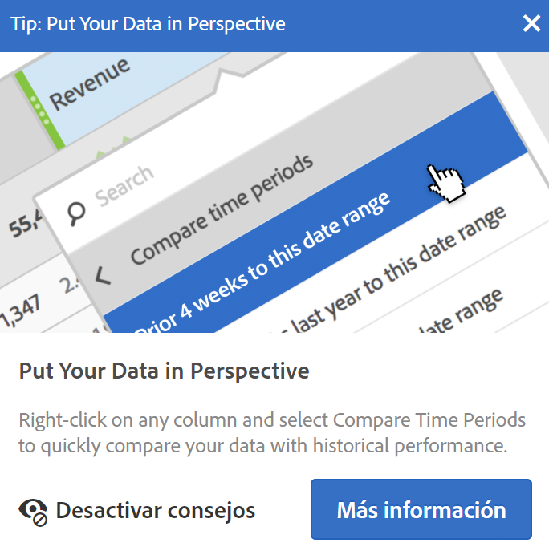 
 </td> 
  </tr> 
  <tr> 
   <td colname="col1"> 
<b> <a href="/help/analyze/analysis-workspace/components/t-freeform-project-segment.md"  > Plantillas de segmentos </a> y <a href="/help/analyze/analysis-workspace/components/apply-create-metrics.md"  > plantillas de métricas calculadas </a></b> 
 </td> 
   <td colname="col2"> 
El carril izquierdo muestra ahora plantillas de segmento y plantillas de métrica calculada. 
 </td> 
  </tr> 
  <tr> 
   <td colname="col1"> 
<b>Capacidad de desplazamiento mientras se arrastran los componentes</b> 
 </td> 
   <td colname="col2"> 
Ahora puede desplazarse hacia arriba o abajo mientras arrastra los componentes a una nueva ubicación. 
 </td> 
  </tr> 
  <tr> 
   <td colname="col1"> 
<b>Información adicional sobre <a href="/help/analyze/analysis-workspace/virtual-analyst/c-anomaly-detection/view-anomalies.md"  > anomalías </a></b> 
 </td> 
   <td colname="col2"> 
Al pasar el cursor sobre una anomalía en un gráfico de líneas, la información ahora muestra la fecha y el valor sin procesar de la anomalía. 
 </td> 
  </tr> 
 </tbody> 
</table>

## Abril de 2018

Nuevas funciones y mejoras publicadas el 12 de abril de 2018.

<table id="table_B9E784CD14A1453EB360FCCDC612250F"> 
 <thead> 
  <tr> 
   <th colname="col1" class="entry"> Función </th> 
   <th colname="col2" class="entry"> Descripción </th> 
  </tr> 
 </thead>
 <tbody> 
  <tr> 
   <td colname="col1"> 
 <a href="/help/analyze/analysis-workspace/visualizations/freeform-table/column-row-settings/column-settings.md"  > Configuración Justificar el texto del encabezado activada de forma predeterminada </a> 
 </td> 
   <td colname="col2"> 
Ahora, la configuración de columna  Justificar el texto del encabezado  está activada de forma predeterminada en las tablas improvisadas. 
 </td> 
  </tr> 
  <tr> 
   <td colname="col1"> 
 <a href="/help/analyze/analysis-workspace/visualizations/freeform-table/column-row-settings/table-settings.md"  > Nueva configuración de filas</a> 
 </td> 
   <td colname="col2"> 
La nueva configuración  Calcular porcentaje por fila  obliga a la tabla improvisada a calcular los porcentajes de las celdas en la fila en lugar de en la columna. Esto resulta particularmente útil en los porcentajes de tendencias, como averiguar cómo se comporta un elemento de dimensión en comparación con el resto a lo largo del tiempo. Se activa de forma predeterminada al hacer clic en el icono  Visualizar . 
 </td> 
  </tr> 
  <tr> 
   <td colname="col1"> 
 <a href="/help/analyze/analysis-workspace/visualizations/freeform-analysis-visualizations.md#section_D3BB5042A92245D8BF6BCF072C66624B"  > Configuración de la visualización “Apilada al 100 %”</a> 
 </td> 
   <td colname="col2"> 
Una nueva configuración en las visualizaciones de áreas apiladas, barras apiladas o barras horizontales apiladas convierte el gráfico en una visualización apilada al 100 % para que pueda analizar las proporciones relativas. 
 
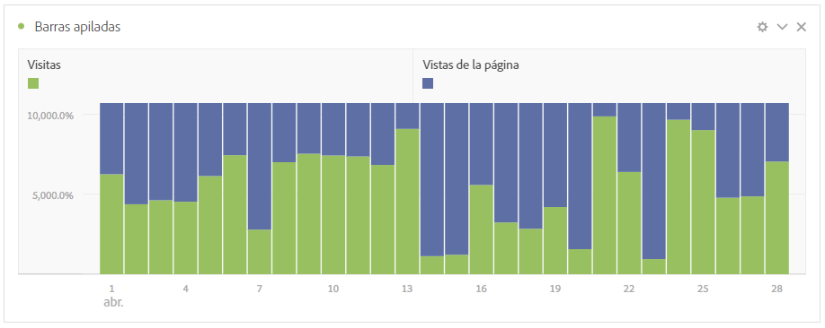 
 </td> 
  </tr>
  <tr> 
   <td colname="col1"> 
 Disponibilidad exclusiva de <a href="/help/analyze/analysis-workspace/virtual-analyst/overview.md"  > Detección de anomalías y Análisis de contribución</a> en Analysis Workspace 
 </td> 
   <td colname="col2"> 
Las características Detección de anomalías y Análisis de contribución se han eliminado del conjunto de funciones de Reports &amp; Analytics, y ahora solo están disponibles en Analysis Workspace. 
 
Tenga en cuenta que los clientes de Adobe Analytics Select y Adobe Analytics Foundation solo tienen acceso a la Detección de anomalías de “granularidad diaria” en Workspace. 
 </td> 
  </tr> 
 </tbody> 
</table>

## Marzo de 2018

Nuevas funciones y mejoras publicadas el 8 de marzo de 2018.

<table id="table_580CF2C1322E4FB78870BE2B1F497B2F"> 
 <thead> 
  <tr> 
   <th colname="col1" class="entry"> Función </th> 
   <th colname="col2" class="entry"> Descripción </th> 
  </tr> 
 </thead>
 <tbody> 
  <tr> 
   <td colname="col1"> 
 <a href="/help/analyze/analysis-workspace/visualizations/freeform-table/column-row-settings/column-settings.md"  > Justificación del texto del encabezado </a> 
 </td> 
   <td colname="col2"> 
Ahora puede justificar el texto del encabezado en las tablas improvisadas para que los encabezados sean más legibles y las tablas se puedan compartir con mayor facilidad. Hemos añadido una opción en la configuración de columna llamada “Justificar el texto del encabezado”. Esto resulta muy útil en el procesamiento de archivos .pdf y en las métricas con nombres largos. 
 </td> 
  </tr> 
  <tr> 
   <td colname="col1"> 
 <a href="/help/analyze/analysis-workspace/components/apply-create-metrics.md"  > Clic con el botón derecho para crear una métrica </a> 
 </td> 
   <td colname="col2"> 
Con el fin de facilitar la creación rápida de métricas calculadas, se ha añadido la opción  Crear métrica a partir de selección  al menú que se abre al hacer clic con el botón derecho en las tablas improvisadas. Esta opción se muestra cuando se selecciona al menos una celda de columna de encabezado. 
 </td> 
  </tr> 
  <tr> 
   <td colname="col1"> 
 <a href="/help/analyze/analysis-workspace/visualizations/map-visualization.md"  > Mejoras en la visualización de Mapa </a> 
 </td> 
   <td colname="col2"> 
Para poder mostrar comparaciones entre períodos (por ejemplo, año tras año) en la visualización de Mapa, hemos añadido las siguientes mejoras: 
 
    <ul id="ul_F570E6AB174C45788620CF50E2742A08"> 
     <li id="li_746E329037764644A9CCF79161C26350">La visualización de Mapa ahora permite mostrar números negativos. Por ejemplo, si planea crear una métrica año tras año, el mapa puede mostrar -33 % en Nueva York. </li> 
     <li id="li_E05F0380627044E6A4E8A60C98494BF7">En las métricas de tipo porcentual, la agrupación reúne los porcentajes según la media. </li> 
     <li id="li_44C04306EA1B413E91B8256B340D5296">Hay un nuevo esquema de colores: positivo/negativo (verde/rojo) </li> 
    </ul> </td> 
  </tr> 
  <tr> 
   <td colname="col1"> 
 <a href="/help/analyze/analysis-workspace/build-workspace-project/starter-projects.md"  > Actualizaciones en las plantillas personalizadas </a> 
 </td> 
   <td colname="col2"> 
En las plantillas personalizadas recién publicadas: 
 
    <ul id="ul_787F48253F454163B99F6DD50F199FE2"> 
     <li id="li_828DD547DDB54A81B9FFB9FE92790F6C">Hemos añadido un icono de plantilla en la parte superior del proyecto (cerca del título) para ayudar a diferenciar el modo de edición de plantilla del hecho de usar una plantilla como punto de partida para un proyecto. </li> 
     <li id="li_EEAA4D115CB74A57BABD524B2561E0CC">Hemos permitido que los usuarios que no son administradores puedan crear (guardar como) y editar plantillas de proyecto del Workspace, siempre que se les haya concedido el permiso Crear/presentar proyectos en Analysis Workspace. (  Administración  &gt;  Administración de usuarios  &gt;  Grupos  &gt;  Editar acceso a todos los informes  &gt;  Personalizar herramientas de Analytics  &gt;  Crear/presentar proyectos en Analysis Workspace ). </li> 
    </ul> </td> 
  </tr> 
 </tbody> 
</table>

## Febrero de 2018

Nueva función y mejoras publicadas el 8 de febrero de 2018.

<table id="table_824BBE4A554B4DB092ADA9044383D0FA"> 
 <thead> 
  <tr> 
   <th colname="col1" class="entry"> Función </th> 
   <th colname="col2" class="entry"> Descripción </th> 
  </tr> 
 </thead>
 <tbody> 
  <tr> 
   <td colname="col1"> 
 <a href="/help/analyze/analysis-workspace/build-workspace-project/starter-projects.md#create-custom-template"  > Plantillas personalizadas de Workspace </a> 
 </td> 
   <td colname="col2"> 
Ahora puede crear sus propias plantillas de Workspace y guardarlas para que otros usuarios de su organización puedan empezar a trabajar con los datos pertinentes para ellos. 
 </td> 
  </tr> 
  <tr>  
   <td colname="col2"> 
Al hacer clic en “nuevo proyecto”, se abre una pantalla nueva que le ofrece la posibilidad de empezar con 
 
    <ul id="ul_FE90E6B9AF334A029D66A43901F8FA0B"> 
     <li id="li_F1DFD9AE140C4E5B849D4C522D5968DB">un proyecto en blanco, </li> 
     <li id="li_23BD391D68674C299858A97BFE10598B">una plantilla estándar (integrada) de Workspace o </li> 
     <li id="li_04D84FE375B84BF88843AA0D43A234BF">una plantilla personalizada de Workspace (ver arriba). </li> 
    </ul> </td> 
  </tr> 
  <tr> 
   <td colname="col1"> 
Clic con el botón derecho para copiar 
 </td> 
   <td colname="col2"> 
Hemos agregado la opción “Copiar en el portapapeles” al hacer clic con el botón derecho para que pueda copiar celdas o tablas de forma sistemática. 
 </td> 
  </tr> 
  <tr> 
   <td colname="col1"> 
 <a href="/help/analyze/analysis-workspace/visualizations/freeform-table/column-row-settings/column-settings.md"  > Mejora en los porcentajes de las columnas </a> 
 </td> 
   <td colname="col2"> 
El “porcentaje del total” mostrado en las columnas antes tenía como límite el 100 %, aunque determinadas situaciones supusieran valores superiores al 100 % del total (por ejemplo, en el caso de los promedios). 
 
Ahora se muestran porcentajes superiores al 100 % para ofrecer una mayor precisión. También hemos incrementado el límite superior hasta el 1000 % para garantizar que la anchura de las columnas se pueda ampliar. 
 </td> 
  </tr> 
  <tr> 
   <td colname="col1"> 
 <a href="/help/analyze/analysis-workspace/visualizations/freeform-table/column-row-settings/column-settings.md#section_3DD847151DA14914888A70FC4FD7BDFB"  > Posibilidad de usar el formato condicional en los desgloses </a> 
 </td> 
   <td colname="col2"> 
Ahora, la aplicación de formato condicional (colores, etc.) en tablas improvisada está activada automáticamente en los desgloses, a menos que los límites “Personalizados” estén seleccionados. 
 </td> 
  </tr> 
  <tr> 
   <td colname="col1"> 
Cambios en la vista de <a href="/help/analyze/analysis-workspace/components/calendar-date-ranges/calendar.md"  > calendario predeterminada </a> 
 </td> 
   <td colname="col2"> 
Ahora, el calendario del Workspace mostrará de forma predeterminada el mes actual y el anterior, en vez de mostrar el mes actual y el siguiente. 
 </td> 
  </tr> 
  <tr> 
   <td colname="col1"> 
Mejora al seleccionar los colores o mantener el puntero sobre ellos en las tablas de Workspace 
 </td> 
   <td colname="col2"> 
La diferencia de colores al mantener el puntero sobre una celda de una tabla improvisada en comparación con el hecho de hacer clic en una celda ahora es más clara. 
 </td> 
  </tr> 
 </tbody> 
</table>

## Enero de 2018

Nuevas funciones y mejoras publicadas el 18 de enero de 2018.

<table id="table_7A2E678577F94BDABB1276C826E6554F"> 
 <thead> 
  <tr> 
   <th colname="col1" class="entry"> Función </th> 
   <th colname="col2" class="entry"> Descripción </th> 
  </tr> 
 </thead>
 <tbody> 
  <tr> 
   <td colname="col1"> 
Más <a href="/help/analyze/analysis-workspace/visualizations/freeform-table/pagination-filtering-sorting.md"  > opciones de filtrado </a> de elementos de dimensión en tablas improvisadas 
 </td> 
   <td colname="col2"> 
Se han añadido estas opciones de filtrado (avanzadas) para elementos de dimensión (además de las opciones existentes “contiene” y “no contiene”): 
 
    <ul id="ul_869B3E943E304C0282D56AD96BB79E18"> 
     <li id="li_81A49BA0CA3041C7AB892FAD2D129E5A">Contiene todos los términos </li> 
     <li id="li_2AB564F917844F82839A91949D0B684A">Contiene cualquier término </li> 
     <li id="li_16C7938EDC8F422EA006FB63F2881EF1">Contiene la frase </li> 
     <li id="li_5130EBE9A7A54CCFA313F3C3C268B367">No contiene ningún término </li> 
     <li id="li_861825154EDC49EBA57514FD0A2AE462">No contiene la frase </li> 
     <li id="li_5364BFB73ECF4B92A6663693ABD4BCF5">Es igual a </li> 
     <li id="li_1EBF3119B6364842A35D39BAD645F4AF">No es igual a </li> 
     <li id="li_487886E0A6EC4245A0E85D2E8B4A20FB">Comienza con </li> 
     <li id="li_A73F54DFBAAB44D4A4134342A3124E47">Finaliza con </li> 
    </ul> </td> 
  </tr> 
  <tr> 
   <td colname="col1"> 
 <a href="/help/analyze/analysis-workspace/visualizations/freeform-analysis-visualizations.md#section_05B7914D4C9E443F97E2BFFDEC70240C"  > Copia y pegado de visualizaciones/paneles </a> entre paneles y proyectos 
 </td> 
   <td colname="col2"> 
Ahora puede hacer clic con el botón derecho, copiar una visualización o panel y, a continuación, pegar (“insertar”) el elemento copiado en otro sitio dentro del mismo proyecto o en un proyecto distinto. 
 
Puede utilizar esta capacidad para crear “bloques de construcción” (visualizaciones/paneles predefinidos) que es posible copiar en otros proyectos para ponerse en marcha más rápido y con datos específicos de su negocio. 
 </td> 
  </tr> 
  <tr> 
   <td colname="col1"> 
 <a href="/help/analyze/analysis-workspace/build-workspace-project/starter-projects.md"  > Nuevas plantillas móviles para “mensajería” y “ubicación” </a> 
 </td> 
   <td colname="col2"> 
Se han añadido dos nuevas plantillas de proyecto: 
 
    <ul id="ul_2F5976C849474A2B8A6BCDA2559F2855"> 
     <li id="li_51B7830E062A4CFDBDF219C56249A733">Una nueva plantilla de proyecto móvil para “mensajería” que se centra en el rendimiento de la mensajería dentro de la aplicación y la mensajería push. </li> 
     <li id="li_D2FB258EF3AF4EB19CEB258D08F4EBBE">Una nueva plantilla de proyecto móvil para “ubicación” que incluye un mapa con datos de ubicación. </li> 
    </ul> </td> 
  </tr> 
  <tr> 
   <td colname="col1"> 
Mejora en el cambio de tamaño de columnas 
 </td> 
   <td colname="col2"> 
Al cambiar el tamaño de la columna más a la izquierda, Workspace mantiene ahora la relación de anchura del resto de las columnas (no ajusta únicamente el ancho de la columna de la derecha). Este cambio acelera la creación de tablas tanto para análisis como para uso compartido. 
 </td> 
  </tr> 
  <tr> 
   <td colname="col1"> 
Visualización de <a href="/help/analyze/analysis-workspace/visualizations/freeform-table/freeform-table.md"  > 400 filas </a> en una tabla 
 </td> 
   <td colname="col2"> 
Ahora se pueden mostrar 400 filas en una tabla (frente a las 200 anteriores) para permitir tendencias de 365 días. 
 </td> 
  </tr> 
  <tr> 
   <td colname="col1"> 
 Compatibilidad con la <a href="/help/analyze/analysis-workspace/visualizations/map-visualization.md"  > visualización Mapa </a> en PDF 
 </td> 
   <td colname="col2"> 
La visualización Mapa, introducida en octubre de 2017, puede representarse ahora en PDF. 
 </td> 
  </tr> 
  <tr> 
   <td colname="col1"> 
 <a href="/help/analyze/analysis-workspace/home.md"  > Intravínculos relativos </a> al guardar como/copiar un proyecto 
 </td> 
   <td colname="col2"> 
Anteriormente, cuando se copiaba un proyecto o se utilizaba “Guardar como”, todos los intravínculos guardados apuntaban al proyecto original, y no al copiado. 
 
Ahora, los intravínculos son relativos al proyecto en el que residen después de la operación de copiar o guardar como. 
 </td> 
  </tr> 
  <tr> 
   <td colname="col1"> 
Análisis de contribución: <a href="https://docs.adobe.com/content/help/es-ES/analytics/analyze/analysis-workspace/virtual-analyst/anomaly-detection/anomaly-detection.html"  > notificación de tokens </a> 
 </td> 
   <td colname="col2"> 
Si su empresa tiene un número limitado de tokens de Análisis de contribución, la interfaz de Analysis Workspace muestra ahora una notificación cada vez que consume un token. De este modo, sabe cuántos tokens le quedan.  
 
(Usuarios administradores: es posible restringir quién puede utilizar estos tokens mediante la edición de los permisos de grupo. El permiso se denomina “Detección de anomalías y análisis de contribución” en  Analytics  &gt;  Administración  &gt;  Administración de usuarios  &gt;  Editar grupos  &gt;  Editar el acceso a todos los informes  &gt;  Personalizar las herramientas del grupo de informes  &gt;  Herramientas e informes).  
 </td> 
  </tr> 
  <tr> 
   <td colname="col1"> 
Archivos CSV con caracteres multibyte 
 </td> 
   <td colname="col2"> Los archivos CSV con caracteres multibyte enviados por correo electrónico se pueden abrir ahora en MS Excel. </td> 
  </tr> 
  <tr> 
   <td colname="col1"> 
Cambios en event#, eVar# y prop# 
 </td> 
   <td colname="col2"> 
Event#, eVar# y prop#, que se añadieron en 2017 a los nombres de dimensión en el raíl izquierdo, solo aparecen ahora cuando se <b>busca</b> el componente. 
 
(También se aplica al creador de grupos de informes virtuales). 
 </td> 
  </tr> 
  <tr> 
   <td colname="col1"> 
Cambios en Ninguno/No especificado 
 </td> 
   <td colname="col2"> 
Se ha cambiado el modo en que Ninguno/No especificado funciona en Analysis Workspace, de modo que sea coherente con Reports &amp; Analytics, el Generador de segmentos y el menú de elementos de dimensión en Analysis Workspace. 
 
Esto significa que el valor aparecerá como “No especificado” en vez de como “Ninguno” en la mayoría de los proyectos de Analysis Workspace. 
 </td> 
  </tr> 
 </tbody> 
</table>

## Noviembre de 2017

Nueva función lanzada el 9 de noviembre de 2017.

<table id="table_C502E81253634E6CBAE7F12C7B62F7B6"> 
 <thead> 
  <tr> 
   <th colname="col1" class="entry"> Función </th> 
   <th colname="col2" class="entry"> Descripción </th> 
  </tr> 
 </thead>
 <tbody> 
  <tr> 
   <td colname="col1"> 
Lista de componentes incompatibles 
 </td> 
   <td colname="col2"> 
En ocasiones, no todos los componentes incluidos en un proyecto se incluyen en el grupo de informes. El mensaje resultante “Grupo de informes incompatible” que se muestra al cargar un proyecto o al cambiar a un grupo de informes incluye ahora una lista con los componentes incompatibles. 
 </td> 
  </tr> 
 </tbody> 
</table>

## Octubre de 2017

Nuevas funciones lanzadas el 26 de octubre de 2017.

<table id="table_892279F2B4AF4DB38C64AA9AFC5657A7"> 
 <thead> 
  <tr> 
   <th colname="col1" class="entry"> Función </th> 
   <th colname="col2" class="entry"> Descripción </th> 
  </tr> 
 </thead>
 <tbody> 
  <tr> 
   <td colname="col1"> 
 <a href="/help/analyze/analysis-workspace/visualizations/map-visualization.md"  > Visualización de mapas </a> 
 </td> 
   <td colname="col2"> 
La nueva Visualización de mapas de Analysis Workspace permite ver fácilmente las interacciones de los clientes en el contexto de su ubicación. De una vista macro (global) a una vista micro (de la ciudad), puede fácilmente aumentar y reducir distintos niveles de jerarquía en la visualización para ver clústeres de usuarios en las regiones. 
 
Puede visualizar los datos de ubicación a través de la dirección IP (en conjuntos de datos no móviles) o arrojar los datos de latitud y longitud (para clientes que usen el SDK móvil) en Analysis Workspace.  
 </td> 
  </tr> 
  <tr> 
   <td colname="col1"> 
 <a href="/help/analyze/analysis-workspace/visualizations/line.md"  > Selector de granularidad en visualizaciones de tendencias </a> 
 </td> 
   <td colname="col2"> 
Ahora puede alternar fácilmente entre las granularidades de tiempo cuando la dimensión de la fuente de datos es de tiempo. Puede cambiar las granularidades en el menú desplegable que hay en la configuración de visualización. 
 </td> 
  </tr> 
  <tr> 
   <td colname="col1"> 
 <a href="/help/analyze/analysis-workspace/components/t-freeform-project-segment.md"  > Dimensiones y eventos completos en la zona de colocación de segmentos </a> 
 </td> 
   <td colname="col2"> 
Antes, en las zonas de colocación de segmentos solo se podían colocar elementos de dimensión, intervalos de fechas o segmentos. Ahora, en esta zona se pueden colocar dimensiones o eventos completos. En ambos casos, Analysis Workspace crea segmentos de visita del tipo “existe”. 
 
Ejemplos: “Visita donde existe eVar1” o “Visita donde existe event1”. 
 
Nota: No se pueden colocar métricas calculadas en una zona de segmentos. Solo sirven para la zona de segmentos aquellas dimensiones/métricas para las que se pueden crear segmentos. 
 </td> 
  </tr> 
  <tr> 
   <td colname="col1"> 
 <a href="/help/analyze/analysis-workspace/visualizations/t-sync-visualization.md"  > Visualizaciones conectadas en la configuración de fuentes de datos </a> 
 </td> 
   <td colname="col2"> 
Ahora, cuando hay visualizaciones conectadas a una tabla improvisada o de conjuntos, el punto superior izquierdo (Configuración de fuentes de datos) muestra dichas visualizaciones. Al pasar el ratón por encima, se resalta la visualización vinculada y, al hacer clic en ella, se abre. 
 
Además, la casilla “Mostrar/ocultar tabla de datos” permite elegir si quiere ver o no esta tabla. 
 </td> 
  </tr> 
  <tr> 
   <td colname="col1"> 
 <a href="/help/analyze/analysis-workspace/home.md"  > Se ha añadido event# a los nombres de evento del carril izquierdo </a> 
 </td> 
   <td colname="col2"> 
Antes de octubre de 2017, se añadieron evar# y prop# a los nombres de dimensión y se podía buscar en esos números. Ahora esta misma funcionalidad está disponible para los eventos. 
 
Ejemplo: ahora, “Suscripciones” figura en el carril izquierdo como “Suscripciones (event1)”. 
 
Recuerde: 
 
    <ul id="ul_5DF85C65F7004539949DDC4F23922296"> 
     <li id="li_A685834B4914460D87568583BB39C474">El número de evento no aparece en la tabla (para abreviar los títulos). </li> 
     <li id="li_D742D04470244633900335B7F5A79FD9">Para mantener la coherencia, las propiedades (props) y las eVars tampoco muestran ya sus números en las tablas. </li> 
    </ul> </td> 
  </tr> 
  <tr> 
   <td colname="col1"> 
 <a href="/help/analyze/analysis-workspace/home.md"  > Dimensiones integradas, ordenadas en un orden lógico de forma predeterminada </a> 
 </td> 
   <td colname="col2"> 
El criterio de ordenación predeterminado de algunas dimensiones integradas se ha actualizado en estos casos: 
 
    <ul id="ul_B9C0C761F39E43A4977EC028F4D4525C"> 
     <li id="li_FE72ADDCD32A4FF7907462726D6E7758">Cuando se arrastran a una tabla improvisada. </li> 
     <li id="li_5D78DD0DCB7347AC85E260F53109010C">Cuando se ven en el carril izquierdo. </li> 
    </ul> 
Por ejemplo, si se coloca “Hora del día” en una tabla, se ordena de 00 a 23. Sigue existiendo la opción de ordenar por cualquier columna de métrica. 
 </td> 
  </tr> 
  <tr> 
   <td colname="col1"> 
 <a href="/help/analyze/analysis-workspace/virtual-analyst/c-anomaly-detection/view-anomalies.md"  > Opción para permitir que el intervalo de confianza vuelva a escalar un gráfico </a> 
 </td> 
   <td colname="col2"> 
El intervalo de confianza de detección de anomalías no escala automáticamente el eje Y de una visualización para conseguir que el gráfico sea más legible. 
 
Ahora, tiene la opción de permitir que el intervalo de confianza escale el gráfico. 
 </td> 
  </tr> 
  <tr> 
   <td colname="col1"> 
 <a href="/help/components/c-alerts/alert-manager.md"  > Alertas: se ha añadido la opción <b>Renovar</b> </a> 
 </td> 
   <td colname="col2"> 
En el Administrador de alertas, cuando se seleccionan una o varias alertas, estas se pueden renovar haciendo clic en  Renovar. 
 
Esto amplía sus fechas de caducidad 1 año a partir del momento en que se hace clic en  Renovar, fuera cual fuera su fecha de caducidad original. 
 </td> 
  </tr> 
  <tr> 
   <td colname="col1"> 
Mejoras de la interfaz de usuario 
 </td> 
   <td colname="col2"> 
    <ul id="ul_645B43AC6F554353B887DD58F0AA86E8"> 
     <li id="li_05B16A84008E4DA3A5DE91AF3C942D55">Panel en blanco: ahora empezamos resaltando todas las visualizaciones que le puede añadir, como Mapa, Visitas en el orden previsto, Flujo, Histograma, Conjunto y Venn. Tiene la opción de guardar este panel como el estado de partida del proyecto predeterminado. </li> 
     <li id="li_9F1ED138DB0E453DA6BD4B4A512492CC">El nuevo diseño del carril izquierdo hace que los paneles, las visualizaciones y los componentes sean más visibles y cómodos de usar. </li> 
     <li id="li_5DF6177F0EFD4D4D9D432768DEA3F37D">Tabla improvisada: las tablas vacías improvisada muestran un GIF animado que ilustra el paradigma “arrastrar y colocar” de Analysis Workspace. </li> 
    </ul> </td> 
  </tr> 
 </tbody> 
</table>

## Septiembre de 2017

Nuevas funciones lanzadas el 21 de septiembre de 2017.

<table id="table_DC0DA93B8A3B481080FCB2BA8F985753"> 
 <thead> 
  <tr> 
   <th colname="col1" class="entry"> Función </th> 
   <th colname="col2" class="entry"> Descripción </th> 
  </tr> 
 </thead>
 <tbody> 
  <tr> 
   <td colname="col1"> 
 <a href="/help/analyze/analysis-workspace/components/dimensions/time-parting-dimensions.md"  > Dimensiones de partición de tiempo en Analysis Workspace</a> 
 </td> 
   <td colname="col2"> 
Las dimensiones basadas en marca de hora se han añadido directamente a Analysis Workspace. Entre las dimensiones se incluyen: 
 
    <ul id="ul_9BDBC0B344504E85840040E493873A47"> 
     <li id="li_826A8CBF4FDB4C98AC176C7145C09DB2">Hora del día (por ejemplo, 01, 12, 15 o 23) </li> 
     <li id="li_FD6AAD4D3F544224A757D8124F973BE5">am/pm (por ejemplo, am o pm) </li> 
     <li id="li_5CAE35FB8E3E490A8FCF72DF8AC619CC">Día de la semana (por ejemplo, lunes, martes, miércoles, etc.) </li> 
     <li id="li_930DFC6BFCC740A392EC7FA859FF0E73">Fin de semana/día laborable (por ejemplo, fin de semana o día laborable) </li> 
     <li id="li_C09F8BF8C598498392732C183C5BB720">Día del mes (por ejemplo, 1, 2, .... 30 y 31) </li> 
     <li id="li_E80A8932C32B4410A9BC703090FB5CFF">Mes del año (por ejemplo, enero, febrero, marzo, etc.) </li> 
     <li id="li_67620F09B58244B2B17317E0DB97067A">Día del año (por ejemplo, día 1, día 2, etc.) </li> 
     <li id="li_A96CD77357064FC19D92EFA8244560D6">Trimestre del año (por ejemplo, T1, T2, etc.) </li> 
    </ul> </td> 
  </tr> 
  <tr> 
   <td colname="col1"> 
 <a href="/help/analyze/analysis-workspace/visualizations/freeform-table/column-row-settings/column-settings.md"  > Administrar varias columnas a la vez en tablas de formas libres </a> 
 </td> 
   <td colname="col2"> 
Ahora, se puede cambiar la configuración de varias columnas a la vez. Basta con seleccionar varias columnas y hacer clic en el icono de configuración de cualquiera de ellas. Los cambios realizados se aplicarán a todas las columnas que tengan celdas seleccionadas. 
 </td> 
  </tr> 
  <tr> 
   <td colname="col1"> 
 <a href="/help/analyze/analysis-workspace/visualizations/c-flow/multi-dimensional-flow.md"  > Flujo: etiquetado interdimensional </a> 
 </td> 
   <td colname="col2"> 
Existe una nueva etiqueta de dimensión en la parte superior de cada columna Flujo que hace que el uso de varias dimensiones en una visualización de flujo sea más intuitivo. 
 </td> 
  </tr> 
  <tr> 
   <td colname="col1"> 
 <a href="/help/analyze/analysis-workspace/visualizations/histogram.md#section_09D774C584864D4CA6B5672DC2927477"  > Método de contabilización de accesos de histograma </a> 
 </td> 
   <td colname="col2"> 
Antes, había dos métodos de contabilización en una visualización de histograma: Visita y Visitante (predeterminado). 
 
Ahora, se puede usar un tercer método de contabilización como contenedor de segmentos: “Acceso”. “Ocurrencias” se utiliza como métrica del eje Y en la tabla improvisada. 
 </td> 
  </tr> 
  <tr> 
   <td colname="col1"> 
 Botón Borrar todo para la configuración de Comparación de segmentos y Análisis de contribución 
 </td> 
   <td colname="col2"> 
Ahora, en lugar de borrar manualmente cada elemento, se pueden borrar todos en las siguientes áreas de Workspace: 
 
    <ul id="ul_73E06D64CDCA4E83B9FEC2FD99D41CD3"> 
     <li id="li_A51EF8FADFA04CC19FD79C1675597659"> <a href="/help/analyze/analysis-workspace/virtual-analyst/contribution-analysis/run-contribution-analysis.md#section_F6932F4BF74544B5872164E7B1E0C6FC"  > Componentes excluidos de Análisis de contribución </a> </li> 
     <li id="li_30E612D5A7584484967260931DB9E30E"> <a href="/help/analyze/analysis-workspace/c-panels/c-segment-comparison/segment-comparison.md"> Componentes excluidos de Comparación de segmentos </a> </li> 
    </ul> </td> 
  </tr> 
  <tr> 
   <td colname="col1"> 
 <a href="/help/analyze/analysis-workspace/visualizations/summary-number-change.md"  > Nombres actualizados para los tipos de visualización Cambio de resumen</a> 
 </td> 
   <td colname="col2"> 
Se ha cambiado el nombre de dos opciones disponibles en Cambio de resumen para aclarar su significado: 
 
    <ul id="ul_7301D1C73E72424F911EE8DAAD9247A0"> 
     <li id="li_89D94632E0C94263A84887AF5B360E27">Mostrar cambio &gt; Mostrar cambio de porcentaje </li> 
     <li id="li_D48EB4055019449DAF2998CB9A5D23DF">Mostrar diferencia &gt; Mostrar diferencia en bruto </li> 
    </ul> </td> 
  </tr> 
  <tr> 
   <td colname="col1"> 
 <a href="/help/analyze/analysis-workspace/visualizations/summary-number-change.md"  > Más lugares decimales para Números/Cambios de resumen abreviados</a> 
 </td> 
   <td colname="col2"> 
Antes, las visualizaciones de Números/Cambios de resumen abreviados mostraban 0 lugares decimales. 
 
Ahora, es posible elegir de 0 a 3 lugares decimales para mejorar los informes. 
 </td> 
  </tr> 
 </tbody> 
</table>

## Agosto de 2017

Nuevas funciones lanzadas el 17 de agosto de 2017.

<table id="table_C29887097C894B1C91AD7086F0DAEC73"> 
 <thead> 
  <tr> 
   <th colname="col1" class="entry"> Función </th> 
   <th colname="col2" class="entry"> Descripción </th> 
  </tr> 
 </thead>
 <tbody> 
  <tr> 
   <td colname="col1"> 
 <a href="/help/analyze/analysis-workspace/home.md"  > Etiquetado de un proyecto mientras se guarda </a> 
 </td> 
   <td colname="col2"> 
Ahora puede agregar etiquetas a un proyecto mientras lo guarda. 
 </td> 
  </tr> 
  <tr> 
   <td colname="col1"> 
 <a href="/help/analyze/analysis-workspace/build-workspace-project/freeform-overview.md"  > Columna Etiquetas de la página de lista de proyectos </a> 
 </td> 
   <td colname="col2"> 
Se ha añadido una columna  Etiquetas  en la página de lista de proyectos de Workspace. En esta columna se muestran las etiquetas de cada proyecto. 
 </td> 
  </tr> 
  <tr> 
   <td colname="col1"> 
 <a href="/help/analyze/analysis-workspace/visualizations/c-flow/flow.md"  > Exportación de visualizaciones de flujo como archivos .csv </a> 
 </td> 
   <td colname="col2"> 
Puede descargar visualizaciones de flujo como archivos .csv, lo que le permitirá analizar los resultados de flujo en Microsoft Excel (visualizados como una tabla) o en otra herramienta. 
 </td> 
  </tr> 
  <tr> 
   <td colname="col1"> 
 <a href="/help/components/c-alerts/intellligent-alerts.md"  > Alertas inteligentes: intervalos de confianza adicionales </a> 
 </td> 
   <td colname="col2"> 
Para las alertas basadas en la detección de anomalías se han añadido dos nuevos niveles de confianza (99,75 % y 99,9 %). También se han cambiado los valores predeterminados de algunas selecciones de granularidad: 
 
    <ul id="ul_EB1F07A4D2204D57B2DDD9838CE4F5D9"> 
     <li id="li_542AAACE703F4EBFBD91F11F5ABC2929">por hora: ahora 99,75 % </li> 
     <li id="li_D01E4598FB33473FAAC5D60441FD081B"> diariamente: ahora 99 % </li> 
    </ul> </td> 
  </tr> 
 </tbody> 
</table>

## Julio de 2017

Nuevas funciones lanzadas el 20 de julio de 2017.

<table id="table_64E3A9960F314E2F9FFC738696EACDF7"> 
 <thead> 
  <tr> 
   <th colname="col1" class="entry"> Función </th> 
   <th colname="col2" class="entry"> Descripción </th> 
  </tr> 
 </thead>
 <tbody> 
  <tr> 
   <td colname="col1"> 
<b> <a href="/help/analyze/analysis-workspace/visualizations/text.md"  > Editor de texto enriquecido </a></b> 
 </td> 
   <td colname="col2"> 
Le permite cambiar los ajustes de fuente (negrita, cursiva, etc.) y los hipervínculos en visualizaciones de cuadros de texto y descripciones de paneles/visualizaciones. 
 </td> 
  </tr> 
  <tr> 
   <td colname="col1"> 
<b> <a href="/help/analyze/analysis-workspace/home.md#section_253EA04E067F4A29A8B54CE2B7631086"  > Intravínculos (vínculos de visualización rápida) </a></b> 
 </td> 
   <td colname="col2"> 
Los <b>intravínculos</b> le permiten vincular con paneles y visualizaciones específicos de un proyecto desde un cuadro de texto, por ejemplo, para crear la tabla de contenido de un proyecto. Puede compartir estos vínculos como lo haría con el de un proyecto para llevar a un usuario hasta una visualización o panel específico de un proyecto. Se han añadido las opciones nuevas “Obtener vínculo del panel” y “Obtener vínculo de visualización”, a las que se accede con el botón derecho. 
 </td> 
  </tr> 
  <tr> 
   <td colname="col1"> 
<b> <a href="/help/analyze/analysis-workspace/visualizations/freeform-analysis-visualizations.md#section_94F1988CB4B9434BA1D9C6034062C3DE"  > Edición de etiquetas de leyenda </a></b> 
 </td> 
   <td colname="col2"> 
Le permite cambiar el nombre de las series en las leyendas de las visualizaciones (visitas en el orden previsto, área, área apilada, barras, barras apiladas, anillo, histograma, barras horizontales, barras horizontales apiladas, líneas, dispersión y Venn) para contribuir al uso de las imágenes. 
 
La edición de leyendas <b>no</b> se aplica a: visualizaciones de rectángulos, viñetas, número o cambio de resumen, texto, improvisación, histograma, cohorte o flujo. 
 </td> 
  </tr> 
  <tr> 
   <td colname="col1"> 
<b> <a href="/help/analyze/analysis-workspace/visualizations/t-sync-visualization.md"  > Actualizaciones de “Administrar fuentes de datos” </a></b> 
 </td> 
   <td colname="col2"> 
Hemos rediseñado el modo de administrar las fuentes de datos para dar más importancia a las visualizaciones. Ya no se emplean tablas separadas y ocultas cuando se vincula la fuente de datos con una tabla. 
 
Ahora, la visualización se mantiene unida a la tabla desde la que se creó. Esto también soluciona un error en las tablas vinculadas en tiempo real que se producía si se cambiaba la granularidad y luego se volvía a la granularidad antigua al cargar de nuevo el proyecto. 
 </td> 
  </tr> 
  <tr> 
   <td colname="col1"> 
<b> <a href="/help/analyze/analysis-workspace/virtual-analyst/contribution-analysis/run-contribution-analysis.md"  > Posibilidad de resaltar una anomalía específica </a></b> 
 </td> 
   <td colname="col2"> 
Ahora, la anomalía se resalta con un punto azul dentro del análisis de contribución y en los proyectos de alerta inteligente vinculados con ella. Esto proporciona una indicación más clara de la anomalía que se está analizando. 
 </td> 
  </tr> 
  <tr> 
   <td colname="col1"> 
<b>“Obtener vínculo del proyecto” para los inicios de sesión de Experience Cloud</b> 
 </td> 
   <td colname="col2"> 
Antes, si iniciaba sesión con las credenciales de Experience Cloud y navegaba a Analytics, no podía utilizar la función   Compartir  &gt;  Obtener vínculo del proyecto . Este problema está resuelto. Para que esta opción esté disponible, aún es necesario haber guardado el proyecto. 
 </td> 
  </tr> 
  <tr> 
   <td colname="col1"> 
<b> <a href="/help/analyze/analysis-workspace/curate-share/t-schedule-report.md"  > Filtro “Proyectos caducados” en el Administrador de proyectos programados </a></b> 
 </td> 
   <td colname="col2"> 
Ahora es posible filtrar para ver los proyectos caducados en el Administrador de proyectos programados. Entonces se puede decidir si los proyectos se reinician o se eliminan. 
 </td> 
  </tr> 
 </tbody> 
</table>

## Junio de 2017

Nuevas funciones lanzadas el 8 de junio de 2017.

<table id="table_5B859A64363A44A98FC55E7AFB3C1D0C"> 
 <thead> 
  <tr> 
   <th colname="col1" class="entry"> Función </th> 
   <th colname="col2" class="entry"> Descripción </th> 
  </tr> 
 </thead>
 <tbody> 
  <tr> 
   <td colname="col1"> <b> <a href="/help/analyze/analysis-workspace/visualizations/fallout/configuring-fallout.md"  > Mejoras en la visita en el orden previsto </a></b> </td> 
   <td colname="col2"> 
    <ul id="ul_8A979BC0BE0F4D008F68B019A2D83A08"> 
     <li id="li_C8093834980B43A094FA9E2A7906E135">Sin límite de segmentos para la comparación. </li> 
     <li id="li_45D709C9B04F4E6A9BD94FD03E0C80FA">Posibilidad de nombrar y administrar más fácilmente grupos de puntos de contacto (añadir, eliminar, mover, etc.) </li> 
     <li id="li_BC609CDFD9AA4EB081987922DB318040">Clic derecho &gt;  Tendencia del punto de contacto %: tendencia del porcentaje total de la visita en el orden previsto. </li> 
     <li id="li_C72BB725368644DDA3FCE479A918CDB3">Clic derecho &gt;  Tendencia de todos los puntos de contacto %: tendencia de todos los porcentajes de punto de contacto en la visita en el orden previsto (excepto para  Todas las visitas, si se incluye) en el mismo gráfico. </li> 
     <li id="li_40D0A8B481B04F21BEC0A4E421C77865">Posibilidad de constreñir puntos de contacto individuales a la siguiente visita (en oposición a hacerlo de forma eventual) dentro de la ruta. </li> 
    </ul> </td> 
  </tr> 
  <tr> 
   <td colname="col1"> <a href="/help/analyze/analysis-workspace/visualizations/c-flow/flow-settings.md"  > <b> Mejoras de flujo </b> </a> </td> 
   <td colname="col2"> 
    <ul id="ul_54675DB3F59E4B24AF0C8F6E6AB2F3C1"> 
     <li id="li_DEF7D9BF03CD4A2D86A4BDD89FB3731A">Se ha añadido una nueva configuración de visualización denominada  Inhabilitar el truncado de etiquetas  (valor predeterminado = sin marcar). </li> 
    </ul> </td> 
  </tr> 
  <tr> 
   <td colname="col1"> <b> <a href="/help/analyze/analysis-workspace/components/calendar-date-ranges/calendar.md"  > Cambios en el calendario </a></b> </td> 
   <td colname="col2"> Se han realizado cambios en el calendario para adaptarlo al calendario de Reports &amp; Analytics: 
    <ul id="ul_BD706B07369F4339BF4925F22FEC1C7F"> 
     <li id="li_33A47BAAD3C04C8784D2FC00A6F6782E">Con el primer clic se inicia la selección de un intervalo de fechas. A continuación, resalte el intervalo en cualquier dirección y vuelva a hacer clic para determinar el final del intervalo de fechas. Si se mantiene pulsada la tecla Mayús (o se hace clic con el botón derecho) mientras se hace clic en la primera fecha, se adjuntará al intervalo. </li> 
     <li id="li_C3BEC56ABCED482C82A41EA0550B3077">Ampliación de los periodos de consulta de los distintos datos acumulados (por ejemplo, permitir que los días se remonten hasta dos años). </li> 
    </ul> </td> 
  </tr> 
  <tr> 
   <td colname="col1"> 
<b>Búsqueda mejorada de elementos de dimensión</b> 
 </td> 
   <td colname="col2"> 
    <ul id="ul_E955585818FF4553A869003B94DDB697"> 
     <li id="li_A37D2DB6290842578FE752DD8E712B73">Se ha mejorado la velocidad. </li> 
     <li id="li_BADFD0FF3D574F1C8F19EFB37F95969C">Opción  Mostrar elementos principales de los últimos 6 meses  que obtiene más datos, si es necesario. </li> 
    </ul> </td> 
  </tr> 
  <tr> 
   <td colname="col1"> 
<b> <a href="/help/analyze/analysis-workspace/visualizations/freeform-table/column-row-settings/column-settings.md"  > Casilla de verificación Usar límites porcentuales </a></b> 
 </td> 
   <td colname="col2"> 
    <ul id="ul_7B6B794EDF874A4D87770AB9BAB42F33"> 
     <li id="li_0B403D892320434FBAD9A7F7B808947C"> Se ha añadido una casilla para indicar techos porcentuales, especialmente para métricas basadas en porcentajes (aunque también funciona para métricas no porcentuales). </li> 
    </ul> </td> 
  </tr> 
  <tr> 
   <td colname="col1"> 
<b>Mejoras en el Administrador de componentes</b> 
 </td> 
   <td colname="col2"> 
    <ul id="ul_BB22F84ABFB04685A9752AD4BDE6E60A"> 
     <li id="li_B3D460C15C454911A9D7254F50815355">Se han añadido fechas de caducidad a las alertas y a los proyectos programados. </li> 
    </ul> </td> 
  </tr> 
  <tr> 
   <td colname="col1"> 
<b> <a href="/help/components/c-alerts/alert-manager.md"  > Mejoras en el Administrador de alertas </a> </b> 
 </td> 
   <td colname="col2"> 
    <ul id="ul_72464DC499744290BA37DB3B1E143F74"> 
     <li id="li_C687F0A3A99F4CC39B482BDA0F7B75DD">Se ha añadido la posibilidad de habilitar/deshabilitar alertas. </li> 
     <li id="li_F7415EE7DF29417FAF416594E36A38A4">Se ha añadido la columna “habilitada/deshabilitada”. </li> 
     <li id="li_61B3A60A2AFB4BD0AA4D83803AB95B1E">Se ha añadido un filtro para las alertas habilitadas/deshabilitadas. </li> 
    </ul> </td> 
  </tr> 
  <tr> 
   <td colname="col1"> 
Nuevas <b> <a href="/help/analyze/analysis-workspace/build-workspace-project/fa-shortcut-keys.md"  > Teclas de acceso directo </a></b> 
 </td> 
   <td colname="col2"> 
Se han añadido las siguientes teclas de acceso directo: 
 
    <ul id="ul_5AE965D910DA4883BC2067CDFDBBA75A"> 
     <li id="li_6DBD6DFB9CA54F89B9A0627F3B1D5928">alt + mayús + 1 = ir al panel Paneles. </li> 
     <li id="li_1B7E7C1115A84DB8A1BC07EA1C3AB15F">alt + mayús + 2 = ir al panel Visualizaciones. </li> 
     <li id="li_1BDB09DDEEDC4E7DB0D1C08A4E02A613">alt + mayús + 3 = ir al panel Componentes. </li> 
    </ul> </td> 
  </tr> 
 </tbody> 
</table>

## Abril de 2017

Nuevas funciones lanzadas el 20 de abril de 2017.

<table id="table_53EEFB870ED943F5BFD71FAB2DBCE49B"> 
 <thead> 
  <tr> 
   <th colname="col1" class="entry"> Función </th> 
   <th colname="col2" class="entry"> Descripción </th> 
  </tr> 
 </thead>
 <tbody> 
  <tr> 
   <td colname="col1"> 
 <a href="/help/analyze/analysis-workspace/build-workspace-project/starter-projects.md"  > Plantilla Personas </a> 
 </td> 
   <td colname="col2"> 
Nota: La plantilla Personas y su métrica asociada Personas solo se pueden usar como parte de la <a href="https://docs.adobe.com/content/help/es-ES/device-co-op/using/data/people.html"  > cooperación entre dispositivos de Adobe Experience Cloud </a>. 
 
La plantilla está basada en la métrica Personas que es una versión deduplicada de la métrica Visitantes únicos. La métrica Personas proporciona una medida de la frecuencia con la que los consumidores que usan varios dispositivos interactúan con la marca. 
 </td> 
  </tr> 
  <tr> 
   <td colname="col1"> 
Mejoras en la opción Deshacer/Rehacer 
 </td> 
   <td colname="col2"> 
En estas listas se muestran las acciones que puede y las que no puede deshacer y rehacer en Analysis Workspace </a>. 
 </td> 
  </tr> 
 </tbody> 
</table>

## Febrero de 2017

Nueva función lanzada el 16 de febrero de 2017:

<table id="table_227D3668E9FD4FF4A1906FC619DCAFBF"> 
 <thead> 
  <tr> 
   <th colname="col1" class="entry"> Función </th> 
   <th colname="col2" class="entry"> Descripción </th> 
  </tr> 
 </thead>
 <tbody> 
  <tr> 
   <td colname="col1"> 
 <a href="/help/analyze/analysis-workspace/visualizations/freeform-table/column-row-settings/table-settings.md"  > Desglose por posición </a> 
 </td> 
   <td colname="col2"> 
Permite el desglose por posición de tabla. Ejemplo: “Siempre quiero desglosadas las 7 filas superiores de una tabla improvisada”. Ahora, cuando crea una tabla improvisada hay una casilla que le permite habilitar “Desglose por posición”. Esta opción está desactivada de manera predeterminada. 
 
Anteriormente, la lista de valores en el desglose estaba “bloqueada”. Esto llevaba a una situación en la que, por ejemplo, si realizaba un desglose de  Fecha  por  Página , obtenía una lista de las 50 primeras páginas para el intervalo de fechas seleccionado. 
 
Si se guardaba ese informe y se ejecutaba un mes después, era probable que las 50 primeras páginas hubieran cambiado. No obstante, Analysis Workspace “confiaba” en los resultados del desglose original y devolvía las mismas páginas, pero con el mes en curso como intervalo de fechas. 
 </td> 
  </tr> 
 </tbody> 
</table>

## Enero de 2017

Nueva función lanzada el 19 de enero de 2017:

<table id="table_0AB06B81BFA34521A9BF1150E64663C3"> 
 <thead> 
  <tr> 
   <th colname="col1" class="entry"> Función </th> 
   <th colname="col2" class="entry"> Descripción </th> 
  </tr> 
 </thead>
 <tbody> 
  <tr> 
   <td colname="col1"> 
 <a href="/help/analyze/analysis-workspace/curate-share/download-send.md"  > Enviar y descargar un PDF sin tener que guardar el proyecto</a> 
 </td> 
   <td colname="col2"> 
Ahora puede enviar y descargar un PDF en Workspace sin tener que guardar el proyecto. El nombre del archivo PDF coincide con el nombre actual del proyecto. El PDF descargado incluye los cambios sin guardar en el proyecto. Tenga en cuenta que no puede programar proyectos sin guardar. (También puede enviar y descargar archivos CSV sin guardar, pero no puede programarlos). 
 </td> 
  </tr> 
  <tr> 
   <td colname="col1"> 
 <a href="/help/analyze/analysis-workspace/curate-share/curate.md"  > Compartir automáticamente componentes de proyectos</a> 
 </td> 
   <td colname="col2"> 
Ahora tiene la opción de compartir automáticamente los componentes del proyecto (segmentos, métricas calculadas e intervalos de fecha) con todos los destinatarios. Después de compartirlos, estos componentes aparecerán en el menú desplegable de componentes de Workspace del destinatario. 
 </td> 
  </tr> 
  <tr> 
   <td colname="col1"> 
Visualización de visitas en el orden previsto en formato CSV 
 </td> 
   <td colname="col2"> 
Se ha agregado compatibilidad con Visualización de visitas en el orden previsto en formato CSV. 
 </td> 
  </tr> 
  <tr> 
   <td colname="col1"> 
 <a href="/help/analyze/analysis-workspace/components/t-freeform-project-segment.md"  > Intervalos de fechas en los segmentos </a> 
 </td> 
   <td colname="col2"> 
Puede soltar intervalos de fecha en las zonas de colocación de segmentos (por ejemplo, zonas de colocación de segmentos de panel, zonas de colocación de segmentos de Visualización de visitas en el orden previsto, etc.). Los intervalos de fecha se convierten automáticamente en segmentos. Los intervalos de fecha pueden ser personalizados y no personalizados, pero no granularidades como hora/día/semana/mes/trimestre/año. 
 </td> 
  </tr> 
  <tr> 
   <td colname="col1"> 
 <a href="/help/analyze/analysis-workspace/components/calendar-date-ranges/time-comparison.md"  > Agregar un periodo de tiempo a cada columna de una tabla </a> 
 </td> 
   <td colname="col2"> 
Ahora puede agregar un periodo de tiempo a cada columna en una tabla, lo que permite agregar un periodo diferente al periodo en que está establecido el calendario. Esta función es otra manera de poder comparar fechas. También puede alinear fechas de cada columna con todas a partir de la misma fila. 
 </td> 
  </tr> 
 </tbody> 
</table>

## Noviembre de 2016

Nueva función lanzada el 10 de noviembre de 2016:

<table id="table_9B2B9CC7A3574A99A716BF1C9745E32B"> 
 <thead> 
  <tr> 
   <th colname="col1" class="entry"> Función </th> 
   <th colname="col2" class="entry"> Descripción </th> 
  </tr> 
 </thead>
 <tbody> 
  <tr> 
   <td colname="col1"> 
 <a href="/help/analyze/analysis-workspace/components/calendar-date-ranges/time-comparison.md"  > Comparación de fechas </a> 
 </td> 
   <td colname="col2"> 
La nueva función de comparación de fechas permite utilizar cualquier columna para crear una comparación de fechas comunes, por ejemplo, año tras año, trimestre tras trimestre, mes tras mes, etc. 
 
Las comparaciones de fechas incluyen automáticamente la columna Diferencia, que muestra el cambio de porcentaje. 
 </td> 
  </tr> 
 </tbody> 
</table>

## Octubre de 2016

Nuevas funciones lanzadas el 20 de octubre de 2016:

<table id="table_56258080C60F480AA83E1D5DE7D2C782"> 
 <thead> 
  <tr> 
   <th colname="col1" class="entry"> Nueva función </th> 
   <th colname="col2" class="entry"> Cómo puede utilizarla </th> 
  </tr> 
 </thead>
 <tbody> 
  <tr> 
   <td colname="col1"> <b> <a href="/help/analyze/analysis-workspace/visualizations/fallout/fallout-flow.md"  > Análisis de visitas en el orden previsto </a></b> </td> 
   <td colname="col2"> 
La nueva función de visitas en el orden previsto ofrece la funcionalidad de embudo de comercialización en Analysis Workspace. Un embudo le permite identificar dónde abandonan los clientes una campaña de marketing o dónde se desvían de una ruta de conversión definida mientras interactúan con su sitio web o campaña en canales múltiples. El análisis de visitas en el orden previsto le permite crear embudos robustos con nuevas visualizaciones y la flexibilidad inherente que proporciona Analysis Workspace para identificar la conversión de métricas de éxito. El análisis de visitas en el orden previsto le permite 
 
 
 
    <ul id="ul_E7C8255BA5D84F74ABBC6CC0E148DFB0"> 
     <li id="li_B7AC104F2A9348DCB2BCAA2FC9D3F3E6">Arrastrar, soltar y reorganizar pasos de embudo (puntos de contacto). </li> 
     <li id="li_CC85524BC64546CD84794CC02C24CF21">Analizar visitas en el orden previsto multidimensionales (mezclar valores de distintas métricas y dimensiones). </li> 
     <li id="li_FA59CEE0211E4894B9109FF6A2FA3F80">Identificar los siguientes pasos para saber a qué lugar van los clientes inmediatamente tras la visita en el orden previsto. </li> 
    </ul> 
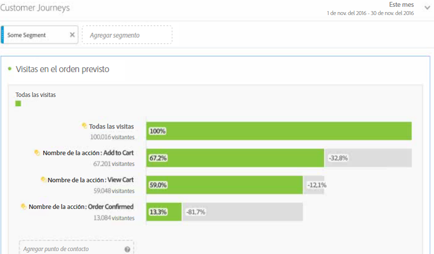 
 </td> 
  </tr> 
  <tr> 
   <td colname="col1"> <b> <a href="/help/analyze/analysis-workspace/visualizations/c-flow/flow.md"  > Visualización de flujo </a></b> </td> 
   <td colname="col2"> 
La nueva característica de flujo le permite visualizar el flujo/recorrido del cliente a través de los sitios web/aplicaciones mediante nuevas visualizaciones actualizadas y flexibles en Analysis Workspace para poder descubrir cómo se mueven y progresan los clientes en sus sitios/aplicaciones. El flujo le permite 
 
 
 
    <ul id="ul_F1D4A99743664CB3B17E9485CF5E72FC"> 
     <li id="li_0F7AF953EAB746DC95032FF9A533E560">Visualizar el recorrido del cliente a través de los activos. </li> 
     <li id="li_697A47BE06CF4284ACA3DBE4CA4012BF">Analizar los pasos siguientes inmediatos desde la entrada, salida o un elemento de dimensión específico en el recorrido del cliente. </li> 
     <li id="li_D13AD928AC434D599D43836FB334B14D">Crear de forma dinámica un segmento de usuarios mediante la designación de un punto específico en una ruta seleccionada. </li> 
    </ul> 
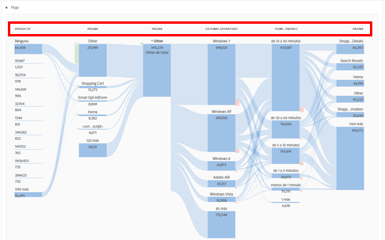 
 </td> 
  </tr> 
  <tr> 
   <td colname="col1"> <b> <a href="/help/components/c-alerts/intellligent-alerts.md"  > Alertas inteligentes </a></b> </td> 
   <td colname="col2"> 
Dado que el nuevo sistema de alertas para todas las alertas inteligentes de Adobe Analytics le permite crear y gestionar alertas en Analysis Workspace, finalice con la vista previa de alerta y la contribución de reglas. Puede: 
 
 
 
    <ul id="ul_02BD64D3047942009880B8F1DA1F2A40"> 
     <li id="li_01504AABBC514DF38354683843222541">Generar alertas en función de anomalías (umbrales del 90 %, 95 % o 99 %; cambio de %; por encima/por debajo). </li> 
     <li id="li_9BFE2B4C429D441287F1A37A08E62A40">Obtener una vista previa de la frecuencia con la que se activará una alerta. </li> 
     <li id="li_08D310196581483DB499C00358835B73">Enviar alertas por correo electrónico o SMS con vínculos a proyectos de Analysis Workspace autogenerados. </li> 
     <li id="li_2ADF9465EE474CDB839ED867662CCE6F">Crear alertas “apiladas” que capturan varias métricas en una sola alerta. </li> 
    </ul> 
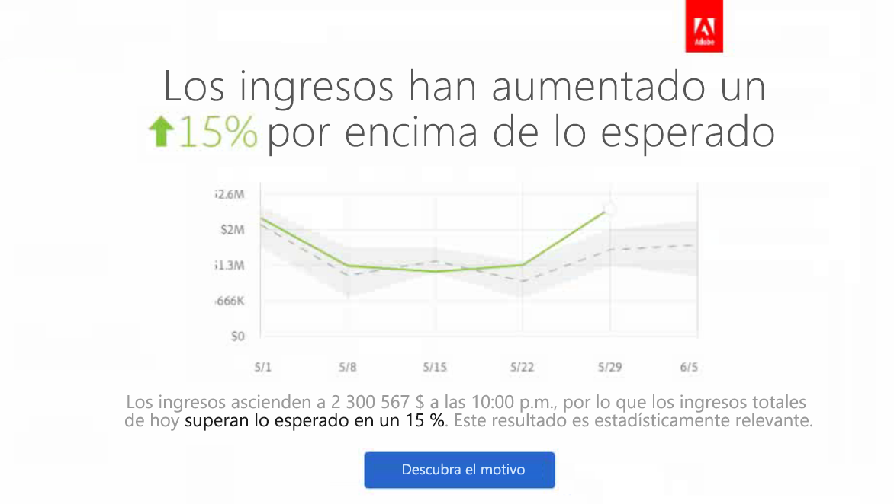 
 </td> 
  </tr> 
  <tr> 
   <td colname="col1"> <b> <a href="/help/analyze/analysis-workspace/virtual-analyst/c-anomaly-detection/anomaly-detection.md"  > Detección de anomalías y análisis de contribución </a></b> </td> 
   <td colname="col2"> 
Avísenos si un cambio en datos de tendencias es significante y cuál fue el motivo. 
 
Tanto la Detección de anomalías como el Análisis de contribuciones ahora son flujos de trabajo principales en Analysis Workspace. 
 
Importante: El análisis de contribución está disponible solamente para clientes de Adobe Analytics Premium. 
 
Puede: 
 
 
 
    <ul id="ul_9CEE47788F3640838D8598F2E2C020D6"> 
     <li id="li_787236BB5EA545B8833B311C06C24337">Detectar automáticamente anomalías de datos estadísticamente significativas en sus datos. </li> 
     <li id="li_2FB3D94DEEF14DD5ADA6AD69E15F243D">Ejecutar un análisis de contribución para cualquier anomalía diaria e incrustarlo a su proyecto de Analysis Workspace. </li> 
    </ul> 
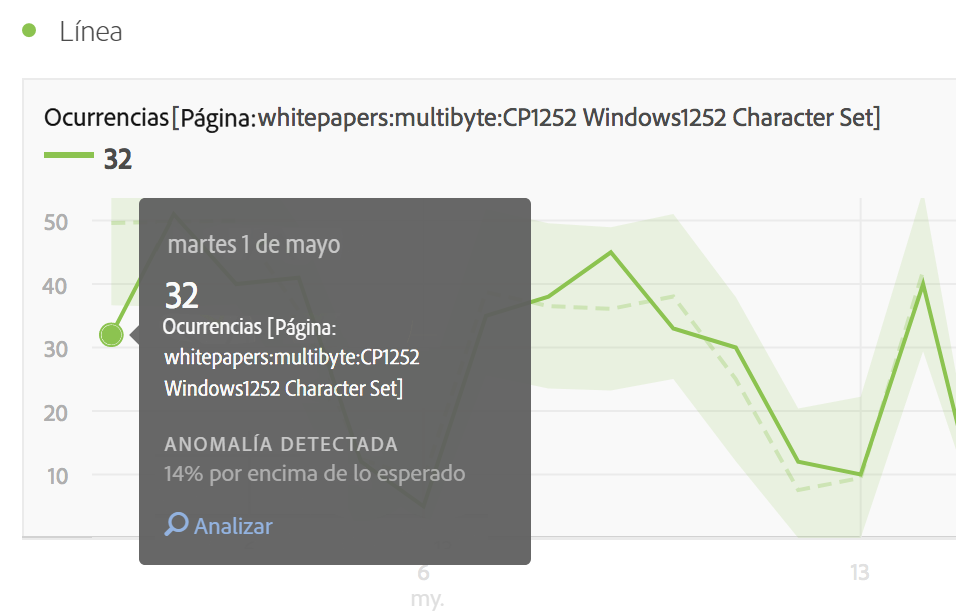 
 
 
 </td> 
  </tr> 
  <tr> 
   <td colname="col1"> <b> <a href="/help/analyze/analysis-workspace/build-workspace-project/starter-projects.md"  > Proyectos iniciales </a></b> </td> 
   <td colname="col2"> Para facilitar los primeros pasos de los usuarios en Analysis Workspace, hemos creado unas plantillas de proyecto previamente para problemas empresariales comunes, como 
 
 
    <ul id="ul_603F5ACC16F74D53AEB9F762FAC91656"> 
     <li id="li_6B3F2E5D4B044EC19D45E5501E33DB91">Retención de usuarios. </li> 
     <li id="li_7240EE8852FC4642B3AD4837C990A775">Adquisición de aplicación móvil. </li> 
    </ul> 
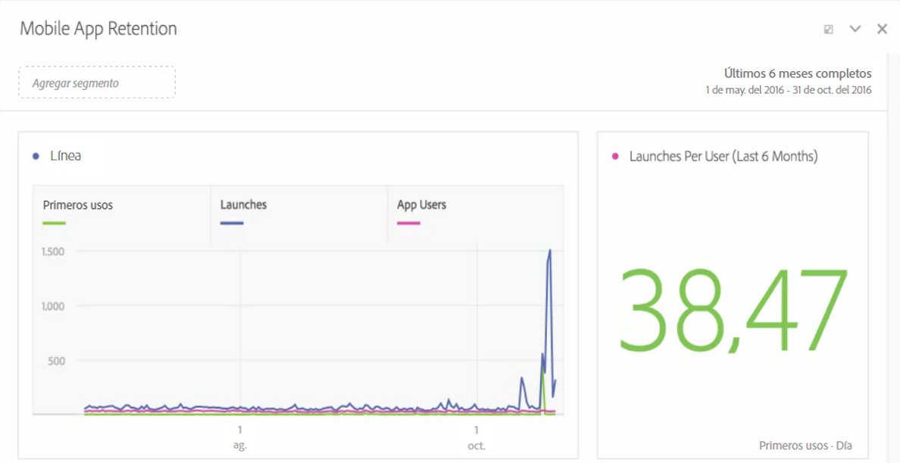 
 </td> 
  </tr> 
  <tr> 
   <td colname="col1"> <b> <a href="/help/analyze/analysis-workspace/visualizations/freeform-analysis-visualizations.md"> Visualización del histograma </a></b> </td> 
   <td colname="col2"> 
El histograma permite a los usuarios ver distribuciones de usuarios en cualquier evento de éxito. Puede personalizar los contenedores y el tamaño del contenedor para adaptarse a cualquier distribución e identificar usuarios de alto y bajo valor. 
 
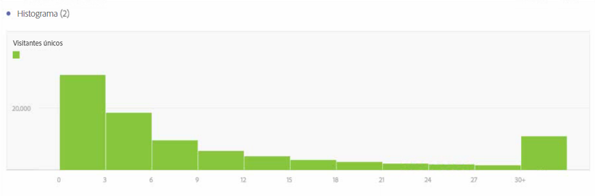 
 </td> 
  </tr> 
  <tr> 
   <td colname="col1"> Actualizaciones diversas </td> 
   <td colname="col2"> 
    <ul id="ul_2585F74DC7754C819017F280E16BF06F"> 
     <li id="li_412446013E7F42DBB1BF50F9E2C4D92F"> 
      <!--AN-124610: --> Se ha agregado “Contar instancias repetidas” como ajuste de nivel de proyecto ( Proyecto  &gt;  Info y configuración del proyecto). Esta configuración especifica si las instancias repetidas se cuentan en los informes. Si hay varios valores secuenciales para una misma variable, puede contarlos como una o como varias instancias de la variable. </li> 
     <li id="li_480E1B307C62418CBC2F50ADE32B9EE9">Se ha agregado un nuevo botón denominado “Aplicar a todos los paneles” al lado de “Cancelar” y “Ejecutar” en el Calendario. “Ejecutar” se ha cambiado a “Aplicar”. Si hace clic en el nuevo botón, no solo cambiará el intervalo de fechas seleccionado para el panel actual, sino también para todos los demás paneles dentro del proyecto. </li> 
     <li id="li_4D10DFE307344D06AA60792FABE5B57E"> 
      <!--AN-124168: -->Se ha agregado un botón “Acciones” en el carril de navegación izquierdo que incluye estas acciones: Etiquetar, Favorito, Aprobar, <b>Compartir (nuevo)</b> y <b>Eliminar (nuevo)</b>. </li> 
     <li id="li_946EC05568D4447193E9307546DF6F9B">Se ha agregado un filtro a la barra de búsqueda que permite filtrar por etiquetas, favoritos, elementos aprobados y componentes. </li> 
     <li id="li_4EA118ACCD3B4F88B0ECF72717F631FA">Se ha agregado un icono de vista previa a filas manuales (no a filas dinámicas que enumeran elementos de dimensión) que permite obtener una vista previa de segmentos, métricas e intervalos de fechas. </li>  
     <li id="li_D81DB98C49664D2884CCCC1DB0058CD8"> 
      <!--AN-124004:-->Para las visualizaciones, hemos agregado una opción al menú contextual del botón secundario denominada  Comenzar de nuevo  (funcionará para Flujo, Venn e Histograma), que elimina la configuración para la visualización actual y abre un nuevo panel donde puede volver a configurarla. </li> 
     <li id="li_84632BFCE1794B49A31FF45067FA04B7">Una nueva configuración de visualización denominada “Leyenda visible” permite ocultar el texto de detalles de filtro para la visualización Número de resumen/Cambio de resumen. </li> 
     <li id="li_EE8C48642DD54A04B08F4222F9565BF6">Una nueva configuración de visualización para las visualizaciones Cambio de resumen permite mostrar la diferencia entre 2 porcentajes. Para los valores que no son de porcentaje, si selecciona la opción “Mostrar diferencia”, mostrará un número. </li> 
     <li id="li_17AAABCA7B3A477182FB70453CA2EEBB">Se ha ajustado el número de filas para dimensiones de tiempo. </li> 
     <li id="li_35A91D50CD514CD0B939C24AEEC64BF4">Se ha actualizado el aspecto del carril izquierdo de navegación en el Generador de segmentos y el Creador de métricas calculadas para que se asemeje a Analysis Workspace. </li> 
    </ul> </td> 
  </tr> 
 </tbody> 
</table>

## Junio de 2016

Nuevas funciones lanzadas el 16 de junio de 2016:

* [Nuevo permiso de grupo](https://docs.adobe.com/content/help/es-ES/analytics/admin/user-product-management/user-groups/groups.html) que permite que los administradores permitan o denieguen el acceso a la pestaña **[!UICONTROL Analytics]** > **[!UICONTROL Workspace]** a los usuarios. Desde el 16 de junio de 2016, todos los usuarios tienen acceso a esta pestaña. Para denegar el acceso, solo tiene que eliminar usuarios del grupo Acceso a Analysis Workspace.
* La variable [El panel Comparación de segmentos](/help/analyze/analysis-workspace/c-panels/c-segment-comparison/segment-comparison.md) detecta las diferencias más significativas estadísticamente entre dos segmentos a través de un análisis automatizado de cada métrica y dimensión a la cual tenga acceso.
* [Estructura del Nuevo menú de proyectos](/help/analyze/analysis-workspace/build-workspace-project/freeform-overview.md) que reorganiza el menú de la parte superior y lo hace más extensible. Por ejemplo, para crear un **Panel de cohorte nuevo** ahora tiene que crear un Panel en blanco y arrastrarlo hasta una visualización de Tabla de cohorte.
* [Nuevo carril izquierdo](/help/analyze/analysis-workspace/build-workspace-project/freeform-overview.md): paneles, visualizaciones, componentes.
* Un nuevo tipo de [Visualización Venn](/help/analyze/analysis-workspace/visualizations/venn.md) le permite arrastrar hasta tres segmentos y una métrica y construir un diagrama de Venn.
* El gráfico de líneas [Selección de tendencias](/help/analyze/analysis-workspace/home.md#section_34930C967C104C2B9092BA8DCF2BF81A) de una tabla jerárquica ahora está vinculado.
* [Icono “Crear imagen”](/help/analyze/analysis-workspace/visualizations/freeform-analysis-visualizations.md): al hacer clic en el botón aparece una suposición inteligente sobre su siguiente acción (gráfico de barras, Venn...).
* La funcionalidad [Filas manuales](/help/analyze/analysis-workspace/visualizations/freeform-table/column-row-settings/manual-vs-dynamic-rows.md) se ha ampliado.
* Nueva zona de colocación [Añadir segmento](/help/analyze/analysis-workspace/components/t-freeform-project-segment.md).
* Actualizaciones menores:

   * Posibilidad de eliminar todas las visualizaciones de un panel y todos los paneles de un proyecto. (Anteriormente, debía mantener al menos una visualización o un panel).
   * Cambios en las [teclas de método abreviado](/help/analyze/analysis-workspace/build-workspace-project/fa-shortcut-keys.md) (teclas de acceso directo) que pueden facilitar el trabajo con Analysis Workspace.
   * Cambios de estilo: fuentes más pequeñas en las visualizaciones, muestras de color en las filas; selector de fecha desplazado hacia abajo (en los paneles).

## Abril de 2016

Nuevas funciones lanzadas el 21 de abril de 2016:

<table id="table_2649645FDED84B71952F741ABB3FC20E"> 
 <thead> 
  <tr> 
   <th colname="col1" class="entry"> Función </th> 
   <th colname="col2" class="entry"> Descripción </th> 
  </tr> 
 </thead>
 <tbody> 
  <tr> 
   <td colname="col1"> Enviar archivo </td> 
   <td colname="col2"> 
Envíe un proyecto de Analysis Workspace por correo electrónico o programe su entrega. Consulte <a href="/help/analyze/analysis-workspace/curate-share/t-schedule-report.md"  > Enviar archivo: programar un proyecto para su entrega </a>. 
 </td> 
  </tr> 
  <tr> 
   <td colname="col1"> Descargar PDF </td> 
   <td colname="col2"> 
Desde el menú Acción, puede descargar un proyecto de Analysis Workspace en formato PDF (similar a la descarga en formato CSV). 
 </td> 
  </tr> 
 </tbody> 
</table>

## Enero de 2016

Nuevas funciones lanzadas el 21 de enero de 2016:

* [Deshacer acciones](/help/analyze/analysis-workspace/new-features-in-analysis-workspace.md#section_12890C393D5E4FC8A3CF050318BD8482)
* [Vincular a este proyecto](/help/analyze/analysis-workspace/new-features-in-analysis-workspace.md#section_453E70F7409F4501B8E976A0D18C9A46)
* [Visualizaciones de gráficos de viñetas, diagramas de dispersión y gráficos de rectángulos](/help/analyze/analysis-workspace/new-features-in-analysis-workspace.md#section_B19EA50EBF5546E99D3A142827153FD6)
* [“Guardar como” para segmentos, métricas y fechas](/help/analyze/analysis-workspace/new-features-in-analysis-workspace.md#section_04C8B10A0751453AAE5F1BC35938C6CE)
* [Botón Agregar nuevo segmento](/help/analyze/analysis-workspace/new-features-in-analysis-workspace.md#section_85CC88C02C79456EA2B41F2BFBB64FC4)
* [Formato condicional](/help/analyze/analysis-workspace/new-features-in-analysis-workspace.md#section_5775B505D83041408B8C3EAEC5D7C32B)
* [Vista previa de dimensión](/help/analyze/analysis-workspace/new-features-in-analysis-workspace.md#section_F519EBF889B244E8B25BB6BA2833325A)
* [Leyenda visible](/help/analyze/analysis-workspace/new-features-in-analysis-workspace.md#section_28D10D86CAE343AB838808C1DD2E7983)
* [Eje Y delimitador a cero](/help/analyze/analysis-workspace/new-features-in-analysis-workspace.md#section_83DF5DE79EF04F9F8DCB3154F5E799B3)
* [Nombre del proyecto en el título de la ficha](/help/analyze/analysis-workspace/new-features-in-analysis-workspace.md#section_497C61A030984BCCA2CEA553312C3226)
* [Transferir propiedad del proyecto](/help/analyze/analysis-workspace/new-features-in-analysis-workspace.md#section_989C2CCB80B5408EB85E6B12C8D943E3)

## Deshacer acciones {#section_12890C393D5E4FC8A3CF050318BD8482}

Ahora puede deshacer la mayoría de las acciones que realiza en Analysis Workspace.

Para deshacer, haga clic en **[!UICONTROL Deshacer]** en el menú de acción.

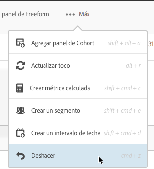

También puede utilizar [accesos directos de teclado](/help/analyze/analysis-workspace/build-workspace-project/fa-shortcut-keys.md) estándar de Windows y Mac (ctrl o cmd + z) para Deshacer.

*`Undo`* es particularmente útil para deshacer desgloses en la tabla.

Acciones que *`not`* no se pueden deshacer:

* Cambiar la configuración de una [!UICONTROL Tabla asociada] (como arrastrar métricas, cambiar valores). Sin embargo, puede hacer clic en **[!UICONTROL Deshacer]** tras hacer clic en **[!UICONTROL Ejecutar]**.

* Cambiar el tamaño o mover paneles y subpaneles.

Acciones que borran el historial de deshacer:

* Guardar el proyecto.
* Cambiar el grupo de informes.

## Vincular a este proyecto {#section_453E70F7409F4501B8E976A0D18C9A46}

En un proyecto, haga clic en **[!UICONTROL Vincular a este proyecto]** del menú Acciones para enviar por correo electrónico a otros usuarios una URL de un proyecto guardado. Los destinatarios administradores pueden editar y guardar un proyecto compartido de esta forma. Del contrario, estos proyectos son de solo lectura.

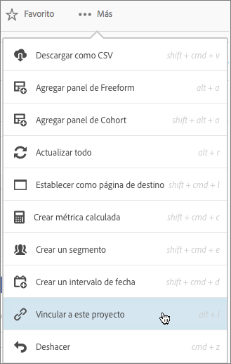

>[!NOTE]
>
>La opción para compartir vínculos de informes no está disponible si su empresa utiliza el inicio de sesión único (tanto el inicio de sesión único heredado como al iniciar sesión mediante Experience Cloud).

## Visualizaciones de gráficos de viñetas, diagramas de dispersión y gráficos de rectángulos {#section_B19EA50EBF5546E99D3A142827153FD6}

Las siguientes visualizaciones nuevas están disponibles en la versión de enero de 2016.

**Gráfico de viñetas**

Puede ver cómo se compara un valor que le interese con otros rangos de rendimiento (objetivos).

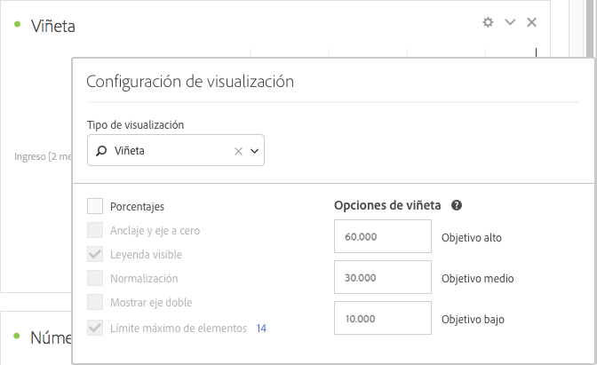

El gráfico de viñetas cuenta con una única medida principal (por ejemplo, los ingresos del año actual hasta la fecha), compara esta medida con una o más medidas para enriquecer su significado (por ejemplo, en comparación con los ingresos objetivo) y los muestra en el contexto de intervalos de rendimiento cualitativos, como elevado, medio y bajo. Puede especificar intervalos objetivo en [!UICONTROL Configuración de visualización].

**Diagrama de dispersión**

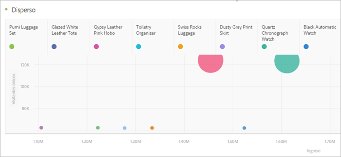

Muestra las impresiones servidas y cuántos usuarios únicos han visto dichas impresiones. El tamaño de cada uno de los puntos de datos proporciona una pista visual acerca del número medio de veces que un visor ha sido expuesto a un anuncio. El tamaño y los datos pueden variar en función de las dimensiones, intervalos de fechas y filtros que haya seleccionado.

>[!NOTE]
>
>Una tabla asociada con un diagrama de dispersión que requiere al menos dos columnas. La primera columna define el eje X y la segunda columna define el eje Y. Si existe una tercera columna disponible, el diagrama de dispersión la utiliza para determinar el radio del punto. En otras palabras, las columnas *1*, *2* y *3* se asignan a *X*, *Y* y *radio del punto*.

**Gráfico de rectángulos**

Muestra datos de forma jerárquica (con estructura de árbol) como un conjunto de rectángulos anidados. Cada rama del árbol es un rectángulo determinado, el cual está en mosaico con rectángulos menores que representan ramas secundarias.

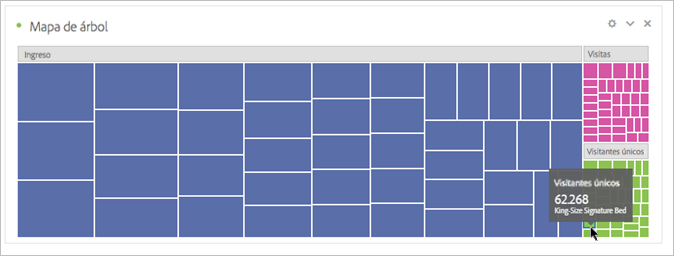

Cuando el color y el tamaño de las dimensiones son correlativos en cierta manera con la estructura de árbol, a menudo se pueden observar patrones que serían difíciles de percibir de otra forma, como por ejemplo, si cierto color es particularmente relevante. Una segunda ventaja de los gráficos de rectángulos es que, por su construcción, hacen un uso eficiente del espacio.

## “Guardar como” para segmentos, métricas y fechas {#section_04C8B10A0751453AAE5F1BC35938C6CE}

Al editar un segmento existente (guardado) en el Generador de segmentos de Analysis Workspace, haga clic en **[!UICONTROL Guardar como]** para crear una copia.

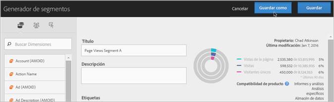

El nuevo segmento se muestra en el grupo [!UICONTROL Segmentos] del panel [!UICONTROL Componentes].

*`Save As`* también está disponible para el [!UICONTROL Generador de métricas calculadas] y el [!UICONTROL Generador de intervalo de fechas].

## Agregar nuevo segmento

Se ha agregado la zona de colocación **[!UICONTROL Colocar un segmento aquí]** para que pueda arrastrar y soltar segmentos en un proyecto.

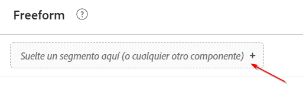

Esta mejora es útil si prefiere crear segmentos directamente cuando trabaja en un proyecto en lugar de usar el panel [!UICONTROL Segmento] para ello.

## Formato condicional {#section_5775B505D83041408B8C3EAEC5D7C32B}

En la Configuración de columna, puede aplicar el formato condicional a los datos de la celda.

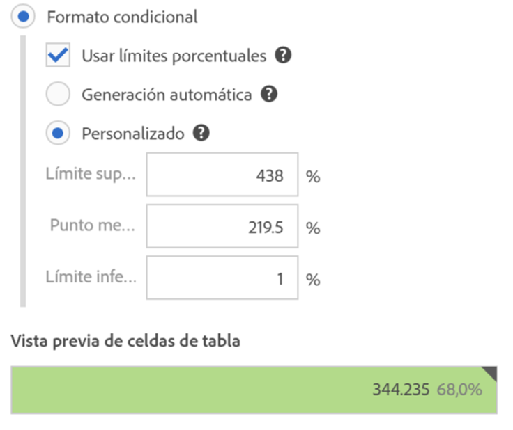

<table id="table_4285E6982FBD4B66AC95AAF6C5C7B347"> 
 <thead> 
  <tr> 
   <th colname="col1" class="entry"> Elemento </th> 
   <th colname="col2" class="entry"> Descripción </th> 
  </tr> 
 </thead>
 <tbody> 
  <tr> 
   <td colname="col1"> Formato condicional </td> 
   <td colname="col2"> 
 Aplica los colores siguientes a las celdas, en función de los valores de los datos: 
 
    <ul id="ul_97E3AD5F6B41460C882D8B4EE0A8C77A"> 
     <li id="li_88874B4250224DE781C03E4A5931D6A2">Verde: valores altos </li> 
     <li id="li_B4863F967C7544D7AA2847696FB85525">Amarillo: valores medios </li> 
     <li id="li_5B06D7CD0C39437898DA55EA653A1124">Rojo: valores bajos </li> 
    </ul> 
Sustituir una dimensión en la tabla restablece los límites de formato condicional. Cuando se sustituye una métrica se vuelven a calcular los límites de dicha columna (donde las métricas se encuentran en el eje X y las dimensiones se encuentran en el eje Y). 
 </td> 
  </tr> 
  <tr> 
   <td colname="col1"> Generación automática </td> 
   <td colname="col2"> 
Genera automáticamente límites para el formato condicional. El límite superior es el valor máximo de esta columna. El límite inferior es el valor más bajo y el punto medio es la media entre los límites superior e inferior. 
 </td> 
  </tr> 
  <tr> 
   <td colname="col1"> Personalizado </td> 
   <td colname="col2"> 
Puede asignar de forma manual los valores de los campos  Superior,  Punto medio y  Límite inferior  para el formato condicional. Esto le proporciona la flexibilidad para determinar si el valor de una columna es bueno, medio o malo. 
 </td> 
  </tr> 
 </tbody> 
</table>

## Vista previa de dimensión {#section_F519EBF889B244E8B25BB6BA2833325A}

En el panel [!UICONTROL Dimensiones], puede colocar el cursor sobre el icono de información situado junto a una dimensión y obtener la vista previa de las cinco principales.

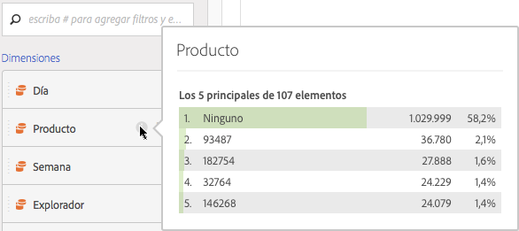

## Leyenda visible {#section_28D10D86CAE343AB838808C1DD2E7983}

En la [!UICONTROL Configuración de visualización], la opción **[!UICONTROL Leyenda visible]** muestra u oculta la leyenda de la visualización.

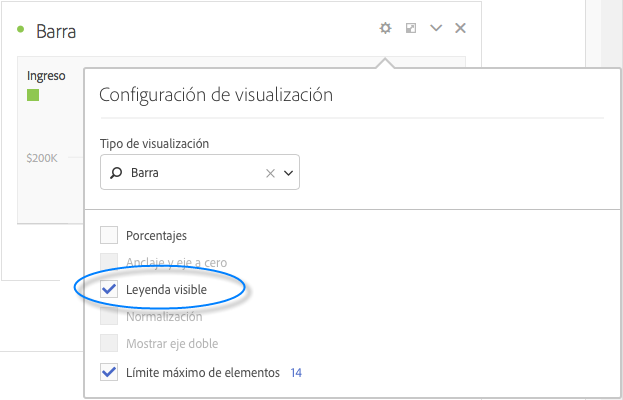

## Eje Y delimitador a cero {#section_83DF5DE79EF04F9F8DCB3154F5E799B3}

Dependiendo de los números de los gráficos de línea y de área, la parte inferior del eje Y podría no ser cero. Al habilitar **[!UICONTROL Eje Y delimitador a cero]** en [!UICONTROL Configuración de visualización], se fuerza al eje Y a comenzar por cero para obtener una visión más precisa de las tendencias. Los siguientes ejemplos muestran cómo cambia un gráfico de ingresos con esta configuración activada o desactivada:

**Eje Y delimitador a cero desactivado**

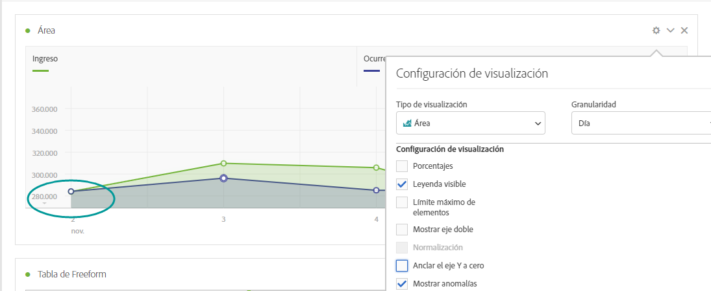

**Eje Y delimitador a cero activado**

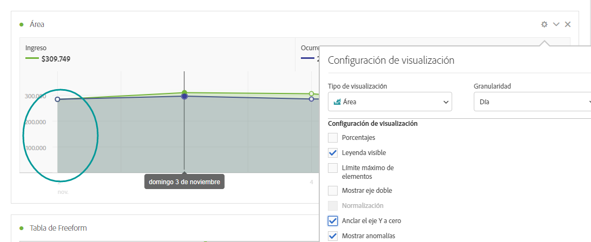

## Nombre del proyecto en el título de la ficha {#section_497C61A030984BCCA2CEA553312C3226}

Al guardar un proyecto, el título de la ficha del navegador se mostrará como “`<Project Name>` - Analysis Workspace”. Esta mejora resulta útil si abre varios proyectos en varias fichas del navegador.

## Transferir propiedad del proyecto {#section_989C2CCB80B5408EB85E6B12C8D943E3}

Los administradores pueden transferir proyectos de [!UICONTROL Analysis Workspace] de un usuario a otro.

Para transferir proyectos, vaya a **[!UICONTROL Administración]** > **[!UICONTROL Administración de usuarios]** > **[!UICONTROL Transferir]**.
