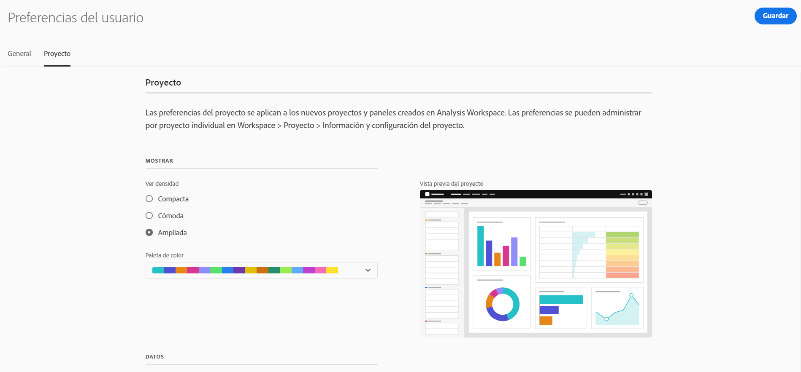

# Preferencias del usuario

La página [!UICONTROL Componentes] > [!UICONTROL Preferencias de usuario] permite administrar la configuración de Analysis Workspace y sus componentes relacionados para los usuarios. Las preferencias de usuario se aplican a todos los *nuevos* proyectos o paneles.

## Preferencias generales

Las preferencias generales se aplican a la experiencia de Adobe Analytics en el explorador.

| Preferencia | Opciones |
| --- | --- |
| Landing page | <ul><li>Lista de proyectos (predeterminada)</li><li>Proyecto en blanco</li><li>Proyecto específico seleccionado de una lista</li></ul> |
| Sugerencias | <ul><li>Enabled (predeterminado)</li><li>Desactivado</li></ul> |

## Preferencias de proyecto

Las preferencias de proyecto se aplican a nuevos proyectos y paneles creados en Analysis Workspace. Ciertas preferencias también se pueden administrar por proyecto en [!UICONTROL Workspace] > [!UICONTROL Proyecto] > [!UICONTROL Información y configuración del proyecto].

| Sección | Preferencia | Opciones |
| --- | --- | --- |
| **Mostrar** |  |  |
|  | [Ver densidad](https://experienceleague.adobe.com/docs/analytics/analyze/analysis-workspace/build-workspace-project/view-density.html?lang=es) | <ul><li>Compacta</li><li>Cómoda</li><li>Expandido (predeterminado)</li></ul> |
|  | [Paleta de color](https://experienceleague.adobe.com/docs/analytics/analyze/analysis-workspace/build-workspace-project/color-palettes.html?lang=es) | <ul><li>Paletas proporcionadas por Adobe (predeterminado)</li><li>Paletas definidas de forma personalizada</li></ul> |
| **Datos** |  |  |
|  | [Grupos de informes](https://experienceleague.adobe.com/docs/analytics/analyze/analysis-workspace/panels/panels.html?#report-suite) | <ul><li>Más reciente (predeterminado)</li><li>Grupo de informes específico seleccionado de una lista</li></ul> |
|  | [Calendario](https://experienceleague.adobe.com/docs/analytics/analyze/analysis-workspace/panels/panels.html?#calendar) | Seleccione entre una lista de: <ul><li>Intervalos proporcionados por el Adobe (el valor predeterminado es Este mes)</li><li>Intervalos definidos a medida</li></ul> |
|  | [Tipo de panel](https://experienceleague.adobe.com/docs/analytics/analyze/analysis-workspace/panels/panels.html) | <ul><li>Improvisado (predeterminado)</li><li>En blanco</li><li>Acceso rápido a información</li></ul> |
|  | Formato de número | <ul><li>1000,00 (predeterminado)</li><li>1 000 000</li><li>1 000,00</li></ul> |
|  | carácter separador de CSV | <ul><li>Coma (predeterminado)</li><li>Punto y coma</li><li>Dos puntos</li><li>Barra vertical</li><li>Periodo</li><li>Espacio</li><li>Tabulación</li></ul> |
