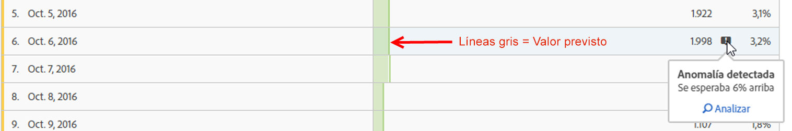
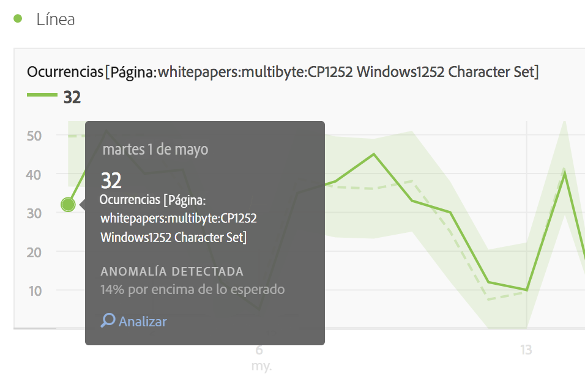
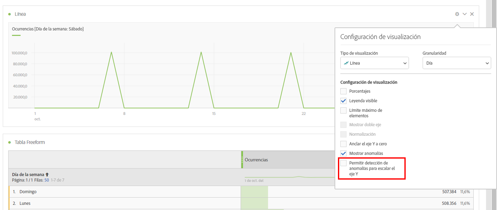

# Ver anomalías en Analysis Workspace

Puede ver anomalías en una tabla o un gráfico de líneas.

## View anomalies in a table {#section_869A87B92B574A38B017A980ED8A29C5}

En una tabla improvisada de series temporales, cada fila ahora se marca de forma automática con un símbolo de exclamación en gris oscuro si se detecta una anomalía en los datos.

La línea vertical gris de cada fila indica el valor esperado. Cuando pasa el ratón por encima del signo de exclamación, la cantidad en la que la anomalía difiere del valor esperado se indica (en + o - %).

## View anomalies in a line chart {#section_7C1192AFDB4345A8A2CCFB3AE0C47D82}

El gráfico de líneas muestra la banda de confianza en verde claro con los valores anómalos (puntos blancos).

Si hace clic en un punto blanco, se volverá verde y le mostrará:

* La fecha en la que se produjo la anomalía
* El valor sin procesar de la anomalía
* El valor de porcentaje por encima o por debajo del valor esperado, que se representa por la línea verde sólida.
* El vínculo Analizar para empezar [Análisis de contribución](../../../../analyze/analysis-workspace/virtual-analyst/contribution-analysis/ca-tokens.md).

Si cuenta con múltiples métricas en el gráfico de líneas, solo se muestran las anomalías y debe pasar el ratón por encima de cada una de ellas para ver la banda de confianza de dicha métrica.

El intervalo de confianza de detección de anomalías no escala automáticamente el eje Y de una visualización para conseguir que el gráfico sea más legible.

Tiene la opción de permitir que el intervalo de confianza escale el gráfico. Solo tiene que hacer clic en el icono de Configuración (engranaje) y marcar **[!UICONTROL Permitir que Detección de anomalías escale el eje Y]**.

