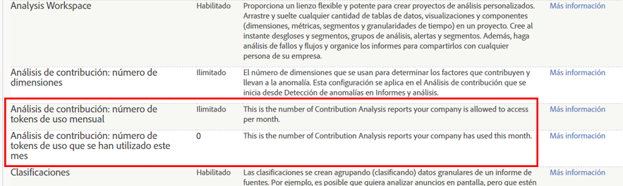

# Resumen de los análisis de contribución

Análisis de contribución descubre patrones ocultos en sus datos para explicar las anomalías estadísticas e identificar correlaciones tras acciones de cliente inesperadas, valores que sobrepasan el límite y picos o caídas repentinos de métricas seleccionadas en segmentos de audiencia convergentes.

Ha ocurrido algo. ¿Por qué? Su informe Detección de anomalías muestra un pico inusual en los pedidos y desea saber por qué. ¿Qué ha pasado fuera de lo normal? ¿Quién está respondiendo a qué campaña o referencia? ¿Algo se ha hecho viral? ¿Qué factores específicos han contribuido a esta anomalía? Y quizá lo más importante: ¿cómo puedo capturar información importante acerca de mi cliente y repetir este comportamiento? (O, si hay una caída en una métrica o una subida en una métrica negativa, ¿cómo puedo evitarla en el futuro?)

Análisis de contribución le ayuda a evaluar los datos inmediatamente para saber por qué se ha producido una anomalía. Desglosa las contribuciones en anomalías en cuestión de segundos, algo que tardaba semanas, proporcionando patrones para segmentos de audiencia y ayudando a desarrollar un diálogo para las interacciones con el cliente. Puede utilizar el análisis de contribución de forma estratégica para identificar y capturar asociaciones significativas y desarrollar nuevos segmentos de audiencia, o utilizarlo de forma táctica para identificar actividades que sobrepasen el límite o actividades fraudulentas que activen una alerta.

[Detección de anomalías](/help/analyze/analysis-workspace/virtual-analyst/c-anomaly-detection/anomaly-detection.md) identifica picos de datos y caídas estadísticas pronunciadas basándose en métricas y segmentos de audiencia concretos. Establece una norma histórica basada en un período de prueba y, a continuación, representa desplazamientos extremos correlacionados con eventos específicos. Puede realizar un informe sobre un aumento abrupto en una métrica positiva de pedidos o un aumento en una métrica negativa de devoluciones, o caídas en ambas, capturando puntos de datos estadísticamente relevantes para ser evaluados por un análisis de contribución. Una vez identificada una anomalía estadística, el análisis de contribución le permite desglosar y evaluar variables de marketing y de campaña relevantes en todos los puntos de datos anómalos. Ejecuta algoritmos avanzados y procesos de aprendizaje automático para evaluar asociaciones que hayan contribuido a un pico o caída significativos. Estos cálculos aparecen en visualizaciones interactivas diseñadas para ofrecerle distintas perspectivas que le ayuden a entender por qué se ha producido algún evento y qué hacer al respecto.

El análisis de contribución le ayuda a desarrollar un diálogo para describir por qué se ha producido una anomalía y cómo responder a ella, capturando métricas relevantes e identificando puntos ocultos que le darán una razón general para las interacciones de la audiencia y las tendencias en los intereses de los clientes. Algunas veces las anomalías son fáciles de ver y corregir, como un pedido aislado de 2000 kayaks. Por el contrario, otras veces es difícil, como identificar una tendencia emergente a lo largo de un período de tiempo en una región que solo reacciona a una determinada campaña con objetivo. Unir elementos de contribución en métricas para varias dimensiones y sus asociaciones le proporciona una idea general de las interacciones de su audiencia y le ayuda a proporcionar contexto a los puntos de datos anómalos.

Estos son algunos casos de uso:

* Identificar el potencial de remarketing mediante la supervisión de cambios en la demanda de productos.
* Mejorar la experiencia del cliente reaccionando a determinados intereses de la audiencia.
* Identificar pedidos fraudulentos de forma temprana como informe sobre ámbitos que sobrepasan el límite.
* Protegerse del espionaje empresarial identificando usos y descargas masivas.
* Supervisar operaciones como, por ejemplo, los informes sobre la falta de etiquetas de javascript.

Después del análisis completo de una anomalía, se genera un resumen de contribución para los elementos principales ordenados según el número total de ocurrencias y el porcentaje del elemento de los valores de contribución. Una puntuación de contribución normalizada le permite comprar, contrastar y asociar fácilmente otros elementos de dimensión significativos.

## Tokens de Análisis de contribución: descripción general {#section_3EF8D2BBCE6E4C309D753BCF04A453D0}

>[!IMPORTANT]
>
>La funcionalidad Análisis de contribución se ha eliminado del conjunto de funciones de Reports &amp; Analytics y ahora solo está disponible en Analysis Workspace.

Los clientes que tengan algún derecho de Análisis de contribución pueden ejecutar análisis de contribución completos tantas veces al mes como deseen en Analysis Workspace. Quedan **excluidos** los clientes de producto específico (SiteCatalyst 15), los de Analytics Foundation y los de Analytics Select, que en ningún caso tienen acceso a la función Análisis de contribución.

El número de ejecuciones por empresa está limitado por los tokens mensuales, que se conceden según el producto de Adobe Analytics que la empresa haya adquirido. También se puede restringir el acceso a Análisis de contribución para evitar un uso indebido de los tokens.

## Preguntas frecuentes {#section_11D0431AD2014B96AB9561CA66A367CE}

<table id="table_357775E5058644099E26B15A6790E8AF"> 
 <thead> 
  <tr> 
   <th colname="col1" class="entry"> Pregunta </th> 
   <th colname="col2" class="entry"> Respuesta </th> 
  </tr>
 </thead>
 <tbody> 
  <tr> 
   <td colname="col1"> 
<b>¿Por qué Adobe ha introducido los tokens?</b> 
 </td> 
   <td colname="col2"> 
El Análisis de contribución es una de las funcionalidades más aclamadas de Adobe Analytics. Al permitirle realizar un número pequeño de ejecuciones “completas” al mes (en lugar de ofrecerle únicamente 3 dimensiones para algunos productos de Analytics), podrá ver mejor las ventajas que aporta un análisis de contribución completo e ilimitado. 
 </td> 
  </tr> 
  <tr> 
   <td colname="col1"> 
<b>¿Cómo funciona la creación de tokens en Análisis de contribución? ¿Hay que pagar un token para cargar un proyecto con un análisis de contribución existente o solo cuando se ejecuta uno nuevo?</b> 
 </td> 
   <td colname="col2"> 
Cada empresa (y no cada usuario) recibe un número determinado de tokens al mes, lo cual le permite ejecutar un análisis de contribución “completo” en Analysis Workspace. 
 
Siempre que se genera un nuevo análisis de contribución, hay que pagar un token. Cargar proyectos con análisis de contribución previamente ejecutados no cuesta ningún token. 
 </td> 
  </tr> 
  <tr> 
   <td colname="col1"> 
<b>¿Se aplican tokens al análisis de contribución en Reports &amp; Analytics?</b> 
 </td> 
   <td colname="col2"> 
No. Desde la versión de abril de 2018, la característica Análisis de contribución ya no se ofrece en Reports &amp; Analytics. 
 </td> 
  </tr> 
  <tr> 
   <td colname="col1"> 
<b>Si mi empresa se queda sin tokens y deseamos ejecutar más análisis de contribución, ¿qué podemos hacer?</b> 
 </td> 
   <td colname="col2"> 
Puede actualizar a otro producto de Adobe Analytics, por ejemplo, de Standard (2 tokens/mes) a Ultimate (20 tokens/mes). No consiste simplemente en comprar más tokens: es preciso actualizar el tipo de paquete existente. 
 </td> 
  </tr> 
  <tr> 
   <td colname="col1"> 
<b>¿Cómo se restringe el acceso a Análisis de contribución?</b> 
 </td> 
   <td colname="col2"> 
De forma predeterminada, solo los administradores tienen acceso para ejecutar los análisis de contribución, pero pueden otorgar acceso a otros usuarios creando un grupo de permisos en <a href="https://docs.adobe.com/content/help/es-ES/core-services/interface/manage-users-and-products/admin-getting-started.html"  >Admin Console</a>. Conceda permiso para usar los análisis de contribución solamente a los usuarios que tengan una razón legítima para usarlos y que sepa que no harán un uso indebido de este permiso. 
 
El permiso se denomina “Análisis de contribución”, en Analytics &gt; Administración &gt; Administración de usuarios &gt; Editar grupos &gt; Editar el acceso a todos los informes &gt; Personalizar las herramientas del grupo de informes &gt; Herramientas e informes. 
 </td> 
  </tr> 
  <tr> 
   <td colname="col1"> 
<b>¿Cómo puedo saber de cuántos tokens al mes dispone mi empresa y qué cantidad hemos usado en el mes actual?</b> 
 </td> 
   <td colname="col2"> 
Vaya a Administración &gt; Configuración de la empresa &gt; Ver los niveles de acceso de la función. Hay 2 elementos nuevos en esta página: 
 
 
 </td> 
  </tr> 
 </tbody> 
</table>

## Derechos de Detección de anomalías y Análisis de contribución {#section_9278D58F21A840AA9B1ED1BD07A1EF0A}

A continuación encontrará una lista detallada de los derechos de Detección de anomalías y Análisis de contribución en Analysis Workspace.

>[!IMPORTANT]
>
>Las características Detección de anomalías y Análisis de contribución se han eliminado del conjunto de funciones de Reports &amp; Analytics, y ahora solo están disponibles en Analysis Workspace. Tenga en cuenta que los clientes de Adobe Analytics Select y Adobe Analytics Foundation solo tienen acceso a la Detección de anomalías de “granularidad diaria” en Workspace.

<table id="table_5C9B7E4AE82640B5A913519E576889B5"> 
 <thead> 
  <tr> 
   <th colname="col1" class="entry"> Derecho de Adobe Analytics </th> 
   <th colname="col2" class="entry"> Detección de anomalías </th> 
   <th colname="col3" class="entry"> Análisis de contribución </th> 
  </tr>
 </thead>
 <tbody> 
  <tr> 
   <td colname="col1"> 
Foundation 
 </td> 
   <td colname="col2"> 
Solo “granularidad diaria” 
 </td> 
   <td colname="col3" colsep="1"> 
Sin tokens 
 </td> 
  </tr> 
  <tr> 
   <td colname="col1"> 
<a href="https://www.adobe.com/es/data-analytics-cloud/analytics/select.html?promoid=B4XQ3X7G&amp;mv=other"  >Select</a> 
 </td> 
   <td colname="col2"> 
Solo “granularidad diaria” 
 </td> 
   <td colname="col3"> 
Sin tokens 
 </td> 
  </tr> 
  <tr> 
   <td colname="col1"> 
<a href="https://www.adobe.com/es/data-analytics-cloud/analytics/prime.html?promoid=91BF51TR&amp;mv=other"  >Prime</a> 
 </td> 
   <td colname="col2"> 
Sí 
 </td> 
   <td colname="col3"> 
10 tokens al mes 
 </td> 
  </tr> 
  <tr> 
   <td colname="col1"> 
<a href="https://www.adobe.com/es/data-analytics-cloud/analytics/ultimate.html?promoid=8N4B5F1V&amp;mv=other"  > Ultimate</a> 
 </td> 
   <td colname="col2"> 
Sí 
 </td> 
   <td colname="col3"> 
20 tokens al mes 
 </td> 
  </tr> 
  <tr> 
   <td colname="col1"> 
+Predictive Workbench 
 </td> 
   <td colname="col2"> 
Sí 
 </td> 
   <td colname="col3"> 
Tokens ilimitados 
 </td> 
  </tr> 
  <tr> 
   <td colname="col1"> 
Standard 
 
    <ul id="ul_73D52020793B44868C9CE0F90893075D"> 
     <li id="li_21EE0871C87E43C8B781219B2BA0FA74">Adobe Analytics Core </li> 
     <li id="li_AB3593200F33439BAEE8FEB13CAE57F4">Adobe Analytics OD </li> 
     <li id="li_2B7D625519BC4A4CB598C95F15D3029B">Adobe Analytics: MA </li> 
    </ul> </td> 
   <td colname="col2"> 
Sí 
 </td> 
   <td colname="col3"> 
2 tokens al mes 
 </td> 
  </tr> 
  <tr> 
   <td colname="col1"> 
Premium (360, Attribution) 
 </td> 
   <td colname="col2"> 
Sí 
 </td> 
   <td colname="col3"> 
2 tokens al mes 
 </td> 
  </tr> 
  <tr> 
   <td colname="col1"> 
Premium (Complete, <a href="https://www.adobe.com/es/data-analytics-cloud/analytics/predictive-intelligence.html"  >Predictive Intelligence</a>) 
 </td> 
   <td colname="col2"> 
Sí 
 </td> 
   <td colname="col3"> 
Tokens ilimitados 
 </td> 
  </tr> 
 </tbody> 
</table>
