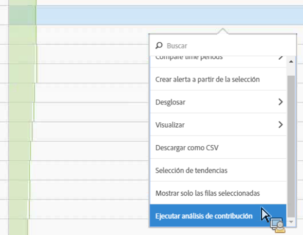
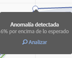
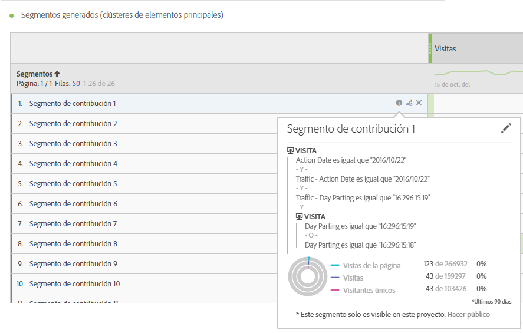
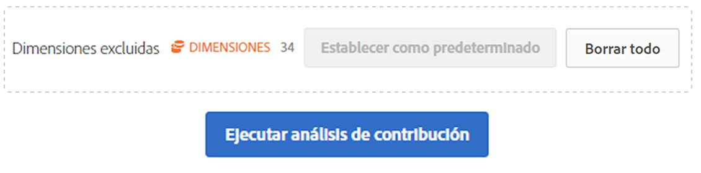
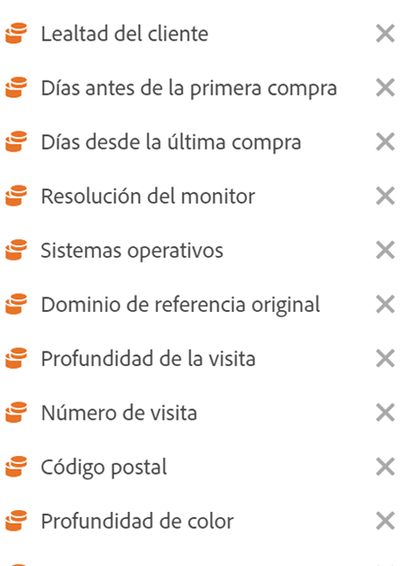

# Ejecutar análisis de contribución

El análisis de contribución es un proceso de aprendizaje automatizado intensivo diseñado para descubrir qué contribuye a una anomalía observada en Adobe Analytics. El propósito es ayudar al usuario a descubrir las áreas de interés u oportunidades para un análisis adicional de forma más rápida de lo que sería posible de otro modo.

## Ejecución de análisis de contribución {#section_7D2C5E48A5664727941DF4C90976D9DC}

Hay dos formas de invocar el análisis de contribución en un proyecto:

* En una tabla improvisada con granularidad diaria, haga clic con el botón derecho en cualquier fila y seleccione **[!UICONTROL Ejecutar análisis de contribución]**. Incluso puede ejecutarlo en filas que no muestren ninguna anomalía.

   >[!NOTE]
   >
   >Actualmente solo se admite el análisis de contribución con granularidad diaria.

   

* En un gráfico de líneas, sitúese sobre un punto de datos de anomalía. Haga clic en el vínculo **[!UICONTROL Analizar]que aparece.**

   

1. (Opcional) Una vez haya hecho clic en **[!UICONTROL Ejecutar análisis de contribución]**, tanto en un gráfico de líneas como en una tabla, puede reducir (y así acelerar) el ámbito del análisis mediante [la exclusión de dimensiones](../../../../analyze/analysis-workspace/virtual-analyst/contribution-analysis/run-contribution-analysis.md#section_F6932F4BF74544B5872164E7B1E0C6FC).

1. Espere mientras se carga su análisis de contribución. Esto puede requerir una gran cantidad de tiempo, en función del tamaño del grupo de informes y el número de dimensiones. El análisis de contribución realiza análisis en 50 000 elementos por dimensión.
1. A continuación, Analysis Workspace carga un nuevo panel de análisis de contribución directamente en este proyecto. Observará una gran cantidad de paneles familiares si ya ha utilizado el análisis de contribución en Reports &amp; Analytics anteriormente:

   * Una visualización que muestra el número de **visitas** en ese día.
   * Una **línea de tendencias de visitas** mensual para el contexto.
   * Los **elementos principales** que han contribuido a esta anomalía, ordenados por [puntuación de contribución](https://marketing.adobe.com/resources/help/en_US/analytics/contribution/ca_contribution_score.html), además de la métrica en cuestión y una métrica de visitantes únicos para poner la métrica en contexto desde una perspectiva de tamaño.

   * La tabla [Segmentos generados](https://marketing.adobe.com/resources/help/en_US/analytics/contribution/ca_workflow_premium.html) (grupos de elementos principales) identifica las asociaciones de los elementos principales en función de su puntuación de contribución, ocurrencias de anomalías y el porcentaje de contribución general a la métrica anómala. A continuación, esto se captura como segmento de audiencia (segmento de contribución 1, segmento de contribución 2, etcétera). Si hace clic en el botón “i” (información), se le mostrará la definición de cada segmento automático, incluidos los elementos principales de los cuales se compone:

      

1. Como el análisis de contribución ahora forma parte de Analysis Workspace, puede aprovechar algunas de sus funciones desde el menú secundario de la tabla para que su análisis sea aún más relevante, por ejemplo:

   * [Desglosar todos los elementos de la dimensión por otra dimensión.](../../../../analyze/analysis-workspace/components/dimensions/t-breakdown-fa.md#task_B594DA2476E84DFDA8279E831F0BD9C4)
   * [Realizar la tendencia de una fila o más.](../../../../analyze/analysis-workspace/analysis-workspace-features.md#section_34930C967C104C2B9092BA8DCF2BF81A)
   * [Añadir nuevas visualizaciones.](../../../../analyze/analysis-workspace/visualizations/freeform-analysis-visualizations.md#concept_09242627629147A88A68F1506954C276)
   * [Crear alertas.](/help/components/c-alerts/intellligent-alerts.md)
   * [Crear o comparar segmentos.](../../../../analyze/analysis-workspace/c-panels/c-segment-comparison/segment-comparison.md#concept_74FAC1C6D0204F9190A110B0D9005793)

>[!NOTE]
>
>Resaltamos la anomalía que se está analizando con un punto azul dentro del análisis de contribución y los proyectos de alerta inteligente vinculados a ella. Esto proporciona una indicación más clara de la anomalía que se está analizando.

## Exclude dimensions from Contribution Analysis {#section_F6932F4BF74544B5872164E7B1E0C6FC}

Puede haber ocasiones en las que desea excluir algunas dimensiones del análisis de contribución. Por ejemplo, es posible que no le importen las dimensiones relacionadas con el navegador o el hardware, y desea acelerar el análisis eliminándolas.

1. Después de hacer clic en **[!UICONTROL Ejecutar análisis de contribución]** (o en **[!UICONTROL Analizar]en un gráfico de líneas), se muestra el panel** Dimensiones excluidas **.**

1. Simplemente arrastre las dimensiones no deseadas al panel **[!UICONTROL Dimensiones excluidas]** y, a continuación, guarde la lista haciendo clic en **[!UICONTROL Establecer como predeterminado]**. O haga clic en **[!UICONTROL Borrar todo]para volver a empezar con la selección de las dimensiones que desea excluir.**

   

1. Una vez haya añadido dimensiones que se deben excluir (o que haya decidido no hacerlo), haga clic en **[!UICONTROL Ejecutar análisis de contribución]de nuevo.**
1. Si alguna vez necesita revisar la lista de dimensiones excluidas, haga doble clic en Dimensiones y aparecerá la lista de dimensiones excluidas:

   

1. Simplemente elimine las dimensiones no deseadas haciendo clic en la x junto a ellas y guarde la lista haciendo clic en **[!UICONTROL Establecer como predeterminado]**.

