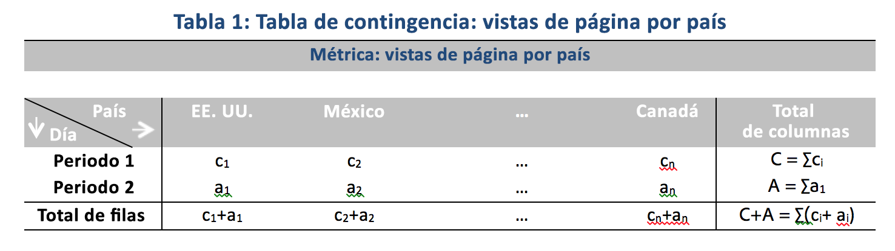

# Técnicas estadísticas utilizadas en los análisis de contribución

El análisis de contribución es un proceso de aprendizaje automatizado intensivo diseñado para descubrir qué contribuye a una anomalía observada en Adobe Analytics. El propósito es ayudar al usuario a descubrir las áreas de interés u oportunidades para un análisis adicional de forma más rápida de lo que sería posible de otro modo.

El análisis de contribución lo logra realizando un algoritmo de dos partes en cada elemento de dimensión disponible para el informe de análisis de contribución del usuario. El algoritmo opera en este orden:

1. Para cada dimensión, calcula la estadística de la prueba V de Cramer. En el siguiente ejemplo, observe una tabla de contingencia con vistas de página por países en dos periodos de tiempo:

   

   En la Tabla 1, la V de Cramer puede utilizarse para medir la asociación entre las vistas de página por países para el período 1 (por ejemplo, histórico) y el período 2 (por ejemplo, el día en que se produjo la anomalía). Un valor bajo para la V de Cramer implica un bajo nivel de asociación. La V de Cramer oscila entre 0 (sin asociación) y 1 (asociación completa). La estadística de V de Cramer se puede calcular:

   

1. Para cada elemento de dimensión, el Residual de persona (PR) se utiliza para medir la asociación entre la métrica anómala y cada elemento de dimensión. PR sigue un estándar de distribución normal, el cual permite que el algoritmo compare las PR de dos variables aleatorias incluso si las desviaciones no son comparables. En la práctica, el error no es conocido y se calcula utilizando una corrección de muestra infinita.

   En el ejemplo anterior de la tabla 1, la PR, con corrección de muestra finita por país “i” y un periodo de tiempo 2 está determinado por

   

   Aquí,

   

   (Se puede obtener una fórmula similar para el periodo de tiempo 1).

   Para los resultados finales, la puntuación de cada elemento de dimensión se ponderará mediante la medición V de Cramer y se cambiará a un número entre 0 y 1 para proporcionar su puntuación de contribución.

