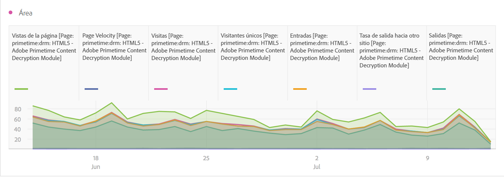
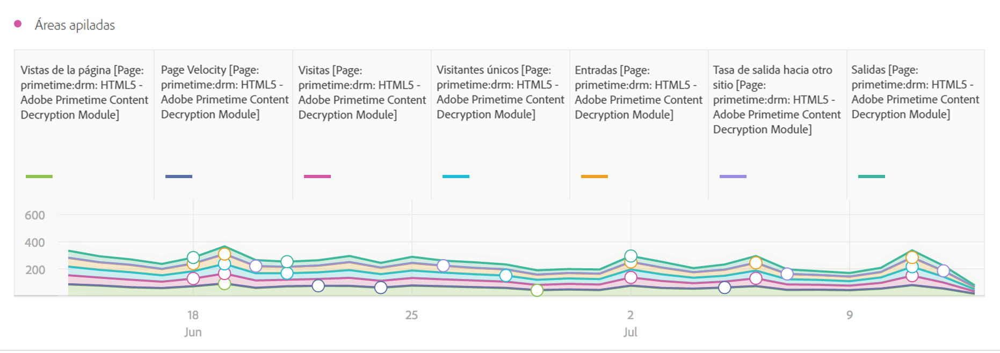
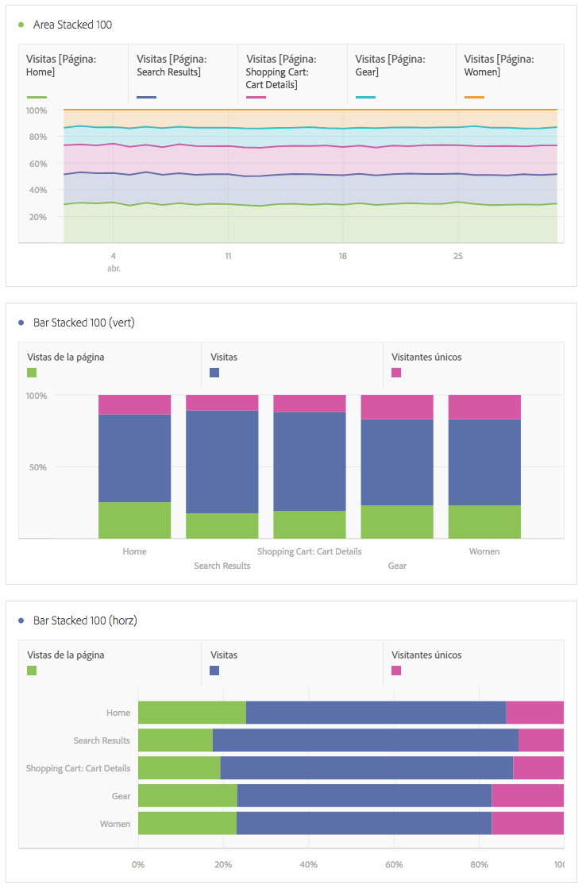

# Área y área apilada

## Área {#section_FDC4B6AA944F4F8AAAEAA5E17359F28A}

Esta visualización es similar a un gráfico de líneas, pero incluye una zona coloreada bajo la línea. Utilice un gráfico de áreas cuando tenga varias métricas y desee visualizar el área a la que hace referencia la intersección de dos o más métricas.

## Area stacked {#section_922BBC5A6D254778A050DF710B0BD8D9}

Esta visualización es similar a un gráfico de áreas, pero cada serie comienza en la parte superior de la serie anterior.

Una nueva configuración en las visualizaciones de áreas apiladas convierte el gráfico en una visualización apilada al 100 %.

