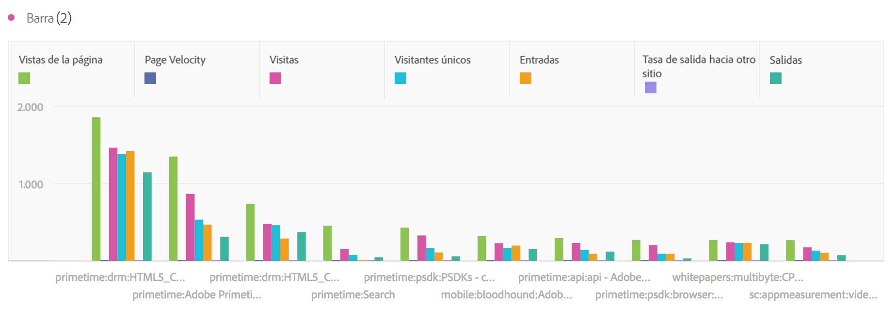
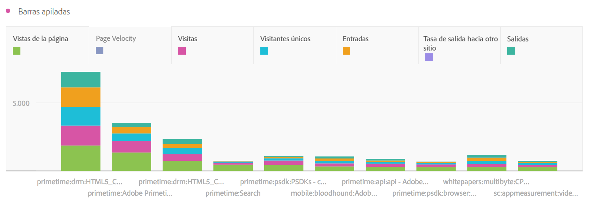

# Barra y barra apilada

## Barra {#section_2E96E55D4E8E488CBCA6A3508DDF3918}

Esta visualización muestra las barras verticales que representan los distintos valores de una o varias métricas.

Un menú desplegable de granularidad en la configuración de visualización le permite cambiar una visualización de tendencias (p. ej., una línea o una barra) de diaria a semanal, mensual, etc.

## Barra apilada {#section_9EA83779AE964635907EE5031A785A49}

Esta visualización es similar a un gráfico de barras, pero con las barras de series apiladas en la parte superior de cada barra.

Una nueva configuración en las visualizaciones de barras apiladas convierte el gráfico en una visualización apilada al 100 %:

