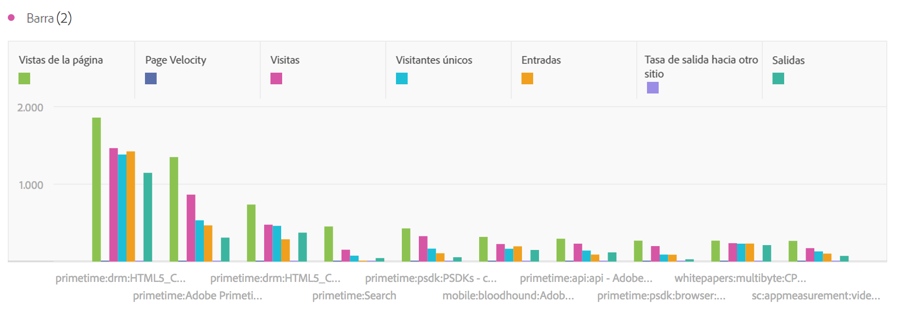
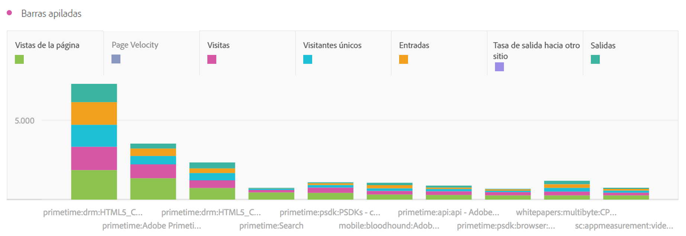

# Barra (apilada)

>[!BEGINSHADEBOX]

_Este artículo documenta las visualizaciones de barras y barras apiladas en_  _**Adobe Analytics**._ _Vea [barras y barras apiladas](https://experienceleague.adobe.com/es/docs/analytics-platform/using/cja-workspace/visualizations/bar) para la_  _**versión de Customer Journey Analytics** de este artículo._

>[!ENDSHADEBOX]

La visualización de barras tiene una opción estándar y apilada.

## Barra {#bar}

<!-- markdownlint-disable MD034 -->

>[!CONTEXTUALHELP]
>id="workspace_bar_button"
>title="Barra"
>abstract="Cree una visualización de barras para representar varios valores en una o varias métricas."

<!-- markdownlint-enable MD034 -->

La visualización  **[!UICONTROL Barra]** muestra las barras verticales que representan varios valores en una o varias métricas.

Un menú desplegable de granularidad en la configuración de visualización le permite cambiar una visualización de tendencias (p. ej., una línea o una barra) de diaria a semanal, mensual, etc.

## Barra apilada {#bar-stacked}

<!-- markdownlint-disable MD034 -->

>[!CONTEXTUALHELP]
>id="workspace_barstacked_button"
>title="Barra apilada"
>abstract="Cree una visualización de barras para representar varios valores en una o varias métricas apiladas."

<!-- markdownlint-enable MD034 -->

La visualización  **[!UICONTROL Barra apliada]** es similar a un gráfico de barras, pero con las barras de series apiladas una encima de la otra.

Use la opción **[!UICONTROL Apilada al 100 %]** en  **[!UICONTROL Configuración]** para convertir el gráfico en una visualización apilada al 100 %.

>[!MORELIKETHIS]
>
>[Agregar una visualización a un panel](/help/analyze/analysis-workspace/visualizations/freeform-analysis-visualizations.md#add-visualizations-to-a-panel)
>[Configuración de la visualización](/help/analyze/analysis-workspace/visualizations/freeform-analysis-visualizations.md#settings)
>[Menú contextual de visualización](/help/analyze/analysis-workspace/visualizations/freeform-analysis-visualizations.md#context-menu)
>