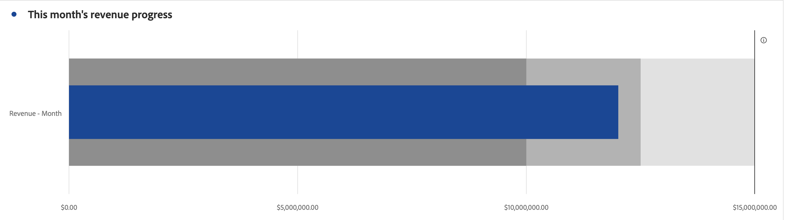

# Viñeta {#bullet}

<!-- markdownlint-disable MD034 -->

>[!CONTEXTUALHELP]
>id="workspace_bullet_goalvalue"
>title="Valor de meta"
>abstract="**[!UICONTROL Meta alta]** es el objetivo principal que busca. **[!UICONTROL Meta baja]** y **[!UICONTROL Meta media]** crean intervalos por debajo de la [!UICONTROL Meta alta]. Nota: Cuando la opción **[!UICONTROL Porcentajes]** esté marcada, escriba las metas como números enteros. Por ejemplo: `20` si su meta es el veinte por ciento."

<!-- markdownlint-enable MD034 -->

<!-- markdownlint-disable MD034 -->

>[!CONTEXTUALHELP]
>id="workspace_bullet_button"
>title="Viñeta"
>abstract="Cree una visualización de gráfico de viñetas para mostrar cómo se compara una métrica con intervalos de rendimiento (objetivos) o se compara con ellos."

<!-- markdownlint-enable MD034 -->

>[!BEGINSHADEBOX]

_Este artículo documenta la visualización de viñetas en_  _&#x200B;**Adobe Analytics**._ _Consulte [Viñeta](https://experienceleague.adobe.com/es/docs/analytics-platform/using/cja-workspace/visualizations/bullet-graph) para la versión_  _&#x200B;**Customer Journey Analytics** de este artículo._

>[!ENDSHADEBOX]

La visualización  **[!UICONTROL Viñeta]** muestra cómo se compara o mide una métrica con los rangos de rendimiento (objetivos).

El gráfico de bala presenta una única medida principal (por ejemplo, los ingresos anuales actuales hasta la fecha) y permite introducir intervalos cualitativos de rendimiento (por ejemplo, en comparación con los ingresos objetivo). Puede especificar rangos altos, medios y bajos. Puede especificar rangos de metas en  **[!UICONTROL Configuración]**.

>[!BEGINSHADEBOX]

Consulte  [Visualización del gráfico de viñetas](https://video.tv.adobe.com/v/23989/?quality=12/?quality=12){target="_blank"} para ver un vídeo de demostración.

>[!ENDSHADEBOX]

## Configuración

Puede definir una configuración específica para una visualización de [!UICONTROL viñeta].

| Configuración | Descripción |
|---|---|
| **[!UICONTROL Opciones de viñeta]** | Especifique valores para **[!UICONTROL Meta alta]**, **[!UICONTROL Meta media]** y **[!UICONTROL Meta baja]** en la visualización de [!UICONTROL Viñeta].  **[!UICONTROL Meta alta &#x200B;]**&#x200B;es el objetivo principal que busca.**[!UICONTROL &#x200B; Meta baja &#x200B;]**&#x200B;y&#x200B;**[!UICONTROL &#x200B; Meta media &#x200B;]**&#x200B;crean intervalos por debajo de la Meta alta. Nota: Cuando la opción&#x200B;**[!UICONTROL &#x200B; Porcentajes &#x200B;]**&#x200B;esté marcada, escriba las metas como números enteros. Por ejemplo: `20` si su meta es el veinte por ciento. |

>[!MORELIKETHIS]
>
>[Añadir una visualización a un panel](/help/analyze/analysis-workspace/visualizations/freeform-analysis-visualizations.md#add-visualizations-to-a-panel)
>&#x200B;>[Configuración de visualización](/help/analyze/analysis-workspace/visualizations/freeform-analysis-visualizations.md#settings)
>&#x200B;>[Menú contextual de visualización](/help/analyze/analysis-workspace/visualizations/freeform-analysis-visualizations.md#context-menu)
>

