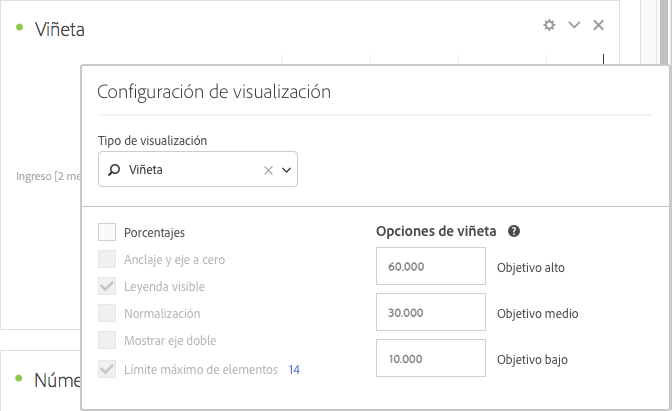

# Gráfico de viñetas

Le permite ver cómo se compara un valor que le interese con otros rangos de rendimiento (objetivos).

El gráfico de bala presenta una única medida principal (por ejemplo, los ingresos anuales actuales hasta la fecha) y permite introducir intervalos cualitativos de rendimiento (por ejemplo, en comparación con los ingresos objetivo). Puede especificar alto, medio y bajo. Puede especificar intervalos objetivo en [!UICONTROL Configuración de visualización].
