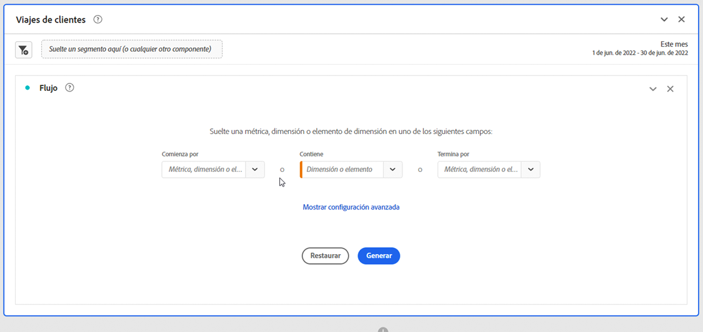
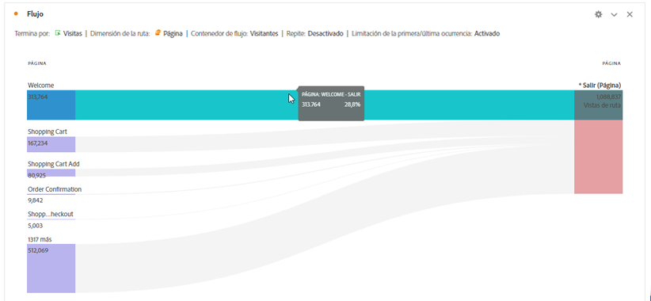
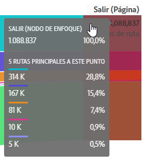
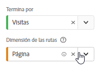
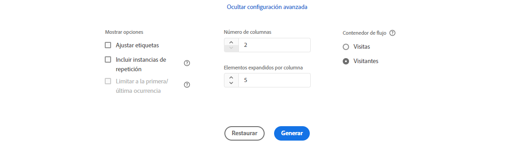

# Configuración de una visualización de flujo {#configure-a-flow-visualization}

>[!CONTEXTUALHELP]
>id="workspace_flow_startswith"
>title="Comienza con"
>abstract="Este campo solo se puede establecer en la compilación inicial. Para actualizar este campo, seleccione **[!UICONTROL Restablecer]** para generar una nueva visualización de flujo."

>[!CONTEXTUALHELP]
>id="workspace_flow_contains"
>title="Contiene"
>abstract="Este campo solo se puede establecer en la compilación inicial. Para actualizar este campo, seleccione **[!UICONTROL Restablecer]** para generar una nueva visualización de flujo."

>[!CONTEXTUALHELP]
>id="workspace_flow_endswith"
>title="Finaliza con"
>abstract="Este campo solo se puede establecer en la compilación inicial. Para actualizar este campo, seleccione **[!UICONTROL Restablecer]** para generar una nueva visualización de flujo."

>[!CONTEXTUALHELP]
>id="workspace_flow_pathingdimension"
>title="Dimensión de las rutas"
>abstract="Seleccione una dimensión para utilizarla como ruta de acceso o de salida del componente seleccionado."

>[!CONTEXTUALHELP]
>id="workspace_flow_container"
>title="Contenedor de flujo"
>abstract="Seleccione el contenedor que desea utilizar para mostrar (números para) las rutas."

>[!CONTEXTUALHELP]
>id="workspace_flow_include_repeats_disabled"
>title="Incluir repeticiones (deshabilitado)"
>abstract="Las repeticiones no se pueden eliminar de las visualizaciones de flujo que incluyen dimensiones de varios valores."

>[!CONTEXTUALHELP]
>id="workspace_flow_include_repeats_default"
>title="Incluir repeticiones"
>abstract="Las visualizaciones de flujo se basan en instancias de una dimensión. Esta configuración le da la opción de incluir o excluir instancias repetidas, por ejemplo: recargas de página."

>[!CONTEXTUALHELP]
>id="workspace_flow_limit_occurrence"
>title="Limitar a la primera/última ocurrencia"
>abstract="Los resultados se limitan a rutas cuando el primer/último punto de contacto es una entrada/salida."

>[!CONTEXTUALHELP]
>id="workspace_flow_numberofcolumns"
>title="Número de columnas"
>abstract="Este campo solo se puede establecer en la compilación inicial. Para actualizar este campo, seleccione **[!UICONTROL Restablecer]** para generar una nueva visualización de flujo."

>[!CONTEXTUALHELP]
>id="workspace_flow_itemsexpandedpercolumn"
>title="Elementos expandidos por columna"
>abstract="Este campo solo se puede establecer en la compilación inicial. Para actualizar este campo, seleccione **[!UICONTROL Restablecer]** para generar una nueva visualización de flujo."

>[!CONTEXTUALHELP]
>id="workspace_flow_resettoupdate"
>title="Restablecer para actualizar"
>abstract="Este campo solo se puede establecer en la compilación inicial. Para actualizar este campo, seleccione **[!UICONTROL Restablecer]** para generar una nueva visualización de flujo."

Las visualizaciones de flujos le permiten comprender los recorridos que se derivan de un evento de conversión específico en el sitio web o la aplicación, o que conducen a él. Traza una ruta a través de las dimensiones (y elementos de dimensión) o las métricas. 

Las visualizaciones de flujos le permiten configurar el inicio o el final de la ruta que le interesa o analizar todas las rutas que fluyen a través de una dimensión o un elemento de dimensión.

## Usar

1. Añada una visualización  **[!UICONTROL Flujo]**. Consulte [Añadir una visualización a un panel](../freeform-analysis-visualizations.md#add-visualizations-to-a-panel).

1. Ancle la visualización de flujo mediante una de las opciones siguientes:

   * [!UICONTROL **Comienza con**] (métricas, dimensiones o elementos), o
   * [!UICONTROL **Contiene**] (dimensiones o elementos), o
   * [!UICONTROL **Finaliza con**] (métricas, dimensiones o elementos)

   Cada una de estas categorías se muestra como *zona de colocación*. Puede rellenar la zona de colocación de tres formas:

   * Utilice el menú desplegable para seleccionar métricas o dimensiones.
   * Arrastre las dimensiones o métricas del panel izquierdo.
   * Empiece a escribir el nombre de una dimensión o métrica y, a continuación, selecciónela cuando aparezca en la lista desplegable.

   >[!IMPORTANT]
   >
   >Las métricas calculadas no se pueden usar con los campos **[!UICONTROL Comienza con]** o **[!UICONTROL Termina con]**.

1. Si elige una métrica, también debe proporcionar una [!UICONTROL **Dimensión de rutas**] para usar como ruta de acceso o de salida del componente seleccionado, como se muestra aquí. El valor predeterminado es [!UICONTROL **Página**].

   

1. (Opcional) Seleccione **[!UICONTROL Mostrar ajustes avanzados]** para configurar cualquiera de las siguientes opciones:

   | Configuración | Descripción |
   | --- | --- |
   | **[!UICONTROL Etiquetas de ajustes]** | Normalmente, las etiquetas de los elementos de flujo se truncan para ahorrar espacio en la pantalla, pero puede hacer la etiqueta entera visible al marcar esta casilla.  Valor predeterminado = sin marcar. |
   | **[!UICONTROL Incluir instancias de repetición]** | Las visualizaciones de flujo se basan en instancias de una dimensión. Esta configuración le da la opción de incluir o excluir instancias repetidas, por ejemplo, recargas de página. Sin embargo, las repeticiones no se pueden eliminar de las visualizaciones de flujo que incluyen dimensiones multivalor, como listVars, listProps, s.product, eVars de comercialización, etc. 
Esta opción está desactivada de forma predeterminada.
 |
   | **[!UICONTROL Limitar a la primera/última ocurrencia]** | Limite las rutas a aquellas que comienzan/terminan con la primera/última ocurrencia de una dimensión, un elemento o una métrica. Consulte [Limitar a la primera/última ocurrencia](#example-scenario-for-limit-to-firstlast-occurrence) para obtener una explicación más detallada. |
   | **[!UICONTROL Número de columnas]** | El número de columnas que quiere incluir en el diagrama de flujo. Puede especificar hasta un máximo de 5 columnas. |
   | **[!UICONTROL Elementos expandidos por columna]** | Cuántos elementos desea incluir en cada columna. Puede especificar un máximo de 10 elementos expandidos por columna. |
   | **[!UICONTROL Contenedor de flujo]** | Se permite alternar entre **[!UICONTROL Sesiones]** y **[!UICONTROL Persona]** para analizar las rutas seguidas. Esta configuración le permite comprender el compromiso de la persona a nivel de persona (a lo largo de las sesiones) o restringir el análisis a una única sesión. |

   >[!IMPORTANT]
   >
   >La combinación de **[!UICONTROL Número de columnas]** y **[!UICONTROL Elementos expandidos por columna]** determina el número de solicitudes subyacentes necesarias para crear la visualización del flujo. Cuanto más altos sean esos números, más tiempo se tarda en procesar una visualización.

1. Seleccione **[!UICONTROL Generar]**.

### Ejemplo

Suponga que desea rastrear la ruta que siguieron los usuarios tanto hacia como desde las páginas más populares de su sitio.

1. Cree una visualización de flujo tal como se ha descrito anteriormente.
1. Arrastre la dimensión [!UICONTROL **Página**] al campo **[!UICONTROL Contiene]** y, a continuación, seleccione [!UICONTROL **Generar**].
1. La visualización de flujo se genera con la página más vista visible en el nodo de enfoque en el centro de la visualización. También verá las páginas principales que llevan a esa página (a la izquierda del nodo de enfoque), así como las páginas principales que salen de esa página (a la derecha del nodo de enfoque).
1. Analice los datos en el flujo, tal como se describe en [Configurar](#configure).

## Configuración

En la parte superior de las visualizaciones aparece un resumen de la configuración de flujo. Las rutas del diagrama son proporcionales. Las rutas con más actividad se muestran más gruesas.

Para explorar en profundidad los datos, tiene varias opciones:

* El diagrama de flujo es interactivo. Pase el ratón por encima del diagrama para cambiar los detalles que se muestran.

* Al seleccionar en un nodo del diagrama, aparecen los detalles de dicho nodo. Seleccione de nuevo el nodo para contraerlo.

  

* Puede filtrar una columna para mostrar solo ciertos resultados, como incluir y excluir, especificar criterios, etc.

* Seleccione  en el lado izquierdo o derecho para expandir una columna.

* Para personalizar la salida, use las opciones del [menú contextual](#context-menu).

* Para editar el flujo o reconstruirlo con diferentes opciones, seleccione  junto al resumen de la configuración.

## Filtro

Por encima de cada columna aparece un  cuando pasa el ratón por encima. Al hacer clic en el filtro, obtiene el mismo cuadro de diálogo de filtro que existe en la tabla de forma libre. Consulte [Filtrar y ordenar](freeform-table/../../freeform-table/filter-and-sort.md).

* Utilice **[!UICONTROL Mostrar configuración avanzada]** para configurar los ajustes avanzados para incluir o excluir determinados criterios con una lista de operadores. Consulte [Filtros y ordenación](../freeform-table/filter-and-sort.md) para obtener más información.
* Una vez filtrada una columna, esa columna específica refleja el filtrado. Un  azul indica que la columna está filtrada.  El filtro reduce la columna para mostrar solo el elemento permitido en el filtro. También elimina todos los elementos, excepto el elemento que desee en el filtro.
* Todas las columnas descendentes y ascendentes deben persistir, siempre y cuando haya datos que fluyen a los nodos que quedan.
* Para quitar un filtro, seleccione  para abrir el menú de filtros. Quite los filtros aplicados y, a continuación, seleccione **[!UICONTROL Guardar]**. El flujo volverá a su estado anterior sin filtrar.

## Menú contextual

Utilice un menú contextual en cualquier nodo de la visualización de flujo con las siguientes opciones:

| Opción | Descripción |
|--- |--- |
| **[!UICONTROL Centrarse en este nodo]** | Cambia el interés al nodo seleccionado. El nodo de interés aparece en el centro del diagrama de flujo. |
| **[!UICONTROL Volver a empezar]** | Le hace regresar al generador de diagramas de forma libre, donde puede crear un nuevo diagrama de flujo. |
| **[!UICONTROL Crear un filtro para esta ruta]** | Crear un filtro. Esta selección le lleva al Generador de filtros, donde puede configurar el nuevo filtro. |
| **[!UICONTROL Desglose]** | Desglosa el nodo mediante las dimensiones, métricas o tiempo disponibles. |
| **[!UICONTROL Filtrar columna]** | Aparecerán las mismas opciones de filtro que están disponibles en la tabla de forma libre. Para obtener más información acerca de las opciones disponibles, consulte la sección &quot;Aplicar un filtro simple o avanzado a una tabla&quot; en [Filtrar y ordenar tablas](/help/analyze/analysis-workspace/visualizations/freeform-table/filter-and-sort.md). |
| **[!UICONTROL Excluir elemento]** o **[!UICONTROL Restaurar elementos excluidos]** | Quita un nodo específico de la columna y lo crea automáticamente como filtro en la parte superior de la columna. Para restaurar el elemento excluido, seleccione en el menú contextual **[!UICONTROL Restaurar elemento excluido]**. También puede abrir el filtro en la parte superior de la columna y quitar el recuadro con el elemento que acaba de excluir. |
| **[!UICONTROL Tendencia]** | Crea un diagrama de tendencia para el nodo. |
| **[!UICONTROL Mostrar columna siguiente]** / **[!UICONTROL Mostrar columna anterior]** | Muestra la columna siguiente (derecha) o anterior (izquierda) de la visualización. |
| **[!UICONTROL Ocultar columna]**n | Oculta la columna seleccionada de la visualización. |
| **[!UICONTROL Expandir toda la columna]** | Expande una columna para mostrar todos los nodos. De forma predeterminada, únicamente se muestran los cinco nodos principales. |
| **[!UICONTROL Crear audiencia a partir de la selección]** | Crea una audiencia basada en la columna seleccionada. |
| **[!UICONTROL Contraer toda la columna]** | Oculta todos los nodos de una columna. |

## Limitar a la primera/última ocurrencia

Al utilizar esta opción, tenga en cuenta que:

* **[!UICONTROL Limitar a primera/última incidencia]** solo cuenta la primera/última incidencia de la serie. Todas las demás ocurrencias de los criterios **[!UICONTROL Comienza con]** o **[!UICONTROL Finaliza con]** se descartan.
* Si se usa con un flujo de **[!UICONTROL Comienza con]**, solo se incluye la primera incidencia que coincida con los criterios de inicio.
En el ejemplo siguiente, se incluyen **todas** las ocurrencias de *Añadir al carro de compras* y *Categoría principal del producto* en cada paso del flujo.
  

  En el ejemplo siguiente, solo se incluyen las **primeras** ocurrencias de *Añadir al carro de compras* y *Categoría principal del producto* en cada paso del flujo.
  
* Si se usa con un flujo **[!UICONTROL Finaliza con]**, solo se incluye la última ocurrencia que coincida con los criterios de finalización.
En el ejemplo siguiente, se incluyen **todas** las ocurrencias de *Categoría principal del producto* y *Añadir al carro de compras* en cada paso del flujo.
  

  En el ejemplo siguiente, solo se incluyen las **últimas** ocurrencias de *Categoría principal del producto* y *Añadir al carro de compras* en cada paso del flujo.
  
* La serie utilizada difiere según el contenedor. Si se usa el contenedor **[!UICONTROL Persona]**, la serie de eventos es la sesión. Si se usa el contenedor **[!UICONTROL Sesión]**, la serie de eventos son todos los eventos de un usuario determinado en el intervalo de fechas proporcionado.
* La opción **[!UICONTROL Limitar a la primera/última ocurrencia]** puede configurarse en los ajustes avanzados cuando se utiliza un elemento de métrica o dimensión en los campos **[!UICONTROL Comienza con]** o **[!UICONTROL Termina con]**.

>[!MORELIKETHIS]
>
>[Añadir una visualización a un panel](/help/analyze/analysis-workspace/visualizations/freeform-analysis-visualizations.md#add-visualizations-to-a-panel)
>[Configuración de visualización](/help/analyze/analysis-workspace/visualizations/freeform-analysis-visualizations.md#settings)
>[Menú contextual de visualización](/help/analyze/analysis-workspace/visualizations/freeform-analysis-visualizations.md#context-menu)
>

<!--
## Create a flow visualization {#configure}

1. Add a blank panel to your project and click the visualizations icon in the left rail. 

   Or
   
   Add a visualization in any of the ways described in the "Add visualizations to a panel" section in [Visualizations overview](/help/analyze/analysis-workspace/visualizations/freeform-analysis-visualizations.md).

1. Anchor your Flow visualization using one of the following options:

   * [!UICONTROL **Starts with**] (metrics, dimensions, or items), or
   * [!UICONTROL **Contains**] (dimensions, or items), or
   * [!UICONTROL **Ends with**] (metrics, dimensions, or items)

   Each of these categories is shown onscreen as a "drop zone." You can populate the drop zone in 3 ways:

   * Use the drop-down menu to select metrics or dimensions.
   * Drag dimensions or metrics from the left rail.
   * Begin typing the name of a dimension or metric, then select it when it appears in the drop-down list.

   >[!IMPORTANT]
   >
   >Calculated metrics cannot be used in the  **[!UICONTROL Starts with]** or **[!UICONTROL Ends with]** fields.

1. If you choose a metric, you also need to provide a [!UICONTROL **Pathing Dimension**] to use as your path leading to or coming from your selected component, as shown here. The default is [!UICONTROL **Page**].

   

1. (Optional) Select **[!UICONTROL Show advanced settings]** to configure any of the following options:

   

   | Setting | Description |
   | --- | --- |
   | **[!UICONTROL Wrap labels]** | Normally, the labels on the Flow elements are truncated to save screen real estate, but you can make the entire label visible by checking this box.  Default = unchecked. |
   | **[!UICONTROL Include repeat instances]** | Flow visualizations are based on instances of a dimension. This setting gives you the option to include or exclude repeated instances, e.g. Page reloads. However, repeats cannot be removed from Flow visualizations that include multi-valued dimensions, such as listVars, listProps, s.product, merchandising eVars, etc. 
This option is disabled by default.
 |
   | **[!UICONTROL Limit to first/last occurrence]** | Limit paths to those that start/end with the first/last occurrence of a dimension/item/metric. See the section below, [Example scenario for 'limit to first/last occurrence'](#example-scenario-for-limit-to-firstlast-occurrence), for a more detailed explanation. |
   | **[!UICONTROL Number of columns]** | The number of columns you want in your Flow diagram. You can specify a maximum of 5 columns. |
   | **[!UICONTROL Items expanded per column]** | The number of items you want in each column. You can specify a maximum of 10 items expanded per column.  |
   | **[!UICONTROL Flow container]** | <ul><li>Visit</li><li>Visitor</li></ul> Lets you switch between Visit and Visitor to analyze visitor pathing. These settings help you understand visitor engagement at the visitor level (across visits), or constrain the analysis to a single visit.|

   >[!IMPORTANT]
   >
   >The combination of **[!UICONTROL Number of columns]** and **[!UICONTROL Items expanded per column]** determine the number of underlying requests required to create the flow visualization. The higher those numbers, the longer it takes to render a visualization.

1. Select **[!UICONTROL Build]**.

>[!INFO]
>
>**Example:** Suppose that you want to trace the path that users took both to and from the most popular pages on your site.
>
>To do this, you would
> 
>1. Begin creating a flow visualization as described above.
>1. Drag the [!UICONTROL **Page**] dimension into the **[!UICONTROL Contains]** field, then select [!UICONTROL **Build**].
>1. The Flow visualization builds with the most-viewed page visible in the focus node in the center of the visualization. You also see the top pages leading into that page (to the left of the focus node) as well as the top pages leading out of that page (to the right of the focus node).
>1. Analyze data in the flow, as described in [View and change the Flow output](#view-and-change-the-flow-output).

## View and change the Flow output {#output}

A summary of the Flow configuration appears at the top of the diagram. The thickness of a path in the diagram is proportional to its activity, with paths with more activity appearing thicker than those with less activity.

To drill down further into the data, you have several options:

* The flow diagram is interactive. Mouse over the diagram to change the details that are shown.

* When you select on a node in the diagram, the details for that node appear. Select on the node again to collapse it.

   

* You can filter a column to display only certain results, such as including and excluding, specifying criteria, and so forth.

* Select the plus sign (+) on the left to expand a column.

* Use the right-click options explained below to further customize the output.

* Select the pencil icon next to the configuration summary to further edit the flow or rebuild it with different options.

* You can also export and further analyze your Flow diagram as part of a project's .CSV file by going to **[!UICONTROL Project]** > **[!UICONTROL Download CSV]**.

## Filtering

Above each column, a filter appears when you hover over it. By selecting the filter, you get the same filter dialog that exists in the Freeform table today. This filter works the same as it does in the Freeform table.

* Use advanced settings to include or exclude certain criteria with our list of operators.
* Once you have filtered an item from the list, that specific column will reflect the filtering. (The filter either reduces it to only show the item allowed in the filter, or it removes all items except for the one item you want in the filter.
* All downstream and upstream columns should persist, as long as there is data flowing into the remaining nodes.
* Once applied, the filter icon appears in blue above the column it is filtering.
* To remove a filter, select the filter icon to open the filter menu. Remove any filters applied and then select **[!UICONTROL Save]**. The flow should return to its previous, unfiltered state.

## Right-click options {#right-click}

| Option | Description |
|--- |--- |
| [!UICONTROL Start over] | Returns you to the Freeform diagram builder, where you can build a new Flow diagram. |
| [!UICONTROL Create segment for this path] | Create a segment. This takes you into the Segment Builder, where you can configure the new segment. |
| [!UICONTROL Breakdown] | Break the node down by available Dimensions, Metrics, or Time. |
| [!UICONTROL Trend] | Create a trended diagram for the node. |
| Show next column / Show previous column | Reveals the next (right) or previous (left) column of the visualization. |
| Hide column | Hides the selected column from the visualization. | 
| [!UICONTROL Expand entire column] | Expand a column to show all nodes. By default, only the top five nodes display. |

## Example scenario for 'limit to first/last occurrence'

When using this option, keep in mind that:

* **[!UICONTROL Limit to first/last occurrence]** counts only the first/last occurrence in the series. All other occurrences of the **[!UICONTROL Starts with]** or **[!UICONTROL Ends with]** criteria are discarded.
* If used with a **[!UICONTROL Starts with]** flow, only the first occurrence that matches the start criteria is included.
* If used with an **[!UICONTROL Ends with]** flow, only the last occurrence that matches the end criteria will be included.
* The series used differs based on the container. If using the **[!UICONTROL Visit]** container, the series of hits will be the session. If using the **[!UICONTROL Visitor]** container, the series of hits will be all the hits for a given user in the provided date range.
* The **[!UICONTROL Limit to first/last occurrence]** option can be configured in the advanced settings when using a Metric or Dimension Item in the "Starts with" or "Ends with" fields.

Example series of hits:

Home > Products > Add to cart > Products > Add to Cart > Billing > Order Confirmation

### Consider a flow analysis using the following settings:

* Start with[!UICONTROL  Add to cart] (Dimension Item)
* [!UICONTROL Page] pathing dimension
* [!UICONTROL Visit] container

If **[!UICONTROL Limit to first/last occurrence]** is *disabled*, then this single series of hits counts 2 occurrences of "Add to Cart".
Expected Flow Output:
"Add to Cart" (2) —> "Products" (1)
                  -> "Billing" (1)

However, if **[!UICONTROL Limit to first/last occurrence]** is *enabled*, only the first occurrence of "Add to cart" is included in the analysis.
Expected Flow Output:
"Add to Cart" (1) —> "Products" (1)

### Consider the same series of hits but using the following settings:

* Ends with [!UICONTROL Add to cart] (Dimension Item)
* [!UICONTROL Page] pathing dimension
* [!UICONTROL Visit] container

If **[!UICONTROL Limit to first/last occurrence]** is *disabled*, then this single series of hits would count 2 occurrences of "Add to Cart".
Expected Flow Output:
"Products" (2) <— "Add to cart" (2)

However, if **[!UICONTROL Limit to first/last occurrence]** is *enabled*, only the last occurrence of [!UICONTROL Add to cart] would be included in the analysis.
Expected Flow Output:
"Products" (1) <— "Add to cart" (1)

-->