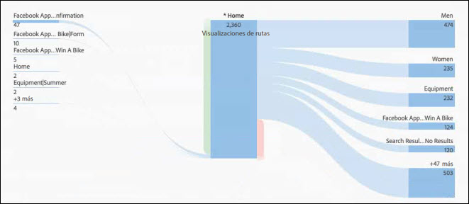
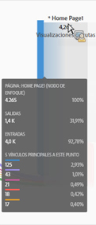
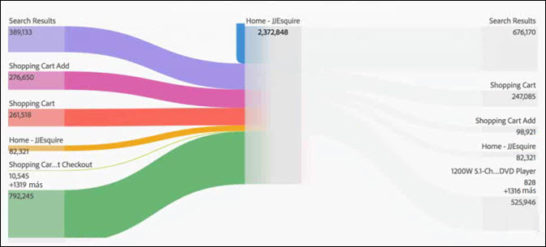
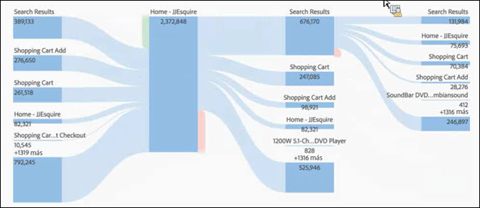

# Configurar una visualización de flujo

El flujo le permite seguir la ruta en páginas o dimensiones como eVars:

* Entrada (solo dimensiones)
* Dimensiones o elementos
* Salida (solo dimensiones)

Cada una de estas categorías se muestra como “zona de colocación”. Arrastre elementos de la lista y suéltelos en la zona de colocación deseada. Los elementos que no sean dimensiones solo pueden soltarse en la zona de colocación media. Si suelta una dimensión en la zona, se ejecuta un informe que inserta los principales elementos para dicha dimensión.

Cuando arrastra un elemento a la zona de colocación, se abre el diagrama de flujo. El contenido del diagrama de flujo depende de la zona de colocación donde suelte la dimensión o elemento. Salir y Entrada muestran todos los elementos para la dimensión (como páginas) que suelte en la zona de colocación de entrada o salida. Por ejemplo, si suelta una dimensión en la zona de colocación central, se abre el diagrama de flujo de dicha dimensión.

Pase el ratón sobre el nodo de interés en el centro del diagrama para ver la información de dicho nodo.

El diagrama de flujo es interactivo. Pase el ratón por encima del diagrama para cambiar los detalles que se muestran.

Las rutas del diagrama son proporcionales. Las rutas con más actividad se muestran más gruesas.

Cuando hace clic en un nodo en el diagrama, se muestran los detalles de dicho nodo. Por ejemplo, si hace clic en **[!UICONTROL Resultado de la búsqueda]en la zona superior derecha, el diagrama se amplía y muestra más detalles sobre el nodo de resultados.** Haga clic de nuevo en un nodo para contraerlo.

De forma predeterminada, el diagrama muestra los cinco flujos principales. Si hace clic en el nodo **[!UICONTROL Más]en la zona inferior del diagrama, el diagrama se amplía para mostrar cinco flujos más.** Siga haciendo clic en **[!UICONTROL Más]para ampliar hasta que no queden flujos adicionales que mostrar.**

No existe limitación a la exploración dentro de un diagrama de flujo.

You can also export and further analyze your Flow diagram as part of a project's .CSV file by going to **[!UICONTROL Project]** &gt; **[!UICONTROL Download CSV]**.
