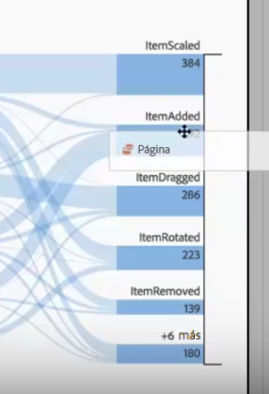

# Flujos interdimensionales

Un flujo interdimensional le permite examinar las rutas del usuario entre diversas dimensiones.

Existe una etiqueta de dimensión en la parte superior de cada columna Flujo que hace que el uso de varias dimensiones en una visualización de flujo sea más intuitivo:

Observaremos dos casos de uso: un caso de uso de aplicación y un caso de uso web.

## Use case one: app {#section_3D31D37B9C9F4134AE46C96291E41294}

La dimensión [!UICONTROL Nombre de la acción] se ha añadido al flujo, donde el principal elemento devuelto es [!UICONTROL ItemAdded]:

Para explorar la interacción entre pantallas/páginas y acciones en esta aplicación, puede arrastrar la dimensión de página a múltiples lugares, en función de qué desee explorar:

* Arrástrela al final de la zona de colocación (dentro de la zona rectangular enmarcada en negro que aparece) para **sustituir** a los principales resultados en los extremos:

    

* Arrástrela al espacio en blanco al final (observe el horquillado negro) para **añadir en** la visualización:

   

Este es el resultado si decide sustituir el elemento ItemScaled de la columna derecha por la dimensión Página. El resultado principal ahora cambia por el resultado principal de la dimensión Página:

Ahora puede ver cómo se mueven los clientes entre las acciones y páginas. Puede explorar aún más el flujo si hace clic en distintos nodos:

Esto es lo que sucede si añade otra dimensión Nombre de la acción al final de la visualización:

Esto permite obtener información exhaustiva y realizar posibles cambios a la aplicación que está analizando.

## Use case two: web {#section_8D55983FA0C84926995270052AE01CD8}

Este caso de uso le muestra cómo puede analizar qué campañas obtienen el máximo número de entradas al sitio web.

Arrastre la dimensión Nombre de campaña a un nuevo flujo:

Ahora deseo ver a qué páginas están impulsando el tráfico estas campañas, por lo que arrastro la dimensión Página a la derecha de los resultados de flujo para añadirlos a la visualización:

A continuación, puede desglosar este resultado según otras métricas o dimensiones, como ingresos, visitas, etcétera.
