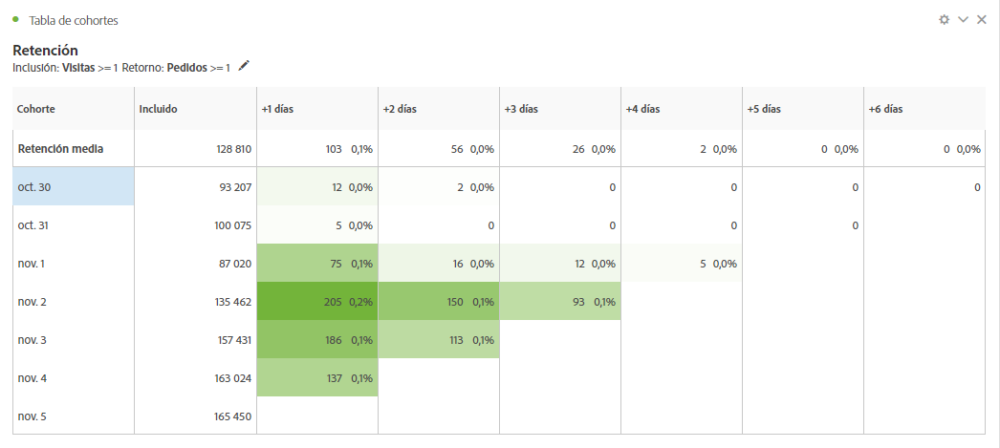
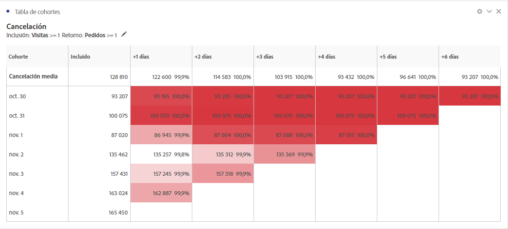
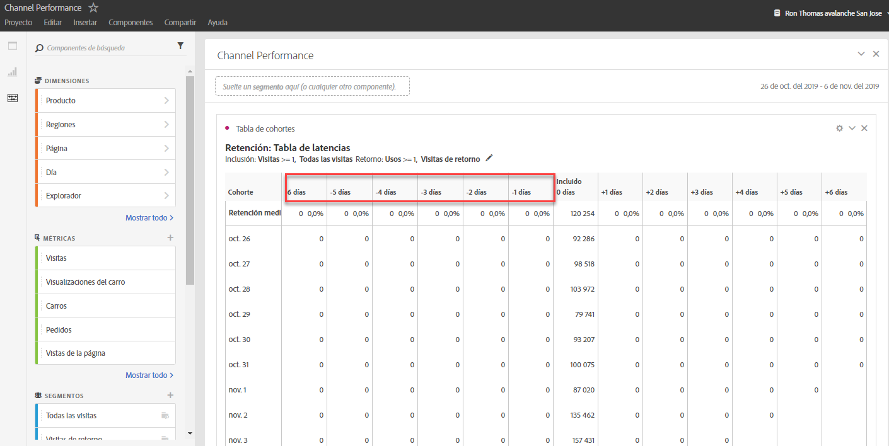
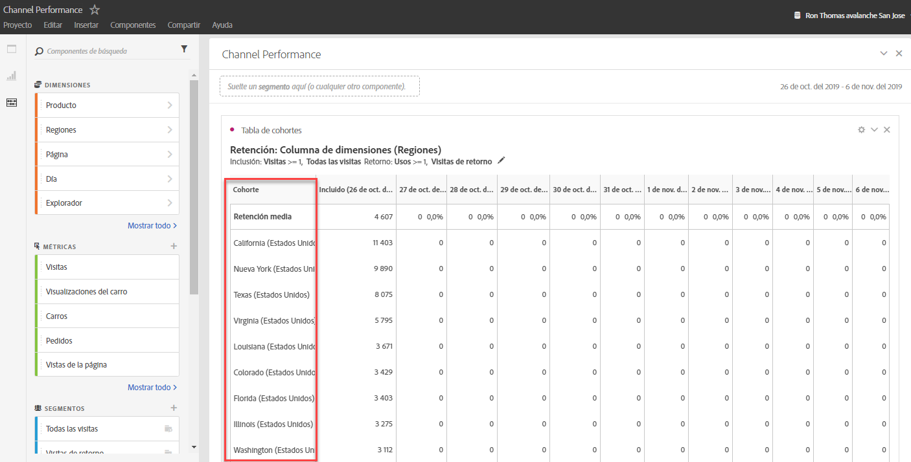

# ¿Qué es el análisis de cohorte?

A *`cohort`* is a group of people sharing common characteristics over a specified period. El análisis de cohorte resulta útil, por ejemplo, cuando desea conocer cómo se involucra una cohorte con una marca. Puede identificar fácilmente los cambios en tendencias y responder en consecuencia (Explanations of Cohort Analysis are available on the web, such as at [Cohort Analysis 101](https://en.wikipedia.org/wiki/Cohort_analysis).)

Después de crear un informe de cohorte, puede depurar sus componentes (dimensiones, métricas y segmentos específicos), y luego compartir el informe de cohorte con quien desee. Consulte [Curate and Share](../../../../analyze/analysis-workspace/curate-share/curate.md#concept_4A9726927E7C44AFA260E2BB2721AFC6).

Examples of what you can do with Cohort Analysis:

* Iniciar campañas diseñadas para generar una acción deseada.
* Modificar el presupuesto de mercadotecnia en el momento justo del ciclo de vida del cliente.
* Reconocer cuándo finalizar una prueba o una oferta, para maximizar el valor.
* Obtener ideas para pruebas A/B en áreas como precios, ruta de actualización, etc.
* Ver un informe de análisis de cohorte dentro de un informe de análisis guiado.
* Reconocer cuándo finalizar una prueba o una oferta, para maximizar el valor.
* Obtener ideas para pruebas A/B en áreas como precios, ruta de actualización, etc.

El análisis de cohorte está disponible para todos los clientes de Analytics con derechos de acceso a Analysis Workspace.

[Análisis de cohorte en YouTube](https://www.youtube.com/watch?v=kqOIYrvV-co&index=45&list=PL2tCx83mn7GuNnQdYGOtlyCu0V5mEZ8sS) (4:36)

>[!IMPORTANT]
>
>El análisis de cohorte no admite métricas calculadas.

## Cohort Analysis capabilities

En enero de 2019, Adobe lanzó una versión nueva y considerablemente mejorada del análisis de cohorte. Ofrece un control mucho más preciso de las cohortes que genera. Estas son las mejoras destacadas:

### Tabla de retención

A retention cohort report returns visitors: each data cell shows the raw number and percentage of visitors in the cohort who did the action during that time period. Se pueden incluir hasta 3 métricas y hasta 10 segmentos.

### Tabla de pérdida

Una cohorte de Churn es el inverso de una tabla de retención y muestra los visitantes que abandonaron o que nunca cumplieron los criterios de retorno para su cohorte a lo largo del tiempo. Se pueden incluir hasta 3 métricas y hasta 10 segmentos.

### Cálculo móvil

Permite calcular la retención o la pérdida en función de la columna previa, no de la columna incluida.

### Tabla de latencia

Mide el tiempo transcurrido antes y después de ocurrir el evento de inclusión. Es una excelente herramienta para el análisis previo/posterior. La columna "Incluido" está en el centro de la tabla y a ambos lados se muestran los periodos de tiempo antes y después del evento de inclusión.

### Cohorte de dimensión personalizada

Cree cohortes basadas en una dimensión seleccionada y no en el tiempo, que es el comportamiento predeterminado. Utilice dimensiones como canal de marketing, campaña, producto, página, región o cualquier otra dimensión de Adobe Analytics para mostrar cómo cambia la retención en función de los distintos valores que adoptan.

Para obtener instrucciones sobre cómo se configura y ejecuta un informe de cohorte, visite [Configurar un informe de análisis de cohorte](/help/analyze/analysis-workspace/visualizations/cohort-table/t-cohort.md).

