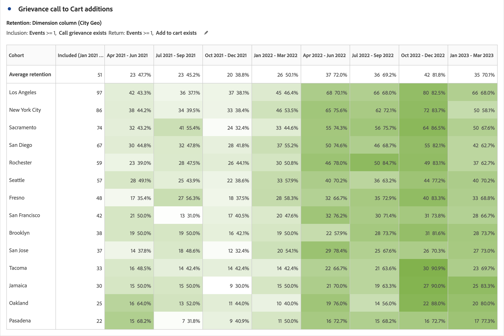

# Información general de la tabla de cohorte {#cohort-table-overview}

<!-- markdownlint-disable MD034 -->

>[!CONTEXTUALHELP]
>id="workspace_cohorttable_button"
>title="Tabla de cohortes"
>abstract="Cree una visualización de cohorte para agrupar usuarios en función de la finalización de un evento y analice la participación en curso y las cancelaciones a lo largo del tiempo."

<!-- markdownlint-enable MD034 -->

<!-- markdownlint-disable MD034 -->

>[!CONTEXTUALHELP]
>id="workspace_cohorttable_panel"
>title="Tabla de cohortes"
>abstract="Agrupe a los usuarios en función de la finalización de un evento y, a continuación, analice su participación actual y las cancelaciones a lo largo del tiempo.  **Parámetros &#x200B;** **Criterios de inclusión**: los componentes utilizados para definir las cohortes de visitantes iniciales. **Criterios de retorno**: los componentes utilizados para determinar si un visitante ha regresado."

<!-- markdownlint-enable MD034 -->

>[!BEGINSHADEBOX]

_Este artículo documenta la tabla de cohorte en_  _&#x200B;**Adobe Analytics**._ _Consulte [Tabla de cohortes](https://experienceleague.adobe.com/e/docs/analytics-platform/using/cja-workspace/visualizations/cohort-table/cohort-analysis) para la versión_  _&#x200B;**Customer Journey Analytics** de este artículo._

>[!ENDSHADEBOX]

Una *cohorte* es un grupo de personas que comparten características en común durante un periodo especificado. La visualización  **[!UICONTROL Tabla de cohorte]** es útil, por ejemplo, cuando desea saber cómo se relaciona una cohorte con una marca. Puede identificar fácilmente los cambios en tendencias y responder en consecuencia. (Las explicaciones de [!UICONTROL análisis de cohorte] se encuentran disponibles en la web, como en la [Guía básica de análisis de cohorte](https://es.wikipedia.org/wiki/Cohort_analysis)).

Después de crear un informe de cohorte, puede depurar sus componentes (dimensiones, métricas y filtros específicos), y luego compartir el informe de cohorte con quien desee. Consulte [Depurar y compartir](/help/analyze/analysis-workspace/curate-share/curate.md).

Ejemplos de lo que puede hacer con una [!UICONTROL Tabla de cohorte]:

* Iniciar campañas diseñadas para generar una acción deseada.
* Modificar el presupuesto de marketing en el momento justo del ciclo de vida del cliente.
* Reconocer cuándo debe finalizar una prueba o una oferta, para maximizar el valor.
* Obtener ideas para pruebas A/B en áreas como precios, ruta de actualización, etc.

[!UICONTROL La tabla de cohorte] está disponible para todos los clientes de Adobe Analytics con derechos de acceso a [!UICONTROL Analysis Workspace].

>[!BEGINSHADEBOX]

Consulte  [Análisis de cohorte en Analysis Workspace](https://video.tv.adobe.com/v/23990/?quality=12&learn=on){target="_blank"} para ver un vídeo de demostración.

>[!ENDSHADEBOX]

>[!IMPORTANT]
>
>El [!UICONTROL Análisis de cohorte] no admite métricas no filtrables (incluidas las métricas calculadas), métricas no enteras (como los ingresos) u ocurrencias. En el [!UICONTROL Análisis de cohorte] solo se pueden utilizar las métricas que se puden utilizar en los filtros, y solo se pueden incrementar de 1 en 1.

Las tablas de cohorte de Adobe Analytics admiten métricas basadas en doble base (o en cualquier métrica numérica). Por ejemplo, Purchase.Value (un valor doble) se puede utilizar como métrica de inclusión/retorno. Además, todas las métricas que se pasan a Adobe Experience Platform a través del conector de origen de Analytics también son dobles.

## Funcionalidades de la tabla de cohorte

En las secciones siguientes se describen las funciones de Análisis de cohorte que permiten un control preciso de las cohortes que está creando.

Para obtener información más detallada sobre cómo crear una cohorte y ejecutar un informe de [!UICONTROL Análisis de cohorte], consulte [Configuración de una tabla de cohorte](/help/analyze/analysis-workspace/visualizations/cohort-table/t-cohort.md).

### Tabla de retención

Una tabla de cohorte de [!UICONTROL retención] devuelve personas: cada celda de datos muestra el número sin procesar y el porcentaje de personas en la cohorte que realizó la acción durante ese periodo de tiempo. Se pueden incluir hasta 3 métricas y hasta 10 filtros.

### Tabla de pérdida

Una tabla de cohorte de [!UICONTROL cancelación] es la inversa de una tabla de retención y muestra a las personas que abandonaron o que no llegaron a satisfacer los criterios de regreso de su cohorte a lo largo del tiempo. Se pueden incluir hasta 3 métricas y hasta 10 filtros.

### Cálculo móvil

Puede calcular la retención o la cancelación basada en la columna anterior, no la columna incluida, que se denomina cálculo móvil.

### Tabla de latencia

Una tabla de latencia mide el tiempo que transcurre antes y después de que se produzca el evento de inclusión. Medir la latencia es una excelente herramienta para el análisis previo/posterior. La columna **[!UICONTROL Incluido]** está en el centro de la tabla y a ambos lados se muestran los periodos de tiempo antes y después del evento de inclusión.

### Cohorte de dimensión personalizada

Cree cohortes basadas en una dimensión seleccionada y no en el tiempo (que es el comportamiento predeterminado). Utilice dimensiones como [!UICONTROL Ciudad geo], [!UICONTROL Canal de marketing], [!UICONTROL campaña], [!UICONTROL producto], [!UICONTROL página], [!UICONTROL región] o cualquier otra dimensión para mostrar cómo cambia la retención. En función de los diferentes valores de estas dimensiones.

>[!MORELIKETHIS]
>
>[Configuración de una tabla de cohorte](/help/analyze/analysis-workspace/visualizations/cohort-table/t-cohort.md)
>

<!--
A *`cohort`* is a group of people sharing common characteristics over a specified period. [!UICONTROL Cohort Analysis] is useful, for example, when you want to learn how a cohort engages with a brand. You can easily spot changes in trends, then respond accordingly. (Explanations of [!UICONTROL Cohort Analysis] are available on the web, such as at [Cohort Analysis 101](https://en.wikipedia.org/wiki/Cohort_analysis).)

After creating a cohort report, you can curate its components (specific dimensions, metrics, and segments), then share the cohort report with anyone. See [Curate and Share](/help/analyze/analysis-workspace/curate-share/curate.md).

Examples of what you can do with [!UICONTROL Cohort Analysis]:

* Launch campaigns designed to spur a desired action.
* Shift marketing budget at exactly the right time in the customer lifecycle.
* Recognize when to end a trial or an offer, in order to maximize value.
* Gain ideas for A/B testing in areas such as pricing, upgrade path, and so on.

[!UICONTROL Cohort Analysis] is available for all Adobe Analytics customers with access rights to [!UICONTROL Analysis Workspace].

>[!BEGINSHADEBOX]

See  [Cohort analysis in Analysis Workspace](https://video.tv.adobe.com/v/25965?quality=12&learn=on){target="_blank"} for a demo video.

>[!ENDSHADEBOX]

>[!IMPORTANT]
>
>[!UICONTROL Cohort Analysis] does not support non-segmentable metrics (including calculated metrics), non-integer metrics (such as Revenue), or Occurrences. 
>
>Only metrics that can be used in segments can be used in [!UICONTROL Cohort Analysis], and they can only be incremented by >1 at a time. 

## Cohort Analysis capabilities

The following sections describe Cohort Analysis features that allow for fine-tuned control over the cohorts you are building.

For more detailed information about creating a cohort and running a [!UICONTROL Cohort Analysis] report, see [Configure a Cohort Analysis report](/help/analyze/analysis-workspace/visualizations/cohort-table/t-cohort.md).

### [!UICONTROL Retention] Table

A [!UICONTROL Retention] cohort report returns visitors: each data cell shows the raw number and percentage of visitors in the cohort who did the action during that time period. You can include up to 3 metrics and up to 10 segments.

>[!BEGINSHADEBOX]

See  [Calculate rolling retention](https://video.tv.adobe.com/v/25962?quality=12&learn=on){target="_blank"} for a demo video.

>[!ENDSHADEBOX]

### [!UICONTROL Churn] Table

A [!UICONTROL Churn] cohort is the inverse of a retention table and shows the visitors who fell out or never met the return criteria for your cohort over time. You can include up to 3 metrics and up to 10 segments.

>[!BEGINSHADEBOX]

See  [Churn analysis](https://video.tv.adobe.com/v/25966?quality=12&learn=on){target="_blank"} for a demo video.

>[!ENDSHADEBOX]

### [!UICONTROL Rolling Calculation]

Lets you calculate retention or churn based on the previous column, not the included column.

### [!UICONTROL Latency] Table

Measures the time that has elapsed before and after the inclusion event occurred. This is an excellent tool for pre/post analysis. The **[!UICONTROL Included]** column is in the center of the table and time periods before and after the inclusion event are shown on both sides.

### [!UICONTROL Custom Dimension] Cohort

Create cohorts based on a selected dimension, and not time-based cohorts, which are the default. Use dimensions such as [!UICONTROL marketing channel], [!UICONTROL campaign], [!UICONTROL product], [!UICONTROL page], [!UICONTROL region], or any other dimension in Adobe Analytics to show how retention changes based on the different values of these dimensions.

-->
