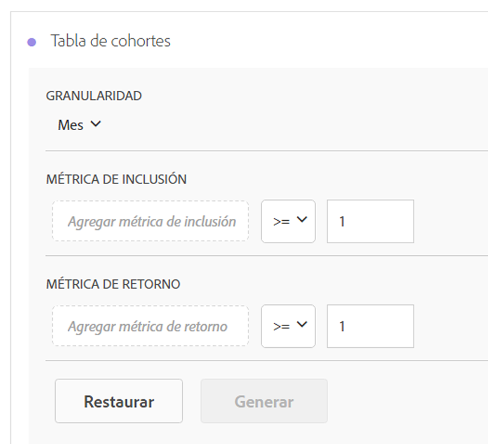
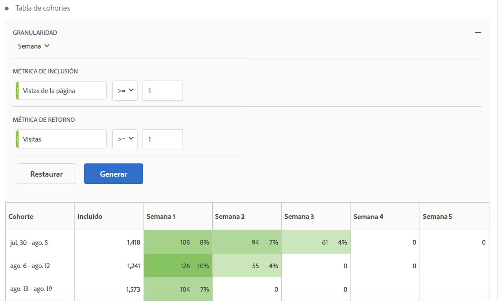

# Configurar un informe de análisis de cohorte

Cree una cohorte y ejecute un informe de análisis de cohorte en Analysis Workspace.

1. In Analysis Workspace, click the **[!UICONTROL Visualizations]** icon in the left rail and drag a **[!UICONTROL Cohort Table]** to the canvas.

   

1. Define the **[!UICONTROL Inclusion Criteria]**, **[!UICONTROL Return Criteria]**, **[!UICONTROL Cohort Type]**, and **[!UICONTROL Settings]** as defined in the table below.

| Elemento | Descripción |
|--- |--- |
| **[!UICONTROL Criterios de inclusión]** | Puede aplicar hasta 10 segmentos de inclusión y hasta 3 métricas de inclusión. La métrica especifica lo que coloca a un usuario en una cohorte. Por ejemplo, si la métrica de inclusión es Órdenes, solo se incluirán en la cohorte inicial aquellos usuarios que hayan realizado una orden durante el intervalo de tiempo del análisis de cohorte. El operador predeterminado entre métricas es Y, aunque se puede cambiar a O. Además, se puede añadir filtrado numérico a estas métricas. Por ejemplo: "Visitas &gt;= 1".  |
| **[!UICONTROL Criterios de regreso]** | Puede aplicar hasta 10 segmentos de regreso y hasta 3 métricas de regreso. La métrica indica si se ha retenido al usuario (retención) o no (pérdida). Por ejemplo, si la métrica de regreso es Vistas de vídeo, solo se representarán como retenidos aquellos usuarios que hayan visto vídeos durante periodos de tiempo siguientes (después del periodo en el que se agregaron a una cohorte). Otra métrica que cuantifica la retención es Visitas. |
| **[!UICONTROL Granularidad]** | La granularidad de tiempo de Día, Semana, Mes, Trimestre o Año. |
| **[!UICONTROL Tipo]** | **** Retención (predeterminado): una cohorte de retención mide en qué medida las cohortes de visitantes regresan a su propiedad a lo largo del tiempo. Esta es la cohorte estándar que siempre hemos tenido y que indica un comportamiento de regreso y repetición por parte del usuario. Una cohorte de retención se indica con el color verde en la tabla. **[!UICONTROL Churn]**: Una canalización (también conocida como «abandono» o «visita en el orden previsto») mide la forma en que las cohortes de visitantes caen de su propiedad a través del tiempo. Pérdida = 1 - Retención. La pérdida es una buena medida de la adherencia y una oportunidad, ya que muestra con qué frecuencia no regresan los clientes. Puede utilizar la sintaxis para analizar e identificar las áreas de enfoque: qué segmentos de cohorte podría utilizar atención. A Churn Cohort is indicated by the color red in the table (similar to fallout in our **[!UICONTROL Flow]** visualization).  |
| **[!UICONTROL Configuración]** | **[!UICONTROL Cálculo móvil]**: calcule la retención o la pérdida en función de la columna previa, no de la columna Incluido (valor predeterminado). Cálculo móvil cambia el método de cálculo para sus periodos de "regreso". El cálculo normal encuentra de forma independiente usuarios que satisfacen los criterios de "regreso" y que fueron parte del periodo de inclusión, sin importar si estaban o no en la cohorte durante el periodo anterior. Por su parte, Cálculo móvil encuentra usuarios que satisfacen los criterios de "regreso" y que fueron parte del periodo anterior. Por tanto, Cálculo móvil filtra y canaliza a los usuarios que satisfacen de forma continua los criterios de "regreso", periodo tras periodo. Los criterios de devolución se aplican a cada uno de los periodos previos al periodo seleccionado.   **[!UICONTROL Tabla de latencia]**: una tabla de latencia mide el tiempo transcurrido antes y después de ocurrir el evento de inclusión. La latencia es muy útil para el análisis previo/posterior. Por ejemplo, si se acerca el lanzamiento de un producto o campaña y quiere realizar un seguimiento del comportamiento anterior, además de ver el desempeño posterior, la tabla de latencia muestra juntos el comportamiento anterior y el posterior para así comprobar el impacto directo. Las celdas de preinclusión en la tabla de latencia se calculan con los usuarios que satisfacen los criterios de "inclusión" en el periodo de inclusión y que después satisfacen los criterios de "regreso" en los periodos anteriores al periodo de inclusión. Tenga en cuenta que las tablas de latencia y la cohorte de dimensión personalizada no se pueden utilizar al mismo tiempo.  **[!UICONTROL Cohorte de dimensión personalizada]**: cree cohortes basadas en la dimensión seleccionada, no en el tiempo (valor predeterminado). Muchos clientes desean analizar sus cohortes en función de un criterio distinto del tiempo. La nueva función de cohorte de dimensión personalizada ofrece la flexibilidad para generar cohortes basadas en dimensiones de su elección. Utilice dimensiones como canal de marketing, campaña, producto, página, región o cualquier otra dimensión de Adobe Analytics para mostrar cómo cambia la retención en función de los distintos valores que adoptan. La definición de segmento Dimensión de cohorte personalizada aplica el elemento de dimensión solo como parte del periodo de inclusión, y no como parte de la definición de devolución.  Después de elegir la opción Cohorte de dimensión personalizada, puede arrastrar y soltar cualquier dimensión que desee en la zona de colocación. De este modo puede comparar elementos de dimensión similares durante el mismo periodo de tiempo. Por ejemplo, puede comparar el rendimiento de ciudades, de productos, de campañas, etcétera. Devuelve sus 14 elementos de dimensión principales. Sin embargo, puede utilizar un filtro (al que se accede manteniendo el puntero a la derecha de la dimensión que ha arrastrado) para que solo se muestren los elementos de dimensión que desee. No es posible utilizar una cohorte de dimensión personalizada junto a la función de tablas de latencia.  |

1. Adjust the **[!UICONTROL Cohort Table Settings]** by clicking the gear icon.

| Configuración | Descripción |
| Mostrar sólo porcentaje | Elimina el valor numérico y sólo muestra el porcentaje. |
| Porcentaje redondeado al más próximo | Redondea el valor porcentual al valor entero más cercano en lugar de mostrar el valor decimal. |
| Mostrar fila porcentual promedio | Inserta una fila nueva en la parte superior de la tabla y luego agrega el promedio de los valores dentro de cada columna. |

## Crear el informe Análisis de cohorte

1. Haga clic en **[!UICONTROL Crear]**.

   

   The report shows visitors who placed an order ( *`Included`* column), and who returned to your site in subsequent visits. La reducción en visitas durante el tiempo le permite identificar problemas y tomar medidas.
1. (Opcional) Cree un segmento a partir de una selección.

   Seleccione celdas (contiguas o no) y haga clic con el botón secundario en &gt; **[!UICONTROL Crear segmento de selección]**.

1. In the [Segment Builder](https://marketing.adobe.com/resources/help/en_US/analytics/segment/?f=seg_build), further edit the segment, then click **[!UICONTROL Save]**.

   El segmento guardado está disponible para usar en el panel [!UICONTROL Segmento] en Analysis Workspace.
1. Especifique un nombre y guarde su proyecto de cohorte.
1. (Optional) [Curate and share](../../../../analyze/analysis-workspace/curate-share/curate.md#concept_4A9726927E7C44AFA260E2BB2721AFC6) the project components.

   >[!NOTE]
   >
   >Debe guardar el proyecto antes de que esté disponible la depuración.

