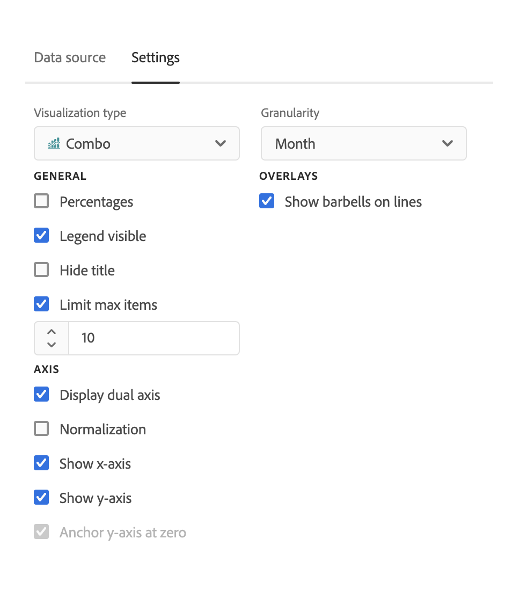

# Gráfico combinado {#combo}

<!-- markdownlint-disable MD034 -->

>[!CONTEXTUALHELP]
>id="workspace_combo_button"
>title="Combo"
>abstract="Cree una visualización de gráfico combinado rápido, sin necesidad de crear primero una tabla de forma libre."

<!-- markdownlint-enable MD034 -->

>[!BEGINSHADEBOX]

*Este artículo documenta la visualización combinada en **Adobe Analytics**. Vea [Combo](https://experienceleague.adobe.com/en/docs/analytics-platform/using/cja-workspace/visualizations/combo-charts) para la versión de **Customer Journey Analytics**de este artículo.*

>[!ENDSHADEBOX]

La visualización de [!UICONTROL gráficos combinados] facilita la creación rápida de una visualización de comparación sin tener que generar una tabla primero. Puede ver fácilmente las tendencias en sus datos en una combinación de líneas/barras.

Utilice un [!UICONTROL Gráfico combinado] para lo siguiente:

* Comparar los pedidos de esta semana con los del mismo período del mes pasado (y del año pasado), todo ello con unos pocos clics.

* Analizar y comparar rápidamente varias métricas (por ejemplo, [!UICONTROL Visitantes únicos] e [!UICONTROL Ingresos]) en el mismo gráfico.

* Analizar una métrica con una función (como [!UICONTROL Promedio acumulado]) en un horizonte temporal.

Recuerde:

* Puede agregar varias comparaciones en un solo [!UICONTROL Gráfico combinado].
* Si añade una o más comparaciones, deben ser del mismo tipo, como una [!UICONTROL Comparación temporal].
* Se pueden añadir hasta cinco comparaciones.
* Puede aplicar hasta tres filtros (segmentos) a una métrica.
* Las métricas calculadas no son compatibles con los gráficos combinados.

## Creación de un gráfico combinado

1. En la lista desplegable Visualizaciones del carril izquierdo, arrastre la visualización [!UICONTROL Gráfico combinado] a un panel en blanco.

   

1. En las listas desplegables, seleccione una dimensión para el eje X y una métrica para el eje Y.

1. Seleccione el tipo de [!UICONTROL Comparación de líneas] que desea utilizar.

   | Tipo de comparación de líneas | Definición |
   | --- | --- |
   | **[!UICONTROL Comparación del tiempo]** | El tipo de comparación más común: comparar este período de tiempo con hace cuatro semanas, por ejemplo. Si ha seleccionado [!UICONTROL Comparación temporal], realice una selección secundaria de qué período de tiempo quiere comparar.
 |
   | **[!UICONTROL Función]** | Puede introducir una función como [!UICONTROL Promedio] en la comparación. Consulte la lista de funciones admitidas a continuación.
 |
   | **[!UICONTROL Métrica secundaria]** | Por ejemplo, podría comparar [!UICONTROL Ingresos] con otra métrica.
 |

   {style="table-layout:auto"}

1. Haga clic en **[!UICONTROL Generar]**.

   El resultado será similar al siguiente:

   

   El período actual se muestra en el gráfico de barras y el período de comparación se representa mediante el gráfico de líneas. Los puntos en el gráfico de líneas se conocen como “marcadores”.

## Funciones compatibles

Si elige **[!UICONTROL Función]** como el [!UICONTROL Tipo de comparación de líneas], se devuelve una función de la métrica que haya elegido.

| Función | Definición |
| --- | --- |
| **[!UICONTROL Suma de la columna]** | Suma todos los valores numéricos de una métrica dentro de una columna (entre los elementos de una dimensión) |
| **[!UICONTROL Promedio acumulado]** | Devuelve el promedio de las últimas N filas. |
| **[!UICONTROL Mediana]** | Devuelve la mediana de una métrica en una columna. La mediana es el número central de un conjunto de números; es decir, la mitad de los valores son mayores o iguales que la mediana y la mitad son menores o iguales que la mediana. |
| **[!UICONTROL Acumulativo]** | La suma acumulada de N filas. |
| **[!UICONTROL Máximo de la columna]** | Devuelve el mayor valor en un conjunto de elementos de una dimensión para una columna de métrica. |
| **[!UICONTROL Media]** | Devuelve la media aritmética o el promedio de una métrica. |
| **[!UICONTROL Mínimo de columna]** | Devuelve el menor valor en un conjunto de elementos de una dimensión para una columna de métrica. |

{style="table-layout:auto"}

Este es un ejemplo de la media acumulada de la métrica Ingresos:

Este es un ejemplo de un gráfico combinado con las funciones Media acumulada y Media:

## Configuración de gráficos combinados

Haga clic en el icono de engranaje en la parte superior derecha de un gráfico combinado para cambiar su configuración.

| Configuración | Definición |
| --- | --- |
| **[!UICONTROL Tipo de visualización]** | Le permite cambiar a otro tipo de visualización. |
| **[!UICONTROL Granularidad]** | En las visualizaciones de tendencias, puede cambiar la granularidad de tiempo (día, semana, mes, etc.) desde esta lista desplegable. |
| **[!UICONTROL General]** |  |
| **[!UICONTROL Porcentajes]** | Muestra valores en porcentajes. |
| **[!UICONTROL Leyenda visible]** | Permite ocultar el texto de leyenda detallado para la visualización de gráficos combinados. |
| **[!UICONTROL Límite máximo de elementos]** | Reduce el número de elementos en el eje X. Si tiene un conjunto de datos grande, solo puede mostrar los primeros 10 elementos (o el valor que elija). |
| **[!UICONTROL Superposiciones]** | Muestre u oculte los marcadores en las líneas. |
| **[!UICONTROL Eje]** | |
| **[!UICONTROL Mostrar eje doble]** | Solo es aplicable si cuenta con dos métricas: puede tener un eje Y a la izquierda (para una métrica) y a la derecha (para otra métrica). Esto resulta útil cuando las métricas trazadas son de magnitudes muy diferentes. El color del eje doble coincide con el color de la tabla, a menos que haya varias comparaciones. En ese caso, el color de todas las comparaciones es gris. |
| **[!UICONTROL Normalización]** | Fuerza métricas para igualar proporciones. Esto resulta útil cuando las métricas trazadas son de magnitudes muy diferentes. |
| **[!UICONTROL Mostrar eje X]** | Muestra u oculta el eje X. |
| **[!UICONTROL Mostrar eje Y]** | Muestra u oculta el eje Y. |
| **[!UICONTROL Anclar eje Y a cero]** | Si todos los valores marcados en el gráfico están considerablemente por encima de cero, el gráfico mostrará el valor base del eje Y distinto a cero. Si marca esta casilla, el eje Y se forzará a ser cero (y se redibujará el gráfico). |

{style="table-layout:auto"}
