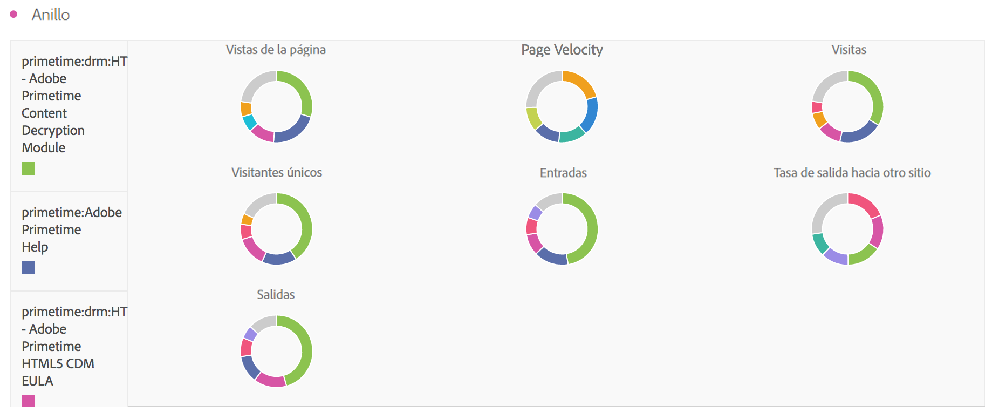

# Anillo

Similar a un gráfico circular, esta visualización muestra los datos como partes o segmentos de un todo. Utilice un gráfico de anillo para comparar porcentajes de un total, normalmente con un número reducido de elementos.

