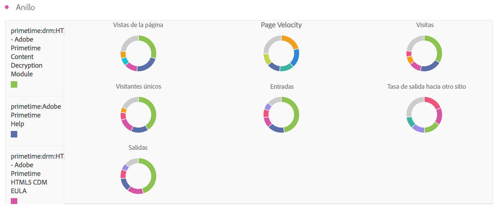

# [!UICONTROL Anillo] {#donut}

<!-- markdownlint-disable MD034 -->

>[!CONTEXTUALHELP]
>id="workspace_donut_button"
>title="Anillo"
>abstract="Cree una visualización de anillo para comparar porcentajes de un total, por lo general con un número reducido de elementos."

<!-- markdownlint-enable MD034 -->

>[!BEGINSHADEBOX]

_Este artículo documenta la visualización de Anillo en_  _&#x200B;**Adobe Analytics**._ _Ver [Anillo](https://experienceleague.adobe.com/es/docs/analytics-platform/using/cja-workspace/visualizations/donut) para la versión de_  _&#x200B;**Customer Journey Analytics** de este artículo._

>[!ENDSHADEBOX]

Similar a un gráfico circular, esta visualización de **[!UICONTROL Anillo]** muestra los datos como partes o filtros de un todo. Utilice una visualización de anillo para comparar porcentajes de un total, normalmente con un número reducido de elementos.

>[!BEGINSHADEBOX]

Vea  [Añadir una visualización de anillo](https://experienceleague.adobe.com/es/docs/analytics-learn/tutorials/analysis-workspace/visualizations/using-the-donut-visualization){target="_blank"} para ver un vídeo de demostración.

>[!ENDSHADEBOX]

>[!MORELIKETHIS]
>
>[Añadir una visualización a un panel](/help/analyze/analysis-workspace/visualizations/freeform-analysis-visualizations.md#add-visualizations-to-a-panel)
>[Configuración de visualización](/help/analyze/analysis-workspace/visualizations/freeform-analysis-visualizations.md#settings)
>[Menú contextual de visualización](/help/analyze/analysis-workspace/visualizations/freeform-analysis-visualizations.md#context-menu)
>

