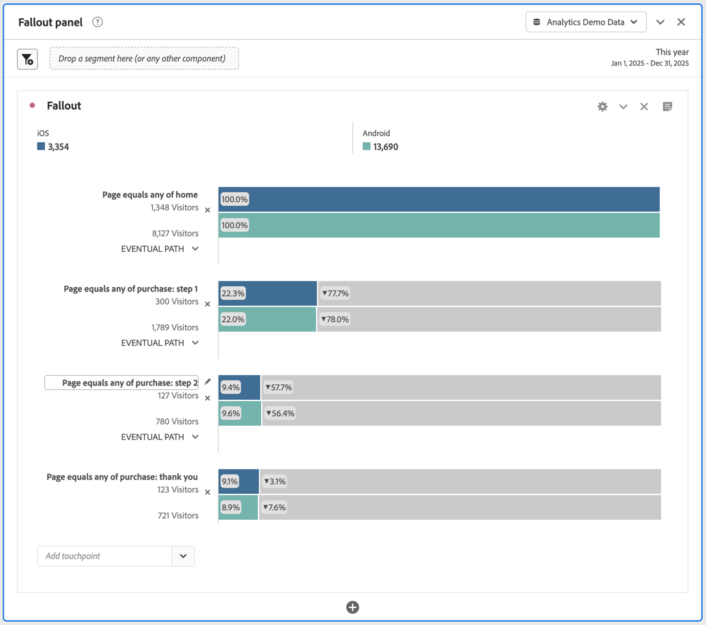

# Aplicación de segmentos en el análisis de abandonos

Puede crear segmentos a partir de un punto de contacto, añadir segmentos como punto de contacto y comparar flujos de trabajo clave entre diversos segmentos en Analysis Workspace.

>[!IMPORTANT]
>
>Los segmentos utilizados como puntos de comprobación de abandonos deben utilizar un contenedor que esté en un nivel inferior al contexto general de la visualización de abandonos. Con los abandonos respectivos a los visitantes, los segmentos utilizados como puntos de comprobación deben ser segmentos basados en visitas o visitas individuales. Con los abandonos respectivos a visitas, los segmentos utilizados como puntos de comprobación deben ser segmentos basados en visitas individuales. Si utiliza una combinación no válida, el resultado de abandonos será del 100%. Verá una advertencia en la visualización de abandonos cuando añada un segmento incompatible como punto de contacto. Determinadas combinaciones de contenedores de segmentos no válidas producirán diagramas de abandonos no válidos, como:
>
>* Cuando se usa un segmento basado en visitantes como punto de contacto dentro de una visualización de abandonos de visitantes.
>* Cuando se usa un segmento basado en visitantes como punto de contacto dentro de una visualización de abandonos de visitas.
>* Cuando se usa un segmento basado en visitas como punto de contacto dentro de una visualización de abandonos de visitas.
>

## Creación de segmentos a partir de un punto de contacto

1. Cree un segmento a partir de un punto de contacto específico en el que esté especialmente interesado y que pueda ser útil para su aplicación en otros informes. Para ello, haga clic con el botón derecho en el punto de contacto y seleccione **[!UICONTROL Crear segmento a partir de punto de contacto]**.

   

   Cuando el Generador de segmentos se abre, ya contiene el segmento secuencial creado previamente que concuerda con el punto de contacto seleccionado:

   

1. Ponga un título y una descripción al segmento y guárdelo.

   Ahora puede utilizar este segmento en cualquier proyecto que desee.

## Añadir un segmento como punto de contacto

Si desea ver, por ejemplo, la tendencia de las visitas de aplicaciones móviles y cómo afectan a las visitas en el orden previsto, solo tiene que arrastrar el segmento de visitas de aplicaciones móviles a las visitas en el orden previsto:

O puede crear un punto de contacto AND arrastrando el segmento Visitas de aplicación móvil a otro punto de comprobación.

## Comparar segmentos en abandonos

Puede comparar una cantidad ilimitada de segmentos en la visualización de visitas en el orden previsto. (Tenga en cuenta que el siguiente vídeo indica que puede comparar hasta 3 segmentos, lo que es incorrecto).

>[!BEGINSHADEBOX]

Vea  [Comparar segmentos en una visualización de visitas en el orden previsto](https://video.tv.adobe.com/v/24046?quality=12&learn=on){target="_blank"} para ver un vídeo de demostración.

>[!ENDSHADEBOX]

1. Seleccione los segmentos que quiera comparar en el panel [!UICONTROL Segmento] de la izquierda. En el ejemplo En el ejemplo, se seleccionan dos segmentos: **[!UICONTROL iOS]** y **[!UICONTROL Android]**.
1. Puede arrastrar los tres segmentos a la zona de colocación de Segmento en la parte superior de la visualización.

   

1. Opcional: puede mantener *Todas las personas* como el contenedor predeterminado o eliminar el contenedor.

1. Ahora puede comparar las visitas en el orden previsto de los tres segmentos como, por ejemplo, cuando un segmento supera a otro u otra información.
