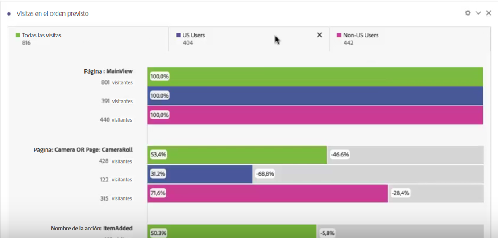

# Aplicar segmentos en el análisis de visitas en el orden previsto

Puede crear segmentos a partir de un punto de contacto, añadir segmentos como punto de contacto y comparar flujos de trabajo clave entre diversos segmentos en Analysis Workspace.

>[!IMPORTANT]
>Los segmentos utilizados como puntos de comprobación en Visitas en el orden previsto deben utilizar un contenedor que se encuentre en un nivel inferior que el contexto general de la visualización de visitas en el orden previsto. Con visitas en el orden previsto de visitante-contexto, los segmentos utilizados como puntos de comprobación deben ser segmentos basados en visitas o visitas. Con visitas en el orden previsto visita-contexto, los segmentos utilizados como punto de comprobación deben ser segmentos basados en visitas. Si utiliza una combinación no válida, las visitas en el orden previsto serán 100%. Se ha añadido una advertencia a la visualización de visitas en el orden previsto que se mostrará cuando agregue un segmento incompatible como punto de contacto. Ciertas combinaciones de contenedores de segmentos no válidos provocarán un diagrama de visitas en el orden previsto no válido, como por ejemplo

>* Cuando se usa un segmento basado en visitantes como punto de contacto dentro de una visualización de abandonos de visitantes.
>* Cuando se usa un segmento basado en visitantes como punto de contacto dentro de una visualización de abandonos de visitas.
>* Cuando se usa un segmento basado en visitas como punto de contacto dentro de una visualización de abandonos de visitas.

## Create a segment from a touchpoint {#section_915E8FBF35CD4F34828F860C1CCC2272}

1. En primer lugar, cree un segmento a partir de un punto de contacto específico en el que esté especialmente interesado y que pueda ser útil para su aplicación en otros informes. Para ello, haga clic con el botón derecho en el punto de contacto y seleccione **[!UICONTROL Crear segmento a partir de touchpoint]**.

   

   Cuando el Generador de segmentos se abre, ya contiene el segmento secuencial creado previamente que concuerda con el punto de contacto seleccionado:

   

1. Ponga un título y una descripción al segmento y guárdelo.

   Ahora puede utilizar este segmento en cualquier informe que desee.

## Add a segment as a touchpoint {#section_17611C1A07444BE891DC21EE8FC03EFC}

Si desea ver, por ejemplo, la tendencia de los usuarios de Estados Unidos y cómo afectan a las visitas en el orden previsto, solo tiene que arrastrar el segmento correspondiente a la visita en el orden previsto:

O puede crear un punto de contacto AND arrastrando el segmento de usuarios de Estados Unidos a otro punto de comprobación.

## Compare segments in fallout {#section_E0B761A69B1545908B52E05379277B56}

Puede comparar una cantidad ilimitada de segmentos en la visualización de visitas en el orden previsto.

1. Seleccione los segmentos que quiera comparar en el carril [!UICONTROL Segmentos] de la izquierda. En nuestro ejemplo, hemos seleccionado 2 segmentos: usuarios de EE. UU. y usuarios fuera de EE. UU.
1. Arrástrelos a la zona de colocación de Segmento en la parte superior.

   

1. Opcional: puede mantener “Todas las visitas” como el contenedor predeterminado o eliminarlo.

   

1. Ahora puede comparar las visitas en el orden previsto de los dos segmentos como, por ejemplo, cuando un segmento supera a otro u otra información.

