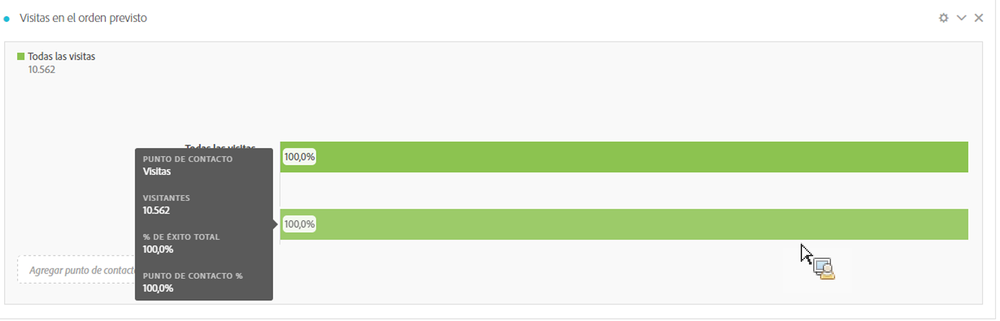

# Configurar una visualización de abandonos

Puede especificar los puntos de contacto para crear una secuencia de visitas en el orden previsto multidimensional. Normalmente, un punto de contacto es una página del sitio. Sin embargo, los puntos de contacto no se limitan a las páginas. Por ejemplo, puede agregar eventos, como unidades, así como visitantes únicos y visitas de retorno. También puede agregar dimensiones, como una categoría, un tipo de explorador o un término de búsqueda interna.

Incluso puede agregar segmentos dentro de un punto de contacto. Por ejemplo, es posible que desee comparar segmentos, como usuarios de iOS y Android. Arrastre los segmentos deseados a la parte superior de la visita en el orden previsto y la información sobre dichos segmentos se agregará al informe de visitas en el orden previsto. Si desea mostrar solo esos segmentos, puede eliminar la línea de base Todas las visitas.

No hay limitación en el número de pasos que puede agregar o en el número de dimensiones utilizadas.

Puede realizar rutas en las eVars, incluidas las eVars de comercialización y las [listVars](https://marketing.adobe.com/resources/help/es_ES/sc/implement/listN.html) (variables que pueden tener varios valores por visita, como productos, listVars, eVars de comercialización y propiedades de lista). Por ejemplo, supongamos que alguien está mirando zapatos y camisetas en una página y en la siguiente mira camisetas y calcetines. El siguiente informe de flujo de productos de zapatos será camiseta y calcetines, NO camisa.

1. Arrastre una [!UICONTROL Fallout] visualización de la lista desplegable Visualizaciones a una [!UICONTROL Freeform Table].

1. Drag the Page dimension into the Freeform Table and from there, drag a page (in this case, Home - JJEsquire) into the **[!UICONTROL Add TouchPoint]** field as the first touchpoint.

   

   Pase el ratón sobre un punto de contacto para ver si las visitas en el orden previsto y otra información sobre ese nivel, como el nombre del punto de contacto o el recuento de visitantes en ese punto y consulte el índice de éxito para ese punto de contacto (además de comparar el índice de éxito con otros puntos de contacto).

   Los números en círculos de la parte gris de la barra muestran la visita en el orden previsto entre puntos de contacto (no la visita en el orden previsto general hasta ese punto). El porcentaje de touchpoint muestra la visita en el orden previsto exitosa desde el paso anterior al paso actual en el informe de visitas en el orden previsto.

   También puede agregar una sola página al informe de visitas en el orden previsto, en lugar de toda la dimensión. Haga clic en la flecha derecha &quot;>&quot; en la dimensión de página para elegir la página específica que agregar al informe de visitas en el orden previsto.

1. Continúe agregando puntos de contacto hasta que se complete la secuencia.

   Puede **combinar varios puntos de contacto** arrastrando uno o varios más a un punto de contacto.

   >[!NOTE]
   >
   >Los segmentos se unen con AND, mientras que los elementos (como elementos de dimensión y métricas) se unen con OR.

   

1. You can also **constrain individual touchpoints to the next hit** (as opposed to &quot;eventually&quot;) within the path. Debajo de cada punto de contacto, hay un selector con las opciones &quot;Ruta eventual&quot; y &quot;Siguiente visita individual&quot;, como se muestra aquí:

   

<table id="table_A91D99D9364B41929CC5A5BC907E8985"> 
 <tbody> 
  <tr> 
   <td colname="col1"> 
Ruta eventual 
 
(Predeterminado) 
 </td> 
   <td colname="col2"> 
Se cuentan los Visitantes que "eventualmente" aterrizarán en la página siguiente de la ruta, pero no necesariamente en la siguiente visita. 
 </td> 
  </tr> 
  <tr> 
   <td colname="col1"> 
Siguiente visita individual 
 </td> 
   <td colname="col2"> 
Se cuentan los Visitantes que aterrizarán en la siguiente página de la ruta en la siguiente visita. 
 </td> 
  </tr> 
 </tbody> 
</table>

## Ajustes de abandonos {#section_0C7C89D72F0B4D6EB467F278AC979093}

| Configuración | Descripción |
|--- |--- |
| Contenedor de visitas en el orden previsto <ul><li>Visita</li><li>Visitante.</li></ul> | Permite alternar entre visitas y visitantes para analizar las rutas seguidas por los visitantes. La opción predeterminada es Visitante.  Estos ajustes le permiten comprender el compromiso del visitante a nivel de visitante (a lo largo de visitas) o restringir el análisis a una única visita. |
| Mostrar &quot;Todos los visitantes&quot; como primer punto de contacto | Puede deseleccionar esta opción si no desea que “Todos los visitantes” sea el primer punto de contacto. |

Al hacer **clic con el botón derecho en un punto de contacto**, se muestran las siguientes opciones:

| Opción | Descripción |
|--- |--- |
| Tendencia del punto de contacto | Consulte los datos de tendencia de un punto de contacto en un gráfico de líneas, con algunos datos de detección de anomalías previamente compilados. |
| Tendencia del punto de contacto (%) | Tendencia del porcentaje total de visitas en el orden previsto. |
| Tendencia de todos los puntos de contacto (%) | Alcanza la tendencia de todos los porcentajes de puntos de contacto en las visitas en el orden previsto (excepto &quot;Todas las visitas&quot;, si se incluye) en el mismo gráfico. |
| Desglosar visitas en el orden previsto en este punto de contacto | Vista qué visitantes hicieron entre dos puntos de contacto (este punto de contacto y el siguiente) si continuaron hasta el siguiente punto de contacto. Esto crea una tabla improvisada que muestra las dimensiones. Puede reemplazar dimensiones y otros elementos de la tabla. |
| Desglosar visitas en el orden previsto en este punto de contacto | Vista lo que las personas que no llegaron a través del canal hicieron inmediatamente después del paso seleccionado. |
| Crear segmento a partir de touchpoint | Cree un nuevo segmento a partir del punto de contacto seleccionado. |
