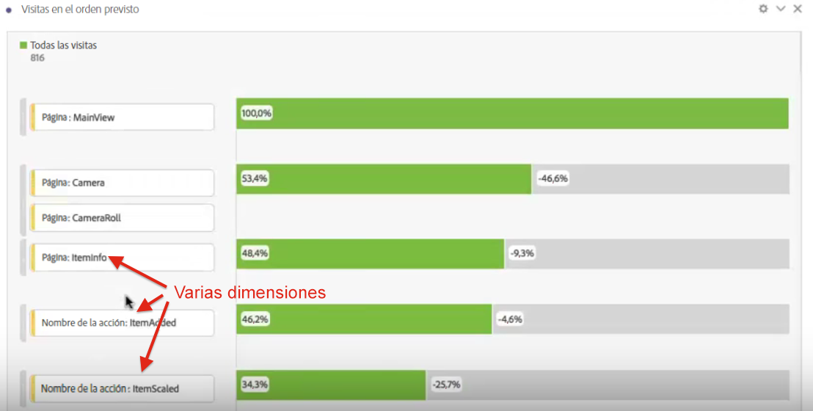
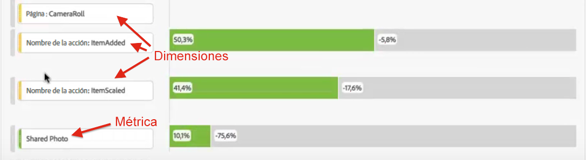
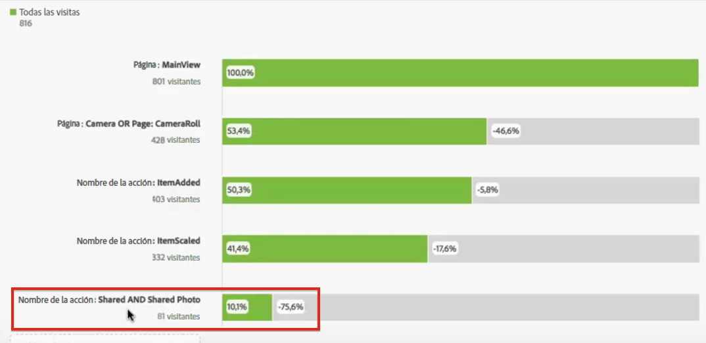

# Visita en orden previsto multidimensional

Las visitas en el orden previsto en Analysis Workspace le permiten mezclar dimensiones y métricas como puntos de contacto en embudos y flujos de trabajo. Esto le proporciona una mayor flexibilidad para definir los pasos del usuario que desea investigar.

>[!BEGINSHADEBOX]

Vea  [Abandonos multidimensional](https://video.tv.adobe.com/v/24043?quality=12&learn=on){target="_blank"} para ver un vídeo de demostración.

>[!ENDSHADEBOX]

**Ejemplo**: además de, por ejemplo, una dimensión Página, puede añadir elementos de dimensión basados en una acción a la visualización Visita en el orden previsto. Esto le permite visualizar cómo interactúan las páginas y ciertas acciones en las rutas de los clientes.

Las visitas en el orden previsto se actualizan de forma dinámica y le permiten ver las visitas en el orden previsto de múltiples dimensiones.

También puede añadir métricas a este conjunto. En este ejemplo, hemos añadido la métrica “Fotografía compartida” para complementar la ruta que han seguido los clientes:

Además, puede combinar distintas dimensiones y métricas en puntos de comprobación AND. Simplemente, arrastre otra dimensión o métrica sobre una existente:

