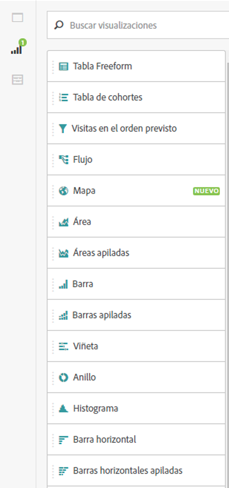
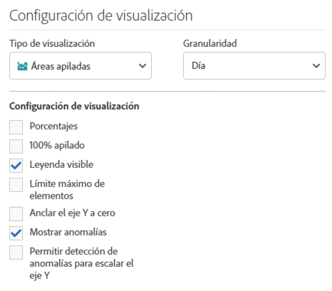
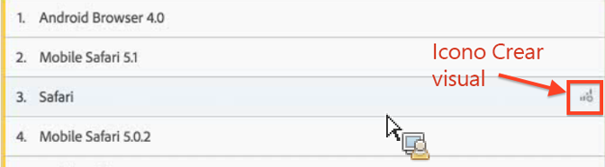
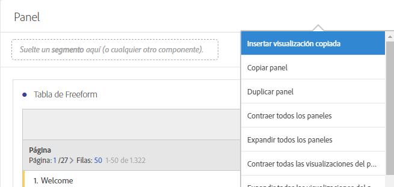

# Información general sobre las visualizaciones

Obtenga información sobre las visualizaciones y los ajustes de visualización en Analysis Workspace.

[Tipos de visualización en Analysis Workspace en YouTube](https://www.youtube.com/watch?v=b1zLEywRa6w&index=39&list=PL2tCx83mn7GuNnQdYGOtlyCu0V5mEZ8sS) (2:57)

## Visualizations panel {#section_DC07F032FBEF4046A40F7B95C28DA018}

Para mostrar el Panel de visualizaciones, haga clic en **[!UICONTROL Visualizaciones]en el panel lateral.**

La mayoría de los tipos de visualización (como los gráficos de área, barras, sectores y líneas) le resultarán familiares si utiliza Adobe Analytics. Sin embargo, Analysis Workspace proporciona una configuración de visualización y múltiples tipos de visualización únicos o nuevos con funciones interactivas.

## Visualization settings {#section_D3BB5042A92245D8BF6BCF072C66624B}

Para acceder a la [!UICONTROL configuración de visualización], arrastre una visualización al [!UICONTROL panel improvisado] y haga clic en el icono de engranaje de [!UICONTROL Configuración de visualización].

>[!IMPORTANT]
>
>La visibilidad de la visualización depende de la visualización. No todos los ajustes se aplican a todas las visualizaciones. Además, algunos ajustes avanzados aparecen **solo** para visualizaciones concretas, como [Ajustes de histograma](../../../analyze/analysis-workspace/visualizations/histogram.md#section_09D774C584864D4CA6B5672DC2927477).

<table id="table_E0695243886046979EE609FAE5D6EA00"> 
 <thead> 
  <tr> 
   <th colname="col1" class="entry"> Configuración </th> 
   <th colname="col2" class="entry"> Descripción </th> 
  </tr> 
 </thead>
 <tbody> 
  <tr> 
   <td colname="col1"> 
Porcentajes 
 </td> 
   <td colname="col2"> 
Muestra valores en porcentajes. 
 </td> 
  </tr> 
  <tr> 
   <td colname="col1"> 
Apilada al 100 % 
 </td> 
   <td colname="col2"> 
Esta configuración en las visualizaciones de áreas apiladas, barras apiladas o barras horizontales apiladas convierte el gráfico en una visualización apilada al 100 %. Ejemplo: 
 
 
 </td> 
  </tr> 
  <tr> 
   <td colname="col1"> 
Leyenda visible 
 </td> 
   <td colname="col2"> 
Le permite ocultar el texto de detalles del filtro para la visualización de Número de resumen/Resumen del cambio. 
 </td> 
  </tr> 
  <tr> 
   <td colname="col1"> 
Límite máximo de elementos 
 </td> 
   <td colname="col2"> 
Le permite limitar el número de elementos que se muestran en una visualización. 
 </td> 
  </tr> 
  <tr> 
   <td colname="col1"> 
Eje Y delimitador a cero 
 </td> 
   <td colname="col2"> 
 Si todos los valores marcados en el gráfico están considerablemente por encima de cero, el gráfico mostrará el valor base del eje Y distinto a cero. Si marca esta casilla, el eje Y se forzará a ser cero (y se redibujará el gráfico). 
 </td> 
  </tr> 
  <tr> 
   <td colname="col1"> 
Normalización 
 </td> 
   <td colname="col2"> 
Fuerza métricas para igualar proporciones. See <a href="https://marketing.adobe.com/resources/help/en_US/reference/?f=normalization" format="https" scope="external"> Normalization</a>. 
 </td> 
  </tr> 
  <tr> 
   <td colname="col1"> 
Mostrar eje doble 
 </td> 
   <td colname="col2"> 
Solo se aplica si tiene dos métricas: puede tener un eje Y a la izquierda (para una métrica) y a la derecha (para la otra métrica). 
 </td> 
  </tr> 
  <tr> 
   <td colname="col1"> 
Mostrar anomalías 
 </td> 
   <td colname="col2"> 
Mejora los gráficos de líneas y las tablas improvisadas para mostrar las anomalías de datos. 
 </td> 
  </tr> 
 </tbody> 
</table>

## Create Visual icon {#section_9C11D9DEDC42413AA53E69A71A509DFC}

Si no está seguro de qué visualización escoger, haga clic en el icono **[!UICONTROL Crear visualización]en cualquier fila de la tabla.** Dicho icono aparecerá cuando se sitúe sobre la fila de la tabla. Si hace clic en él, Analysis Workspace le dirá qué visualización sería la más adecuada para sus datos. Por ejemplo, si tiene hasta tres segmentos seleccionados, se creará un diagrama de Venn. Para más de tres segmentos, se creará un gráfico de barras. Para otros tipos de datos, es posible que se cree un gráfico de líneas, etc.

## Right-click visualization/panel menu {#section_05B7914D4C9E443F97E2BFFDEC70240C}

Se puede acceder a la configuración contextual de un gráfico si hace clic con el botón derecho junto al encabezado de una visualización o un panel. Estarán disponibles todos o algunos de los siguientes ajustes:

| Configuración | Descripción |
|--- |--- |
| Insertar visualización/panel copiado | Le permite pegar (“insertar”) el elemento copiado en otro lugar del proyecto o en otro proyecto diferente. |
| Copiar visualización/panel | Le permite hacer clic con el botón derecho y copiar una visualización o un panel. |
| Duplicar visualización/panel | Crea un duplicado exacto de la visualización actual, el cual puede modificar a continuación. |
| Contraer todos los paneles | Contrae todos los paneles del proyecto. |
| Contraer todas las visualizaciones del panel | Contrae todas las visualizaciones de este panel de proyecto. |
| Ampliar todos los paneles | Amplía todos los paneles del proyecto. |
| Ampliar todas las visualizaciones del panel | Amplía todas las visualizaciones de este panel de proyecto. |
| Editar descripción | Añade (o edita) una descripción de texto del panel/visualización. Esta descripción se muestra en Proyecto &gt; Información y configuración del proyecto . |
| Obtener vínculo del panel | Le permite dirigir a los usuarios a un panel concreto de un proyecto. |
| Obtener vínculo de visualización | Le permite copiar y compartir este vínculo para enviar a otros usuarios directamente a esta visualización. Los usuarios deberán iniciar sesión. |
| Volver a empezar | (Funciona en Flujo, Venn, Histograma) Elimina la configuración de la visualización actual y abre un panel nuevo donde puede volver a configurarla. |

## Edit legend labels {#section_94F1988CB4B9434BA1D9C6034062C3DE}

Le permite cambiar el nombre de las series en las leyendas de las visualizaciones (visitas en el orden previsto, área, área apilada, barras, barras apiladas, anillo, histograma, barras horizontales, barras horizontales apiladas, líneas, dispersión y Venn) para contribuir al uso de las imágenes.

La edición de leyendas **no** se aplica a: visualizaciones de rectángulos, viñetas, número o cambio de resumen, texto, Freeform, histograma, cohorte o flujo.

Para editar una etiqueta de leyenda en un gráfico de líneas, por ejemplo:

1. Haga clic con el botón derecho en una de las etiquetas de leyenda.
1. Haga clic en **[!UICONTROL Editar etiqueta]**.

   

1. Introduzca el nuevo texto de etiqueta.
1. Pulse **[!UICONTROL Intro]para guardar.**

Este es un [vínculo a un vídeo](https://www.youtube.com/watch?v=mry3vDrTml0&index=61&list=PL2tCx83mn7GuNnQdYGOtlyCu0V5mEZ8sS) sobre este tema.
