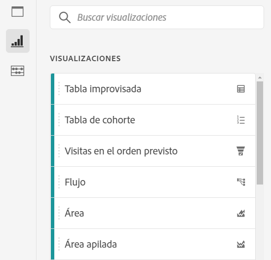
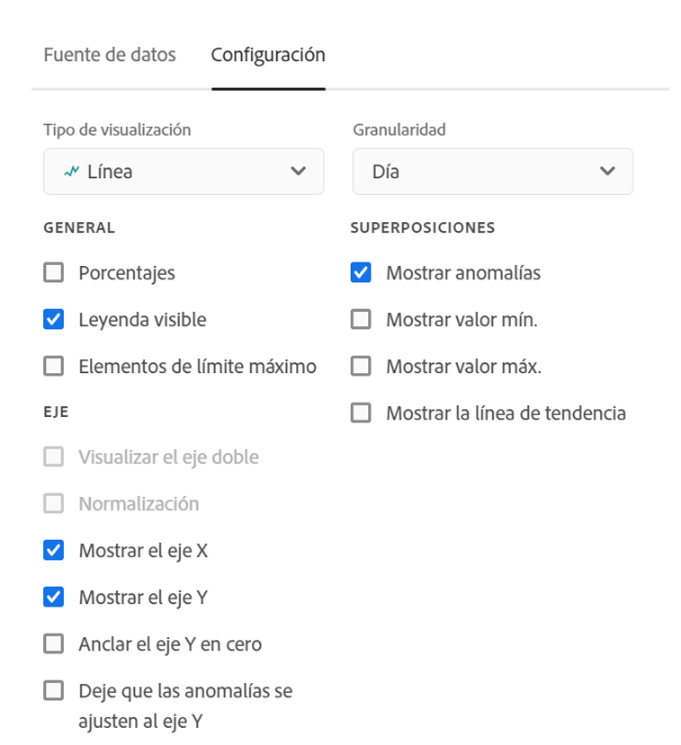
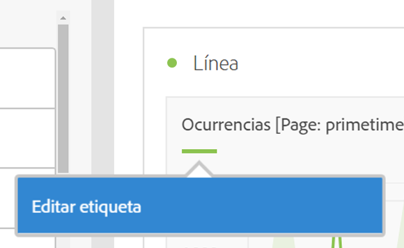
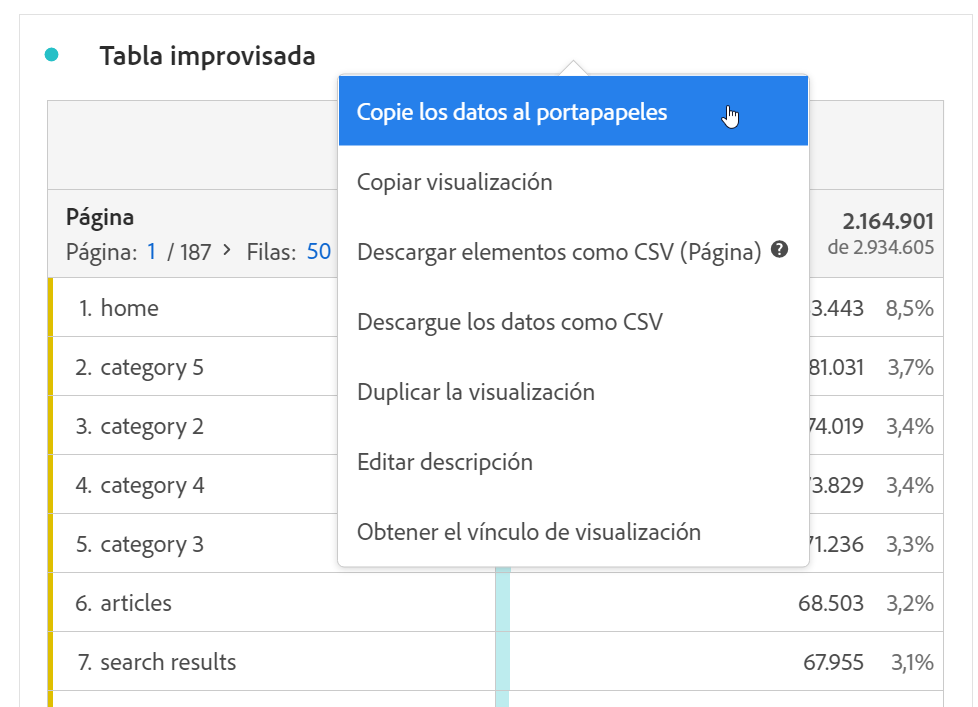
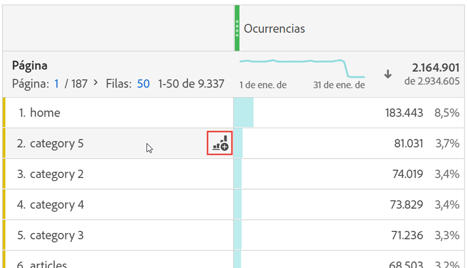

# Resumen de las visualizaciones

Workspace oferta una serie de visualizaciones que le permiten generar representaciones visuales de sus datos, como gráficos de barras, gráficos circulares, histogramas, gráficos de líneas, mapas, gráficos de dispersión, etc. La mayoría de los tipos de visualización le resultarán familiares si utiliza Adobe Analytics. Sin embargo, Analysis Workspace proporciona una configuración de visualización y múltiples tipos de visualización únicos o nuevos con funciones interactivas.

Puede acceder a las visualizaciones desde el icono superior izquierdo de Workspace, un panel [en](https://experienceleague.adobe.com/docs/analytics/analyze/analysis-workspace/panels/blank-panel.html)blanco o a través del menú que aparece al hacer clic con el botón derecho en el flujo de trabajo.

Los siguientes tipos de visualización están disponibles en Analysis Workspace:

| Nombre de la visualización | Descripción |
| --- | --- |
| [Área](/help/analyze/analysis-workspace/visualizations/area.md) | Como un gráfico de líneas, pero con un área de color debajo de la línea. Utilice un gráfico de áreas cuando tenga varias métricas y desee visualizar el área a la que hace referencia la intersección de dos o más métricas. |
| [Barra](/help/analyze/analysis-workspace/visualizations/bar.md) | Muestra las barras verticales que representan los distintos valores de una o varias métricas. |
| [Gráfico de viñetas](/help/analyze/analysis-workspace/visualizations/bullet-graph.md) | Muestra cómo se compara un valor que le interese con otros rangos de rendimiento (objetivos). |
| [Tabla de cohorte](/help/analyze/analysis-workspace/visualizations/cohort-table/cohort-analysis.md) | Una *`cohort`* es un grupo de personas que comparten características en común durante un periodo especificado. La Análisis de cohorte es útil para la retención, la generación o la análisis de latencia. |
| [Anillo](/help/analyze/analysis-workspace/visualizations/donut.md) | Similar a un gráfico circular, esta visualización muestra los datos como partes o segmentos de un todo. |
| [Abandono](/help/analyze/analysis-workspace/visualizations/fallout/fallout-flow.md) | Los informes de visitas en el orden previsto muestran dónde abandonaron los visitantes y continuaron en una secuencia de páginas predefinidas. Se puede establecer en secuencias posibles o exactas |
| [Flujo](/help/analyze/analysis-workspace/visualizations/c-flow/flow.md) | Muestra las rutas exactas de los clientes a través de los sitios web y las aplicaciones. |
| [Tabla de forma libre](/help/analyze/analysis-workspace/visualizations/freeform-table/freeform-table.md) | Una tabla improvisada no es solamente una tabla de datos, sino también una visualización interactiva. Es la base de la análisis de datos en Workspace. |
| [Histograma](/help/analyze/analysis-workspace/visualizations/histogram.md) | Un histograma crea bloques de visitantes, visitas o visitas individuales en función de un volumen de métrica. |
| [Barra horizontal](/help/analyze/analysis-workspace/visualizations/horizontal-bar.md) | Muestra las barras horizontales que representan los distintos valores de una o varias métricas. |
| [Líneas](/help/analyze/analysis-workspace/visualizations/line.md) | Representa las métricas con una línea para mostrar cómo cambian los valores con el paso del tiempo. Un gráfico de líneas utiliza el tiempo a lo largo del eje x. |
| [Mapa](/help/analyze/analysis-workspace/visualizations/map-visualization.md) | Permite crear un mapa visual de cualquier métrica (incluidas las métricas calculadas). |
| [Diagrama de dispersión](/help/analyze/analysis-workspace/visualizations/scatterplot.md) | Muestra la relación entre los elementos de dimensión y hasta tres métricas. |
| [Número de resumen](/help/analyze/analysis-workspace/visualizations/summary-number-change.md) | Muestra la celda seleccionada como un número grande. |
| [Cambio de resumen](/help/analyze/analysis-workspace/visualizations/summary-number-change.md) | Muestra el cambio entre las celdas seleccionadas como un número/porcentaje grande. |
| [Texto](/help/analyze/analysis-workspace/visualizations/text.md) | Le permite agregar texto definido por el usuario al espacio de trabajo. Útil para agregar contexto adicional a la análisis y perspectivas, además de aprovechar las descripciones de paneles y visualizaciones |
| [Gráfico de rectángulos](/help/analyze/analysis-workspace/visualizations/treemap.md) | Muestra datos de forma jerárquica (con estructura de árbol) como un conjunto de rectángulos anidados. |
| [Venn](/help/analyze/analysis-workspace/visualizations/venn.md) | Utiliza círculos para representar la superposición de métricas de hasta 3 segmentos. |

## Configuración {#settings}

Cada visualización tiene su propia configuración que puede administrar. Para acceder a Configuración [!UICONTROL de]visualización, haga clic en el icono de engranaje Configuración [!UICONTROL de] visualización.

| Configuración | Descripción |
| --- | --- |
| Tipo de visualización | Cambie el tipo de imagen que se utiliza para representar los datos. |
| Granularidad | Para las visualizaciones de tendencias, puede cambiar la granularidad de tiempo (día, semana, mes, etc.) de este menú desplegable. Este cambio también se aplica a la tabla del origen de datos. |
| Porcentajes | Muestra valores en porcentajes. |
| Apilada al 100 % | Esta configuración en visualizaciones apiladas de áreas, barras apiladas u barras horizontales convierte el gráfico en una visualización &quot;100% apilada&quot;. Ejemplo:  |
| Leyenda visible | Permite ocultar el texto de leyenda detallado para la visualización Número de resumen/Cambio de resumen. |
| Límite máximo de elementos | Le permite limitar el número de elementos que se muestran en una visualización. |
| Eje Y delimitador a cero | Si todos los valores marcados en el gráfico están considerablemente por encima de cero, el gráfico mostrará el valor base del eje Y distinto a cero. Si marca esta casilla, el eje Y se forzará a ser cero (y se redibujará el gráfico). |
| Normalización | Fuerza métricas para igualar proporciones. Esto resulta útil cuando las métricas trazadas son de magnitudes muy diferentes. |
| Mostrar eje doble | Solo es aplicable si cuenta con dos métricas: puede tener un eje Y a la izquierda (para una métrica) y a la derecha (para otra métrica). Esto resulta útil cuando las métricas trazadas son de magnitudes muy diferentes. |
| Mostrar anomalías | Mejora los gráficos de líneas y las tablas improvisadas al mostrar la detección de anomalías. La detección de anomalías en visualizaciones de línea incluye un valor esperado (línea discontinua) y un rango esperado (banda sombreada). |

## Leyenda {#legend}

Una leyenda de visualización le ayuda a relacionar la fecha de una tabla de origen con las series trazadas en la visualización. La leyenda es interactiva: puede hacer clic en un elemento de leyenda para mostrar u ocultar una serie en la visualización. Esto resulta útil si desea simplificar los datos que se están visualizando.

Además, puede cambiar el nombre de las etiquetas de leyenda para que los elementos visuales sean más consumibles. Note: legend editing does **not** apply to: Treemap, Bullet, Summary Change/Number, Text, Freeform, Histogram, Cohort or Flow visualizations.

Para editar una etiqueta de leyenda:

1. Haga clic con el botón derecho en una de las etiquetas de leyenda.
1. Haga clic en **[!UICONTROL Editar etiqueta]**.

   

1. Introduzca el nuevo texto de etiqueta.
1. Pulse **[!UICONTROL Intro]** para guardar.

Aquí tiene un [vínculo que dirige a un vídeo](https://docs.adobe.com/content/help/en/analytics-learn/tutorials/analysis-workspace/visualizations/series-label-editing.html) sobre este tema.

## Menú contextual {#right-click}

Para una visualización, puede hacer clic con el botón derecho en el encabezado de visualización para obtener más funcionalidad. La configuración variará según la visualización. Algunos de los ajustes disponibles son:

| Configuración | Descripción |
| --- | --- |
| Insertar visualización/panel copiado | Permite pegar (&quot;insertar&quot;) un panel o una visualización copiados en otro lugar del proyecto o en un proyecto completamente diferente. |
| Copiar visualización | Le permite hacer clic con el botón derecho y copiar una visualización, para poder insertarla en otro lugar del proyecto o en un proyecto completamente diferente. |
| [Descargar elementos como CSV](https://experienceleague.adobe.com/docs/analytics/analyze/analysis-workspace/curate-share/download-send.html?#download-items) | Descargue hasta 50.000 elementos de dimensión para la dimensión seleccionada como CSV. |
| [Descargue los datos como CSV](https://experienceleague.adobe.com/docs/analytics/analyze/analysis-workspace/curate-share/download-send.html?#download-data) | Descargue la fuente de datos de visualización como un CSV. |
| Duplicar visualización | Crea un duplicado exacto de la visualización actual, el cual puede modificar a continuación. |
| Editar descripción | Añada (o edite) una descripción de texto para la visualización. |
| Obtener vínculo de visualización | Permite dirigir a alguien a una visualización específica dentro de un proyecto. Cuando se hace clic en el vínculo, se requerirá que el destinatario inicie sesión antes de que se le dirija a la visualización exacta vinculada. |
| Volver a empezar | (Funciona para Flujo, Venn, Histograma) Elimina la configuración de la visualización actual para que pueda volver a configurarla desde cero. |

## Icono Crear imagen {#quick-viz}

If you are not sure which visualization to pick, click the **[!UICONTROL Create Visual]** icon in any table row (available on hover). Ésta es la forma más rápida de agregar una visualización. Si hace clic en él, Analysis Workspace le dirá qué visualización sería la más adecuada para sus datos. Por ejemplo, si tiene 1 fila seleccionada, creará un gráfico de líneas de tendencias. Si tiene 3 filas de segmentos seleccionadas, creará un diagrama de Venn.

