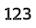
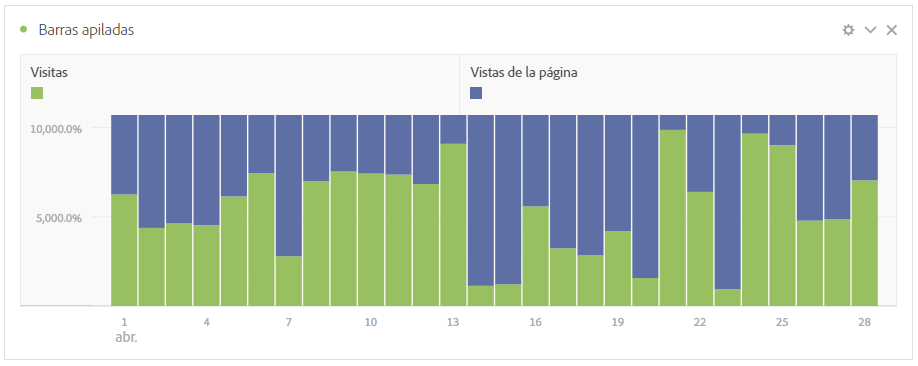

# Resumen de las visualizaciones

Workspace oferta una serie de visualizaciones que le permiten generar representaciones visuales de sus datos, como gráficos de barras, gráficos circulares, histogramas, gráficos de líneas, mapas, gráficos de dispersión, etc. La mayoría de los tipos de visualización le resultarán familiares si utiliza Adobe Analytics. Sin embargo, Analysis Workspace proporciona una configuración de visualización y múltiples tipos de visualización únicos o nuevos con funciones interactivas.

## Tipos de visualización

Los siguientes tipos de visualización están disponibles en Analysis Workspace:

| Nombre de la visualización | Descripción |
| --- | --- |
| [Área](/help/analyze/analysis-workspace/visualizations/area.md)

 | Es similar a un gráfico de líneas, pero incluye una zona coloreada bajo la línea. Utilice un gráfico de áreas cuando tenga varias métricas y desee visualizar el área a la que hace referencia la intersección de dos o más métricas. |
| [Barra](/help/analyze/analysis-workspace/visualizations/bar.md)

 | Muestra las barras verticales que representan los distintos valores de una o varias métricas. |
| [Gráfico de viñetas](/help/analyze/analysis-workspace/visualizations/bullet-graph.md)

 | Muestra cómo se compara un valor que le interese con otros rangos de rendimiento (objetivos). |
| [Tabla de cohorte](/help/analyze/analysis-workspace/visualizations/cohort-table/cohort-analysis.md)

 | Una *`cohort`* es un grupo de personas que comparten características en común durante un periodo especificado. El análisis de cohorte es útil para el análisis de retención, pérdida o latencia. |
| [Anillo](/help/analyze/analysis-workspace/visualizations/donut.md)

 | Similar a un gráfico circular, esta visualización muestra los datos como partes o segmentos de un todo. |
| [Abandono](/help/analyze/analysis-workspace/visualizations/fallout/fallout-flow.md)

 | Los informes de visitas en el orden previsto muestran dónde abandonaron los visitantes y continuaron en una secuencia de páginas predefinidas. Se puede establecer en secuencias posibles o exactas |
| [Flujo](/help/analyze/analysis-workspace/visualizations/c-flow/flow.md)

 | Muestra las rutas del cliente en sus sitios web y aplicaciones. |
| [Tabla de forma libre](/help/analyze/analysis-workspace/visualizations/freeform-table/freeform-table.md)

 | Una tabla de forma libre no es solamente una tabla de datos, sino también una visualización interactiva. Es la base del análisis de datos en Workspace. |
| [Histograma](/help/analyze/analysis-workspace/visualizations/histogram.md)

 | Un histograma agrupa a visitantes, visitas o visitas individuales en contenedores en función de un volumen de métrica. |
| [Barra horizontal](/help/analyze/analysis-workspace/visualizations/horizontal-bar.md)

 | Muestra las barras horizontales que representan los distintos valores de una o varias métricas. |
| [Resumen de métricas clave](/help/analyze/analysis-workspace/visualizations/key-metric.md)

 | Muestra las tendencias de una métrica dentro de un solo periodo de tiempo o permite comparar el rendimiento de las métricas en dos periodos de tiempo. |
| [Líneas](/help/analyze/analysis-workspace/visualizations/line.md)

 | Representa las métricas con una línea para mostrar cómo cambian los valores con el paso del tiempo. Un gráfico de líneas utiliza el tiempo a lo largo del eje x. |
| [Mapa](/help/analyze/analysis-workspace/visualizations/map-visualization.md)

 | Permite crear un mapa visual de cualquier métrica (incluidas las métricas calculadas). |
| [Diagrama de dispersión](/help/analyze/analysis-workspace/visualizations/scatterplot.md)

 | Muestra la relación entre los elementos de dimensión y hasta tres métricas. |
| [Número de resumen](/help/analyze/analysis-workspace/visualizations/summary-number-change.md)

 | Muestra la celda seleccionada como 1 número grande. |
| [Cambio de resumen](/help/analyze/analysis-workspace/visualizations/summary-number-change.md)

 | Muestra el cambio entre las celdas seleccionadas como 1 gran número/porcentaje. |
| [Texto](/help/analyze/analysis-workspace/visualizations/text.md)

 | Le permite agregar texto definido por el usuario a Workspace. Útil para añadir contexto adicional a los análisis y perspectivas, además de aprovechar las descripciones de paneles/visualizaciones |
| [Gráfico de rectángulos](/help/analyze/analysis-workspace/visualizations/treemap.md)

 | Muestra datos de forma jerárquica (con estructura de árbol) como un conjunto de rectángulos anidados. |
| [Venn](/help/analyze/analysis-workspace/visualizations/venn.md)

 | Utiliza círculos para mostrar la superposición de métricas de hasta 3 segmentos. |

## Adición de visualizaciones a un panel

1. Abra el proyecto de Analysis Workspace donde desee agregar una visualización.

1. Utilice cualquiera de los siguientes métodos para añadir la visualización:

   

   * En el panel izquierdo, seleccione  **Visualizaciones** y, a continuación, arrastre una visualización al panel al que desee agregar la visualización.

   * En el panel donde desea agregar la visualización, seleccione  y, a continuación, elija el icono que representa la visualización que desea agregar. Pase el ratón sobre el icono de cada visualización para ver el nombre.

   * Agregue un [panel en blanco](/help/analyze/analysis-workspace/c-panels/blank-panel.md) y, a continuación, seleccione la visualización que desee agregar.

   * En el menú contextual de una visualización existente en su proyecto de Analysis Workspace, seleccione **[!UICONTROL Duplicar visualización]** o **[!UICONTROL Copiar visualización]**.

   * Utilice el menú Workspace **[!UICONTROL Insert]** para insertar una visualización.

   * En el menú contextual de una tabla de forma libre, seleccione **[!UICONTROL Visualizar]**. A continuación, seleccione la visualización en el submenú. En función de la selección actual en la tabla, Workspace determina qué visualización ofrecer e interpreta los datos para crear la visualización solicitada.

## Leyenda

Una leyenda de visualización le ayuda a relacionar fechas en una tabla de origen con series trazadas en la visualización. La leyenda es interactiva: puede seleccionar un elemento de leyenda para mostrar u ocultar una serie en la visualización, lo que resulta útil si desea simplificar los datos que se visualizan.

Además, puede cambiar el nombre de las etiquetas de leyenda para que los elementos visuales sean más legibles. Nota: la edición de leyendas **no** se aplica a: visualizaciones de rectángulos, viñetas, número o cambio de resumen, texto, forma libre, histograma, cohorte o flujo.

Para editar una etiqueta de leyenda:

1. Haga clic con el botón derecho en una de las etiquetas de leyenda.
1. Haga clic en **[!UICONTROL Editar etiqueta]**.

   

1. Introduzca el nuevo texto de etiqueta.
1. Pulse **[!UICONTROL Intro]** para guardar.

### Configuración

Los ajustes de visualización disponibles dependen de la visualización. La tabla siguiente resume las configuraciones más comunes. Algunas visualizaciones sí tienen una configuración específica. Consulte la documentación de visualización individual para obtener más información.

| Opción | Descripción |
| --- | --- |
| **[!UICONTROL Tipo de visualización]** | Cambie el tipo de visualización utilizado para visualizar los datos. |
| **[!UICONTROL Granularidad]** | Cambie la granularidad de tiempo de las visualizaciones de tendencias. Este cambio también se aplica a la tabla de fuente de datos. |
| **[!UICONTROL Porcentajes]** | Mostrar valores en porcentajes. |
| **[!UICONTROL 100% apilado]** | Convierta el gráfico en una visualización apilada al 100 %.  Solo se aplica a una visualización apilada de áreas, barras y barras horizontales. |
| **[!UICONTROL Leyenda visible]** | Muestra el texto de la leyenda. |
| **[!UICONTROL Límite máximo de elementos]** | Limite el número de elementos que muestra una visualización. Cuando se selecciona, define el número máximo de elementos. |
| **[!UICONTROL Mostrar anotaciones]** | Muestre las anotaciones realizadas para esta visualización. |
| **[!UICONTROL Ocultar título]** | Oculte el título de la visualización. |
| **[!UICONTROL Anclar eje Y a cero]** | Fuerza la parte inferior del eje Y a cero. Si todos los valores marcados en el gráfico están considerablemente por encima de cero, el gráfico establece de forma predeterminada que la parte inferior del eje Y sea distinta a cero. Si activa esta opción, el eje Y se fuerza en cero (y se vuelve a dibujar el gráfico). |
| **[!UICONTROL Mostrar eje doble]** | Mostrar los ejes Y izquierdo y derecho de dos métricas diferentes. Esta opción solo se aplica si tiene dos métricas. Los ejes dobles son útiles cuando las métricas trazadas son de diferentes magnitudes. |
| **[!UICONTROL Mostrar eje X]** | Mostrar el eje x en la visualización. |
| **[!UICONTROL Mostrar eje Y]** | Mostrar el eje Y en la visualización. |
| **[!UICONTROL Mostrar puntos en las líneas]** | Mostrar puntos en la visualización de líneas en una visualización de gráfico combinado. |
| **[!UICONTROL Normalización]** | Forzar métricas para que igualen proporciones. Las proporciones iguales son útiles cuando las métricas trazadas son de diferentes magnitudes. |
| **[!UICONTROL Mostrar anomalías]** | Mejore los gráficos de líneas y las tablas improvisadas mostrando la detección de anomalías. La detección de anomalías en las visualizaciones de líneas incluye un valor esperado (línea discontinua) y un intervalo esperado (banda sombreada). |
| **[!UICONTROL Mostrar previsión]** | Mejore los gráficos de líneas y las tablas improvisadas mostrando los valores de previsión. |
| **[!UICONTROL Mostrar min]** | Mostrar el valor mínimo en la visualización. |
| **[!UICONTROL Mostrar máximo]** | Mostrar el valor máximo en la visualización. |
| **[!UICONTROL Mostrar línea de tendencia]** | Mostrar una línea de tendencia en la visualización. Cuando se selecciona, puede seleccionar el tipo de línea de tendencia en el menú desplegable. |

Puede personalizar la configuración de todas las visualizaciones que cree. Para obtener más información, consulte [Preferencias de usuario](/help/analyze/analysis-workspace/user-preferences.md).

## Menú contextual {#right-click}

Utilice el menú contextual (disponible a través de una selección alternativa, por ejemplo, hacer clic con el botón derecho cuando utilice un ratón) en un encabezado de visualización para acceder a funciones adicionales para una visualización. No todas las opciones están disponibles para todas las visualizaciones.

| Opción | Descripción |
| --- | --- |
| **[!UICONTROL Insertar visualización copiada]** | Pegue (inserte) una visualización copiada en otro lugar del proyecto o en un proyecto completamente diferente. |
| **[!UICONTROL Copiar datos al portapapeles]** | Copie los datos de la visualización en el portapapeles. |
| **[!UICONTROL Copiar selección al portapapeles]** | Copie la selección de la visualización en el portapapeles. |
| **[!UICONTROL Descargar elementos como CSV (*nombre de dimensión*)]** | Descargue los elementos de dimensión (hasta un máximo de 50 000) de la visualización en su dispositivo local. Un máximo de 50 000 elementos de dimensión para la dimensión seleccionada. |
| **[!UICONTROL Copiar visualización]** | Copie la visualización para poder insertarla en otro lugar del proyecto o en un proyecto completamente diferente. |
| **[!UICONTROL Descargar CSV de datos]** | Descargue los datos mostrados de la visualización en su dispositivo local. |
| **[!UICONTROL Duplicar visualización]** | Cree un duplicado exacto de la visualización. |
| **[!UICONTROL Editar descripción]** | Añada (o edite) una descripción de texto para la visualización. Ver [Texto](text.md). |
| **[!UICONTROL Obtener vínculo de visualización]** | Copie y comparta un vínculo directamente en la visualización. El cuadro de diálogo Compartir vínculo muestra el vínculo. Seleccione Copiar para copiar el vínculo en el portapapeles. |
| **[!UICONTROL Volver a empezar]** | Elimine la configuración de la visualización actual para poder volver a configurarla desde cero. |

## Configuración

Algunas visualizaciones (como Tabla de cohortes, Visitas en el orden previsto, Flujo y otras) tienen un cuadro de diálogo de configuración para ayudarle a crear la visualización. Use  en la parte superior de la visualización para acceder y cambiar la configuración.

## Visualizar

Si no está seguro de qué visualización escoger, seleccione  **[!UICONTROL Visualizar]** en cualquier fila de la tabla de forma libre (disponible al pasar el ratón por encima). Esta selección es la forma más rápida de agregar una visualización. Analysis Workspace realiza una suposición detallada sobre la visualización que mejor se ajustaría a sus datos. Por ejemplo, si tiene una fila seleccionada, se crea un [gráfico de líneas](line.md) con tendencias. Si tiene tres filas de filtros seleccionadas, se crea un diagrama [venn](venn.md).

<!--
## Settings {#settings}

| Setting | Description |
| --- | --- |
| Visualization Type | Change the type of visual used to depict the data. |
| Granularity | For trended visualizations, you can change the time granularity (day, week, month, etc.) from this drop-down list. This change also applies to the data source table. |
| Percentages | Displays values in percentages. |
| 100% Stacked | This setting on area stacked, bar stacked or horizontal bar stacked visualizations turns the chart into a "100% stacked" visualization. Example:  |
| Legend Visible | Lets you hide the detailed legend text for the Summary Number/Summary Change visualization. |
| Limit Max Items | Lets you limit the number of items that a visualization displays. |
| Anchor Y Axis at Zero | If all the values plotted on the chart are considerably above zero, the chart default will make the bottom of the y-axis NON-ZERO. If you check this box, the y-axis will be forced to zero (and it will re-draw the chart). |
| Normalization | Forces metrics to equal proportions. This is helpful when plotted metrics are of very different magnitudes. |
| Display Dual Axis | Only applies if you have two metrics - you can have a y-axis on the left (for one metric) and on the right (for the other metric). This is helpful when plotted metrics are of very different magnitudes. |
| Show Anomalies | Enhances line graphs and freeform tables by displaying anomaly detection. Anomaly detection in line visualizations includes an expected value (dashed line) and an expected range (shaded band). |

## Legend {#legend}

A visualization legend helps you to relate date in a source table to plotted series in the visualization. The legend is interactive - you can click a legend item to show/hide a series in the visualization. This is helpful if you want to simplify the data being visualized. 

Additionally, you can rename legend labels to help you make visuals more consumable. Note: legend editing does **not** apply to: Treemap, Bullet, Summary Change/Number, Text, Freeform, Histogram, Cohort or Flow visualizations.

To edit a legend label:

1. Right-click one of the legend labels.
1. Click **[!UICONTROL Edit Label]**.

   

1. Enter the new label text.
1. Press **[!UICONTROL Enter]** to save.

## Right-click menu {#right-click}

Additional functionality for a visualziation is available by right-clicking on the visualization header. Settings will vary by visualization. Some of the settings available are:

| Setting | Description |
| --- | --- |
| Insert Copied Panel/Visualization|Lets you paste ("insert") a copied panel or visualization to another place within the project, or into a completely different project. |
| Copy Visualization | Lets you right-click and copy a visualization, so that you can insert it to another place within the project, or into a completely different project. |
| [Download items as CSV](https://experienceleague.adobe.com/docs/analytics/analyze/analysis-workspace/curate-share/download-send.html?#download-items) | Download up to 50,000 dimension items for the selected dimension as a CSV. |
| [Download data as CSV](https://experienceleague.adobe.com/docs/analytics/analyze/analysis-workspace/curate-share/download-send.html?#download-data) | Download visualization data source as a CSV. |
| Duplicate Visualization | Makes an exact duplicate of the current visualization, which you can then modify. |
| Edit Description | Add (or edit) a text description for the visualization. |
| Get Visualization Link | Lets you direct someone to a specific visualization within a project. When the link is clicked, the recipient will be required to login before being directed to the exact visualization linked to. |
| Start Over | (Works for Flow, Venn, Histogram) Deletes the configuration for the current visualization so you can re-configure it from scratch. |

## Create Visual icon {#quick-viz}

If you are not sure which visualization to pick, click the **[!UICONTROL Create Visual]** icon in any table row (available on hover). This the the fastest way to add a visualization. Clicking it prompts Analysis Workspace to take an educated guess at which visualization would best fit your data. For example, if you have 1 row selected, it will create a trended line graph. If you have 3 segment rows selected, it will create a Venn diagram. 

## Change the scale axis on visualizations

Here is a video overview:

>[!VIDEO](https://video.tv.adobe.com/v/24708/?quality=12)

-->
