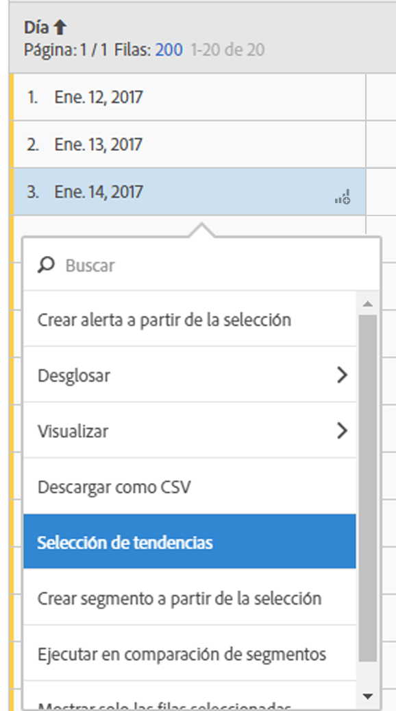

# Tabla improvisada

En Analysis Workspace, una tabla de datos (tabla improvisada) no es solamente una tabla de informe, sino también una visualización interactiva. Puede interactuar con filas aisladas, con un número de filas seleccionadas o con una tabla entera.

Puede visualizar hasta 400 filas en una tabla.

Puede interactuar con la tabla de formas exclusivas:

* [Crear una alerta](/help/components/c-alerts/alert-builder.md) a partir de una selección de tabla
* Ejecutar [desgloses](../../../analyze/analysis-workspace/components/dimensions/t-breakdown-fa.md#task_B594DA2476E84DFDA8279E831F0BD9C4) y crear segmentos en línea (clic con el botón derecho)
* Run [visualizations](../../../analyze/analysis-workspace/visualizations/freeform-analysis-visualizations.md#concept_09242627629147A88A68F1506954C276) on specific cells
* Export rows to [CSV](../../../analyze/analysis-workspace/curate-share/download-send.md#concept_BB548979F47F45739679B830428C3025)
* Ejecutar visualizaciones de [tendencias](../../../analyze/analysis-workspace/analysis-workspace-features.md#section_34930C967C104C2B9092BA8DCF2BF81A) de celdas seleccionadas
* Crear  [segmentos](../../../analyze/analysis-workspace/components/t-freeform-project-segment.md#task_11C6A2C7717B48049E5750B9D20FEC80) a partir de una selección
* Perform a [segment comparison](../../../analyze/analysis-workspace/c-panels/c-segment-comparison/segment-comparison.md#concept_74FAC1C6D0204F9190A110B0D9005793)
* Muestre solamente las filas seleccionadas.

See [Create an Analysis Workspace project](../../../analyze/analysis-workspace/build-workspace-project/t-freeform-project.md#task_C2C698ACC7954062A28E4784911E6CF2) for more information.
