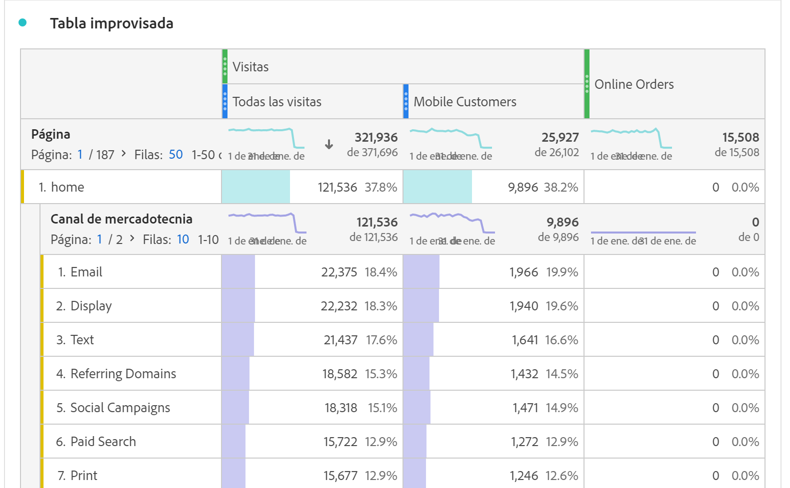
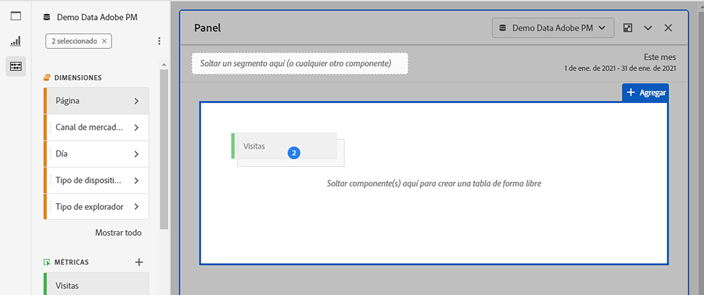
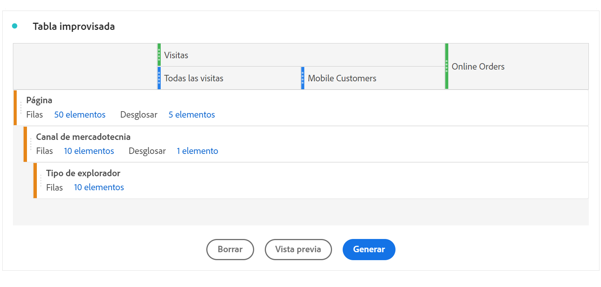

# Información general sobre las tablas de forma libre {#freeform-table-overview}

<!-- markdownlint-disable MD034 -->

>[!CONTEXTUALHELP]
>id="workspace_freeformtable_button"
>title="Tabla de forma libre"
>abstract="Cree una visualización de tabla de forma libre vacía que pueda elaborar con dimensiones, segmentos, métricas e intervalos de fechas. Puede utilizar la tabla de forma libre como base para otras visualizaciones."

<!-- markdownlint-enable MD034 -->

>[!BEGINSHADEBOX]

_Este artículo documenta la visualización de tabla de forma libre en_  _&#x200B;**Adobe Analytics**._ _Consulte [Tabla de forma libre](https://experienceleague.adobe.com/es/docs/analytics-platform/using/cja-workspace/visualizations/freeform-table/freeform-table) para la versión de_  _&#x200B;**Customer Journey Analytics** de este artículo._

>[!ENDSHADEBOX]

En Analysis Workspace, la visualización de una  **[!UICONTROL Tabla de forma libre]** es la base del análisis interactivo de datos. Puede arrastrar y soltar una combinación de [componentes](/help/analyze/analysis-workspace/components/analysis-workspace-components.md) en filas y columnas para crear una tabla personalizada para su análisis. A medida que se suelta cada componente, la tabla se actualiza inmediatamente para que pueda analizar rápidamente y explorar en mayor profundidad.

Para crear y configurar una [!UICONTROL tabla de forma libre]:

* Añada una visualización  **[!UICONTROL Tabla de forma libre]**. Consulte [Añadir una visualización a un panel](../freeform-analysis-visualizations.md#add-visualizations-to-a-panel).

## Tablas automatizadas

La forma más rápida de crear una tabla es soltar componentes directamente en un proyecto, panel o tabla de forma libre en blanco. Se creará automáticamente una tabla de forma libre en un formato recomendado. [Vea el tutorial](https://experienceleague.adobe.com/es/docs/analytics-learn/tutorials/analysis-workspace/building-freeform-tables/auto-build-freeform-tables-in-analysis-workspace).

## Generador de tablas de forma libre

Si prefiere primero añadir varios componentes a la tabla y luego procesar los datos, puede seleccionar **[!UICONTROL Habilitar generador de tablas de forma libre]**. Con el generador habilitado, puede arrastrar y soltar dimensiones, desgloses, métricas y filtros para generar tablas que respondan a preguntas más complejas. Se actualizarán los datos cuando seleccione **[!UICONTROL Generar]**.

## Interacciones

Puede interactuar con una tabla de forma libre y personalizarla de diversas maneras:

### Filtrar y ordenar

* Puede [filtrar y ordenar](filter-and-sort.md) los datos de una tabla.

### Filas

* Puede [crear una nueva visualización](../freeform-analysis-visualizations.md#visualize) rápidamente desde una o varias filas usando .
* Puede visualizar más filas en una sola pantalla ajustando la [densidad de vista](/help/analyze/analysis-workspace/build-workspace-project/view-density.md) del proyecto.
* Cada fila de dimensión puede mostrar hasta 400 filas antes de que se produzca la paginación. Seleccione el número que hay junto a **[!UICONTROL Filas]** en el encabezado de la primera columna para mostrar más filas en una página. Vaya a otra página mediante  en el encabezado de la primera columna.
* Puede desglosar filas por componentes adicionales. Para desglosar muchas filas a la vez solo tiene que seleccionar varias filas y arrastrar el siguiente componente sobre las filas seleccionadas. Obtenga más información sobre los [desgloses](/help/analyze/analysis-workspace/components/dimensions/t-breakdown-fa.md).
* Las filas se pueden [filtrar](/help/analyze/analysis-workspace/visualizations/freeform-table/filter-and-sort.md) para mostrar un conjunto reducido de elementos. Hay opciones de configuración adicionales disponibles en la [Configuración de fila](/help/analyze/analysis-workspace/visualizations/freeform-table/column-row-settings/table-settings.md).

### Columnas

* Los componentes se pueden apilar en columnas para crear métricas filtradas, análisis entre pestañas, etcétera.
* La vista de cada columna se ajusta en la [configuración de columna](/help/analyze/analysis-workspace/visualizations/freeform-table/column-row-settings/column-settings.md).
* Hay varias acciones disponibles a través del [menú contextual](/help/analyze/analysis-workspace/visualizations/freeform-analysis-visualizations.md#context-menu). El menú proporciona diferentes acciones en función de si selecciona el encabezado de tabla, las filas o las columnas.

## Configuración

Seleccione  para mostrar **[!UICONTROL Configuración de tabla]**. Están disponibles las siguientes opciones de [configuración](../freeform-analysis-visualizations.md#settings) específicas de la visualización:

### Fuente de datos

| Opción | Descripción |
|---|---|
| **[!UICONTROL Visualizaciones vinculadas]**. | Enumera todas las visualizaciones vinculadas. |
| **[!UICONTROL Mostrar fuente de datos]** | Cuando esta opción está desmarcada, la tabla de forma libre que funciona como fuente de datos para la visualización queda oculta en Workspace. |

### Configuración

| Opción | Descripción |
|---|---|
| **[!UICONTROL Alinear fechas de cada columna para que todas empiecen en la misma fila]** | Seleccione esta opción para alinear las fechas de cada columna para que todas empiecen en la misma fila. |

## Menú contextual

Las siguientes opciones de [menú contextual](../freeform-analysis-visualizations.md#context-menu) están disponibles en el encabezado de la visualización:

| Opción | Descripción |
| --- | --- |
| **[!UICONTROL Insertar visualización copiada]**&#x200B;n | Pega (inserta) una visualización copiada en otro lugar dentro del proyecto o en un proyecto completamente diferente. |
| **[!UICONTROL Copiar datos en el portapapeles]** | Copia los datos de la visualización en el portapapeles. |
| **[!UICONTROL Copiar selección en el portapapeles]** | Copia la selección de la visualización en el portapapeles. |
| **[!UICONTROL Descargar elementos como CSV (*nombre de dimensión*)]** | Descarga inmediatamente los elementos de dimensión (hasta un máximo de 50 000) de la visualización en su dispositivo local. Un máximo de 50 000 elementos de dimensión para la dimensión seleccionada. |
| **[!UICONTROL Copiar visualización]** | Copia la visualización para que la pueda insertar en otro lugar del proyecto o en un proyecto completamente diferente. |
| **[!UICONTROL Descargar CSV de datos]** | Descargue inmediatamente los datos mostrados de la visualización en su dispositivo local. |
| **[!UICONTROL Duplicar visualización]** | Crea un duplicado exacto de la visualización. |
| **[!UICONTROL Editar descripción]** | Añade (o edita) una descripción de texto para la visualización. Véase [Texto](../text.md). |
| **[!UICONTROL Obtener vínculo de visualización]** | Copia y comparte un vínculo directamente en la visualización. El cuadro de diálogo Compartir vínculo muestra el vínculo. Seleccione Copiar para copiar el vínculo en el portapapeles. |
| **[!UICONTROL Volver a empezar]** | Elimina la configuración de la visualización actual para que pueda volver a configurarla desde cero. |

## Vídeos

>[!BEGINSHADEBOX]

Consulte  [Información general del generador de tablas de forma libre](https://video.tv.adobe.com/v/31318?quality=12&learn=on){target="_blank"} para ver un vídeo de demostración.

>[!ENDSHADEBOX]

>[!BEGINSHADEBOX]

Consulte  [Filtros de tabla de forma libre](https://video.tv.adobe.com/v/23232?quality=12&learn=on){target="_blank"} para ver un vídeo de demostración.

>[!ENDSHADEBOX]

>[!BEGINSHADEBOX]

Consulte  [Totales de tabla de forma libre](https://video.tv.adobe.com/v/29273?quality=12&learn=on){target="_blank"} para ver un vídeo de demostración.

>[!ENDSHADEBOX]

>[!MORELIKETHIS]
>
>[Añadir una visualización a un panel](/help/analyze/analysis-workspace/visualizations/freeform-analysis-visualizations.md#add-visualizations-to-a-panel)
>&#x200B;>[Configuración de visualización](/help/analyze/analysis-workspace/visualizations/freeform-analysis-visualizations.md#settings)
>&#x200B;>[Menú contextual de visualización](/help/analyze/analysis-workspace/visualizations/freeform-analysis-visualizations.md#context-menu)
>

