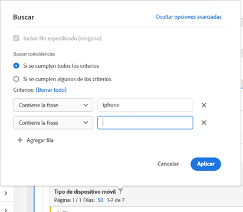

# Paginación, filtrado y ordenación de tablas

Vea este tutorial de vídeo para obtener información general:

[Paginación, filtrado y ordenación de tablas en Analysis Workspace](https://docs.adobe.com/help/es-ES/analytics-learn/tutorials/analysis-workspace/building-freeform-tables/pagination-filtering-sorting-tables.html)

## Opciones de filtrado avanzadas {#section_36E92E31442B4EBCB052073590C1F025}

Al hacer clic en el icono de filtro y, luego, en Mostrar avanzado junto a una dimensión de una tabla improvisada, podrá filtrar según los criterios siguientes:

* Contiene
* No contiene
* Contiene todos los términos
* Contiene cualquier término
* Contiene la frase
* No contiene ningún término
* No contiene la frase
* Es igual a
* No es igual a
* Comienza con
* Finaliza con

