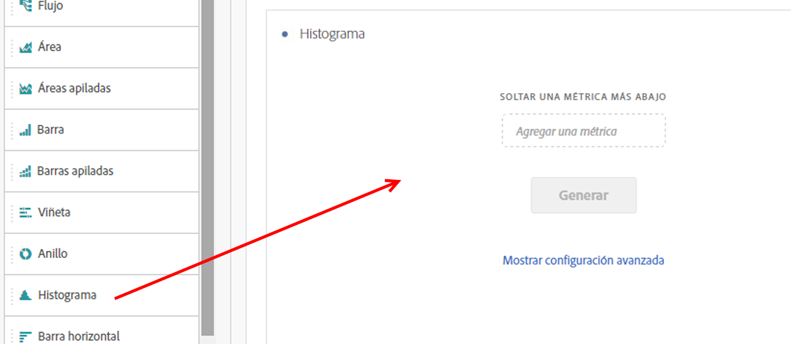
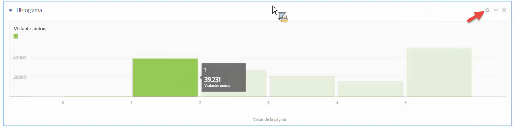
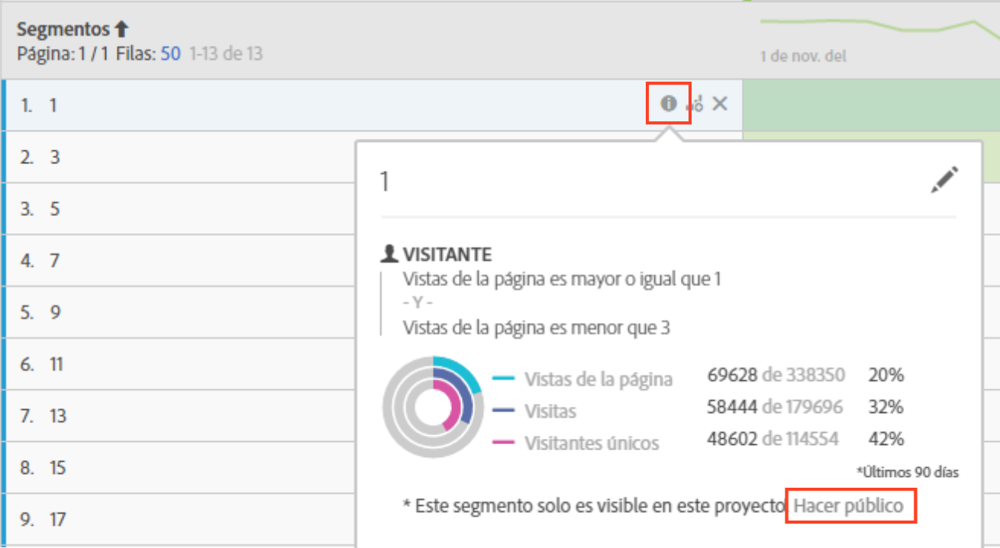

# Histograma

Un histograma es similar a un gráfico de barras, pero agrupa números en rangos (contenedores). Analytics automatiza la creación de contenedores de números en rangos, pero puede modificar la configuración en [Configuración avanzada](#section_09D774C584864D4CA6B5672DC2927477).

## Build a histogram {#section_74647707CC984A1CB6D3097F43A30B45}

Para crear un histograma:

1. Haga clic en **[!UICONTROL Visualizaciones]en el carril izquierdo.**
1. Arrastre **[!UICONTROL Histograma]al panel.**
1. Seleccione una métrica para arrastrar a la visualización del histograma y haga clic en **[!UICONTROL Generar]**.

>[!NOTE]
>
>Los histogramas solo admiten métricas estándar, no métricas calculadas.

Aquí hemos utilizado la métrica Vistas de página por Visitantes únicos. El primer contenedor (izquierda) corresponde a 1 vista de página por visitante único, el segundo bloque a dos vistas de página, etcétera.

## Advanced settings {#section_09D774C584864D4CA6B5672DC2927477}

Para ajustar la configuración de su histograma, haga clic en el icono de Configuración (“engranaje”) en la esquina superior derecha. A continuación verá los ajustes que puede modificar:

| Configuración de histograma | Qué hace |
|---|---|
| Iniciando el depósito | Determina por qué contenedor empieza el histograma. La opción predeterminada es “1”. Puede ajustar los números iniciales de 0 hasta el infinito (sin números negativos). |
| Contenedor de métricas | Le permite aumentar/disminuir el número de rangos de fecha (contenedores). El número máximo de contenedores es 50. |
| Tamaño del contenedor de métricas | Le permite establecer el tamaño de cada contenedor. Por ejemplo, puede cambiar el tamaño del contenedor de 1 vista de página a 2 vistas de página. |
| Método de recuento | Elija entre [Visitante](https://marketing.adobe.com/resources/help/en_US/reference/visitors.html), [Visita](https://marketing.adobe.com/resources/help/en_US/reference/metrics_visit.html) o [Acierto](https://marketing.adobe.com/resources/help/en_US/reference/hit.html). Por ejemplo, vistas de página por visita o visitas de página por visitante o visitas de página por cada acierto. Para aciertos, se utiliza “Ocurrencias” como métrica del eje y en una tabla de forma libre. |

**Ejemplos**:

* Iniciando el depósito: 1; Contenedores de métricas: 5; Tamaño del contenedor de métricas: 2 será el resultado en este histograma: 1-2, 3-4, 5-6, 7-8, 9-10.
* Iniciando el depósito: 0; Contenedores de métricas: 3; Tamaño del contenedor de métricas: 5 será el resultado en este histograma: 0-4, 5-9, 10-14

## View and edit histogram data {#section_B2CD7CDF0F6B432F928103AE7AAA3617}

To view or change the data source for the histogram chart, click the dot next to the Histogram header to go to **[!UICONTROL Data Source Settings]** &gt; **[!UICONTROL Show Data Source]**.

Los segmentos creados previamente que se muestran en la tabla son segmentos internos y no aparecerán en el selector de segmentos. Haga clic en el icono “i” junto al nombre del segmento y, a continuación, haga clic en **[!UICONTROL Hacer público]para que el segmento sea público.**

Para explorar más formas en las que gestionar las tablas de datos improvisadas y otras visualizaciones, como hacer desgloses de datos, vaya [aquí](https://marketing.adobe.com/resources/help/en_US/analytics/analysis-workspace/freeform-analysis-visualizations.html).
