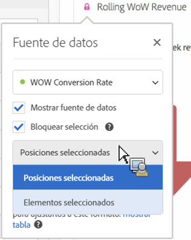

# Histograma

Un histograma es similar a un gráfico de barras, pero agrupa números en rangos (contenedores). Analytics automatiza la creación de contenedores de números en rangos, pero puede modificar la configuración en [Configuración avanzada](#section_09D774C584864D4CA6B5672DC2927477).

## Crear un histograma {#section_74647707CC984A1CB6D3097F43A30B45}

Para crear un histograma:

1. Click **[!UICONTROL Visualizations]** in the left rail.
1. Drag **[!UICONTROL Histogram]** to the panel.
1. Choose a Metric to drag to the Histogram visualization and click **[!UICONTROL Build]**.

>[!NOTE] Los histogramas únicamente admiten métricas estándar, pero no métricas calculadas.

Aquí hemos utilizado la métrica Vistas de página por Visitantes únicos. El primer contenedor (izquierda) corresponde a 1 vista de página por visitante único, el segundo bloque a dos vistas de página, etcétera.

## Configuración avanzada {#section_09D774C584864D4CA6B5672DC2927477}

Para ajustar la configuración de su histograma, haga clic en el icono de Configuración (“engranaje”) en la esquina superior derecha. A continuación verá los ajustes que puede modificar:

| Configuración de histograma | Qué hace |
|---|---|
| Iniciando el depósito | Determina por qué contenedor empieza el histograma. La opción predeterminada es “1”. Puede ajustar los números iniciales de 0 hasta el infinito (sin números negativos). |
| Contenedor de métricas | Le permite aumentar/disminuir el número de rangos de fecha (contenedores). El número máximo de contenedores es 50. |
| Tamaño del contenedor de métricas | Le permite establecer el tamaño de cada contenedor. Por ejemplo, puede cambiar el tamaño del contenedor de 1 vista de página a 2 vistas de página. |
| Método de recuento | Lets you choose among [Visitor](/help/components/c-variables/c-metrics/visitors.md), [Visit](/help/components/c-variables/c-metrics/metrics-visit.md), or [Hit Type](/help/components/c-variables/dimensionslist/report-hit-type.md). Por ejemplo, vistas de página por visita o visitas de página por visitante o visitas de página por cada acierto. Para visitas, se utiliza “Ocurrencias” como métrica del eje y en una tabla de forma libre. |

<!--Russ or Meike - Check Hit Type link above. -->

**Ejemplos**:

* Iniciando el depósito: 1; Contenedores de métricas: 5; Tamaño del contenedor de métricas: 2 será el resultado en este histograma: 1-2, 3-4, 5-6, 7-8, 9-10.
* Iniciando el depósito: 0; Contenedores de métricas: 3; Tamaño del contenedor de métricas: 5 será el resultado en este histograma: 0-4, 5-9, 10-14

## Ver y editar los datos de un histograma {#section_B2CD7CDF0F6B432F928103AE7AAA3617}

To view or change the data source for the histogram chart, click the dot next to the Histogram header to go to **[!UICONTROL Data Source Settings]** > **[!UICONTROL Show Data Source]**.

Los segmentos creados previamente que se muestran en la tabla son segmentos internos y no aparecerán en el selector de segmentos. Click the &quot;i&quot; icon next to the segment name, then click **[!UICONTROL Make public]** to make the segment public.

Para explorar más formas en las que gestionar las tablas de datos improvisadas y otras visualizaciones, como hacer desgloses de datos, vaya [aquí](https://docs.adobe.com/content/help/es-ES/analytics/analyze/analysis-workspace/visualizations/freeform-analysis-visualizations.html).
