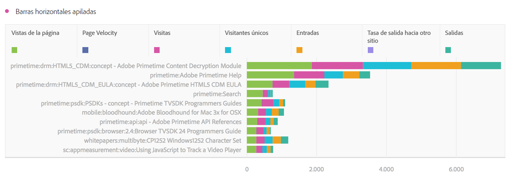
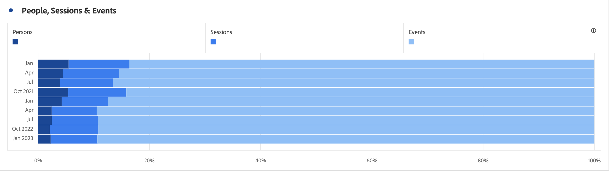

# Barra horizontal (apilada)

>[!BEGINSHADEBOX]

_Este artículo documenta las visualizaciones de barras horizontales y barras horizontales apiladas en_  _**Adobe Analytics**._ _Vea [barras horizontales y barras horizontales apiladas](https://experienceleague.adobe.com/es/docs/analytics-platform/using/cja-workspace/visualizations/horizontal-bar) para la_  _**versión de Customer Journey Analytics** de este artículo._

>[!ENDSHADEBOX]

La visualización de barra horizontal tiene una opción estándar y apilada.

## Barra horizontal {#horizontal-bar}

<!-- markdownlint-disable MD034 -->

>[!CONTEXTUALHELP]
>id="workspace_horizontalbar_button"
>title="Barra horizontal"
>abstract="Cree una visualización de barras horizontales para representar varios valores en una o varias métricas."

<!-- markdownlint-enable MD034 -->

Esta visualización  **[!UICONTROL Barra horizontal]** muestra las barras horizontales que representan varios valores en una o varias métricas.

## Barras horizontales apiladas {#horizontal-bar-stacked}

<!-- markdownlint-disable MD034 -->

>[!CONTEXTUALHELP]
>id="workspace_horizontalbarstacked_button"
>title="Barras horizontales apiladas"
>abstract="Cree una visualización de barras horizontales para representar varios valores en una o varias métricas apiladas."

<!-- markdownlint-enable MD034 -->

La visualización  **[!UICONTROL Barra horizontal apilada]** es como la [!UICONTROL Barra horizontal], pero las barras de serie aparecen apiladas.

Utilice la opción **[!UICONTROL Apilada al 100 %]** en  **[!UICONTROL Configuración]** para convertir el gráfico en una visualización apilada al 100 %.

>[!MORELIKETHIS]
>
>[Agregar una visualización a un panel](/help/analyze/analysis-workspace/visualizations/freeform-analysis-visualizations.md#add-visualizations-to-a-panel)
>[Configuración de la visualización](/help/analyze/analysis-workspace/visualizations/freeform-analysis-visualizations.md#settings)
>[Menú contextual de visualización](/help/analyze/analysis-workspace/visualizations/freeform-analysis-visualizations.md#context-menu)
>

