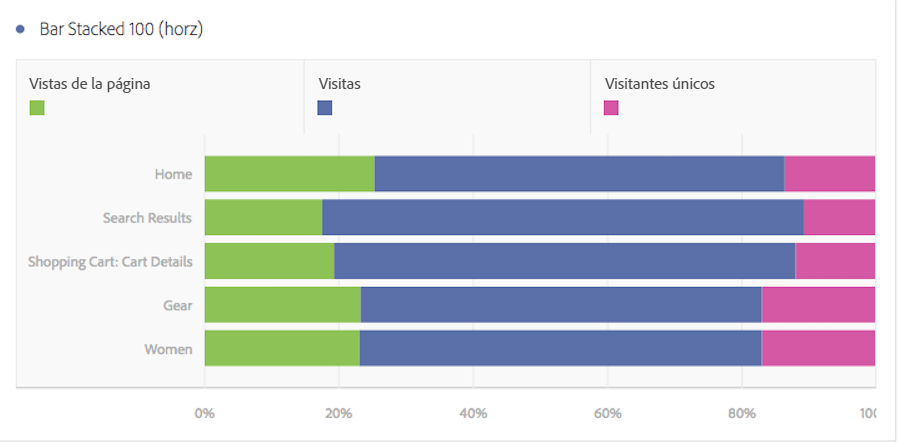

# Barras horizontales y barras horizontales apiladas

## Barra horizontal {#section_73A4D6F6C8864045A97B0B32B5FFFEDB}

Esta visualización muestra las barras horizontales que representan los distintos valores de una o varias métricas.

## Barras horizontales apiladas {#section_50C08E9E20A94024A6553BC352ADB597}

Esta visualización es similar al [!UICONTROL gráfico de barras horizontales], pero las barras de series aparecen apiladas.

Una nueva configuración en las visualizaciones de [!UICONTROL barras apiladas horizontales] convierte el gráfico en una visualización apilada al 100%:

