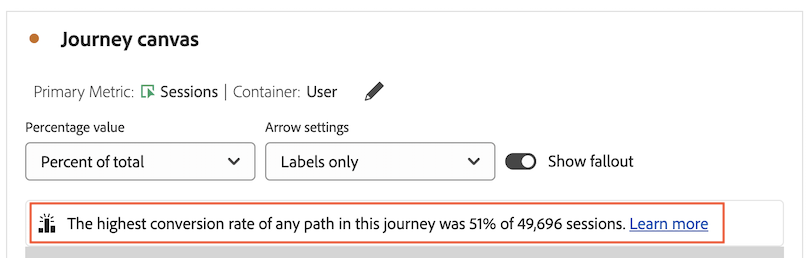
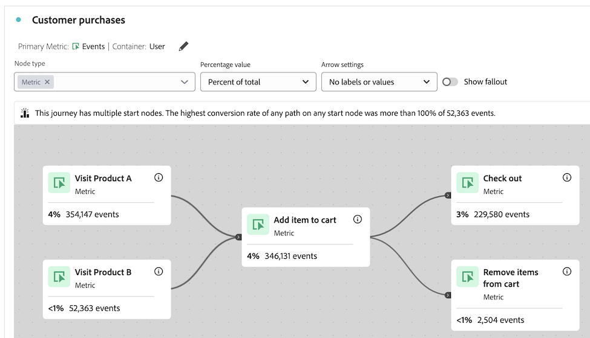

# Información general sobre el lienzo de recorrido {#journey-canvas-overview}

<!-- markdownlint-disable MD034 -->

>[!CONTEXTUALHELP]
>id="cja_journeycanvas_button"
>title="Lienzo de recorrido"
>abstract="Muestra cómo las personas avanzan o abandonan en una serie de puntos de contacto. Se utiliza para recorridos con varios puntos de entrada y rutas."

<!-- markdownlint-enable MD034 -->

<!-- markdownlint-disable MD034 -->

>[!CONTEXTUALHELP]
>id="cja_journeycanvas_panel"
>title="Lienzo de recorrido"
>abstract="Analice cómo las personas avanzan o abandonan un recorrido definido. Cree análisis de los recorridos de usuario creando un gráfico flexible de nodos y flechas que representen cualquier combinación de eventos, elementos de dimensión y segmentos. Arrastre los nodos en el lienzo para reorganizar los eventos y las condiciones del recorrido. A medida que lo haga, los datos se actualizarán en consecuencia."

<!-- markdownlint-enable MD034 -->

<!-- markdownlint-disable MD034 -->

>[!CONTEXTUALHELP]
>id="journeycanvas_button2"
>title="Lienzo de recorrido"
>abstract="Muestra cómo las personas avanzan o abandonan en una serie de puntos de contacto. Se utiliza para recorridos con varios puntos de entrada y rutas."

<!-- markdownlint-enable MD034 -->

<!-- markdownlint-disable MD034 -->

>[!CONTEXTUALHELP]
>id="journeycanvas_panel2"
>title="Lienzo de recorrido"
>abstract="Analice cómo las personas avanzan o abandonan un recorrido definido. Cree análisis de los recorridos de usuario creando un gráfico flexible de nodos y flechas que representen cualquier combinación de eventos, elementos de dimensión y segmentos. Arrastre los nodos en el lienzo para reorganizar los eventos y las condiciones del recorrido. A medida que lo haga, los datos se actualizarán en consecuencia."

<!-- markdownlint-enable MD034 -->

>[!BEGINSHADEBOX]

_Este artículo documenta la visualización del lienzo de Recorrido en_  _&#x200B;**Adobe Analytics**.  _ Consulte [Información general del lienzo de Recorrido](https://experienceleague.adobe.com/es/docs/analytics-platform/using/cja-workspace/visualizations/journey-canvas/journey-canvas) para la __&#x200B;**Customer Journey Analytics**&#x200B;versión de este artículo._

>[!ENDSHADEBOX]

{{release-limited-testing}}

La visualización de lienzo de recorrido le permite analizar y obtener información detallada sobre los recorridos que proporciona a sus usuarios y clientes. Le permite definir un recorrido y ver cómo la gente se fue (abandonó) o continuó a través del recorrido.

Puede [generar análisis de recorridos de usuario](/help/analyze/analysis-workspace/visualizations/journey-canvas/configure-journey-canvas.md) utilizando cualquier combinación de eventos, elementos de dimensión, segmentos e intervalos de fechas para crear nodos de recorrido. Conecte los nodos para crear el flujo del recorrido e incluya varias rutas y puntos de decisión. Arrastre los nodos en el lienzo para reorganizar los eventos y las condiciones del recorrido. Los datos se actualizan en tiempo real a medida que realiza cambios.

[Los nodos están conectados](/help/analyze/analysis-workspace/visualizations/journey-canvas/configure-journey-canvas.md#logic-when-connecting-nodes) como una &quot;ruta final&quot;, lo que significa que los visitantes se cuentan siempre y cuando se muevan de un nodo al otro, independientemente de los eventos que se produzcan entre los dos nodos. El tiempo asignado para que los usuarios se desplacen por la ruta viene determinado por la configuración del contenedor.

## Funciones principales

Entre las principales características de la visualización de lienzo de recorrido se incluyen:

* Un análisis en profundidad de la visita en el orden previsto y de la visita de paso que se adapta a los recorridos de usuario más complejos.

* Un lienzo para asignar y visualizar los distintos puntos de entrada, nodos y rutas de un recorrido de usuario.

* Interacciones de arrastrar y soltar para añadir componentes al lienzo y para cambiar la posición de los nodos existentes.

## Información potencial

El lienzo de recorrido proporciona información práctica para los recorridos más complejos.

### Ruta con la tasa de conversión más alta {#conversion-rate-caption}

El dato más destacado del lienzo de recorrido se muestra como un subtítulo en la parte superior del propio lienzo.

En este subtítulo se resume cuál de todas las rutas del recorrido tuvo la tasa de conversión más alta.

Cuando el recorrido contiene varios nodos de inicio, el subtítulo se muestra de la forma siguiente:

Cuando el recorrido contiene un solo nodo de inicio, el subtítulo se muestra de la forma siguiente:

Tenga en cuenta lo siguiente al interpretar este subtítulo:

* Una _ruta_ se define como un nodo de inicio que está conectado mediante flechas a un nodo final, con cualquier número de nodos conectados entre ellos.

* El cálculo de la tasa de conversión depende del tipo de recorrido (el número de nodos iniciales y finales que contiene el recorrido y si las rutas se cruzan entre sí).

  En la tabla siguiente se describe cómo se calculan las tasas de conversión en función del tipo de recorrido:

  | Tipo de recorrido | Cálculo de la tasa de conversión | Ejemplo |
  |---------|----------|---------|
  | **Un solo nodo inicial y un solo nodo final** | La tasa de conversión se calcula dividiendo el número del nodo final por el del nodo inicial. |  |
  | **Un solo nodo inicial y varios nodos finales** | La tasa de conversión se calcula buscando el nodo final con el número más alto y dividiendo ese número por el del nodo inicial. |  |
  | **Varias rutas independientes, cada una de las cuales contiene un solo nodo inicial y un solo nodo final** | La tasa de conversión se calcula dividiendo el número del nodo final por el del nodo inicial. La ruta con la tasa de conversión más alta se describe en el subtítulo. |  |
  | **Varios nodos de inicio que en cualquier punto del recorrido convergen en un nodo común** | La tasa de conversión se calcula buscando el nodo final con el número más alto y dividiendo ese número por el del nodo inicial con el número más bajo. |  |

### Visita de paso, visita en orden previsto y mucho más

A continuación se muestran algunos ejemplos de otras informaciones que el lienzo de recorrido puede ayudar a proporcionar. Puede elegir si estas perspectivas se basan en todas las personas del grupo de informes, en todas las personas que iniciaron el recorrido o en todas las personas del nodo anterior del recorrido.

#### Visita en orden imprevisto

* El número y porcentaje de personas que completaron el recorrido (llegaron al nodo final)

* El número y porcentaje de personas que llegaron a un nodo determinado del recorrido

* El paso más habitual que se produjo después o antes de un nodo determinado del recorrido

#### Visita en orden previsto

* Los nodos del recorrido en el que las personas abandonaron con mayor frecuencia el recorrido (no llegaron a ninguno de los nodos inmediatamente posteriores)

#### Datos adicionales para cada nodo

* Añada una dimensión de desglose en cualquier nodo del recorrido para ver los datos adicionales de ese nodo específico

## Elija entre visualizaciones Lienzo de recorrido, Visita en orden previsto o Flujo

La visualización de Lienzo de recorrido tiene similitudes con la [visualización Visita en orden previsto](/help/analyze/analysis-workspace/visualizations/fallout/fallout-flow.md) y la [visualización Flujo](/help/analyze/analysis-workspace/visualizations/c-flow/flow.md), pero con diferencias importantes.

### Conocer las diferencias

<!-- Information in this snippet is shared between Journey canvas, Fallout, and Flow visualization docs -->

{{journey-visualization-comparisons}}

### Cuándo utilizar el lienzo de recorrido

El lienzo de recorrido es esencial para lo siguiente:

* Análisis de visitas en el orden previsto que implica recorridos con varios puntos de entrada y rutas.

* Recorridos no lineales con varios puntos de entrada y rutas, con una secuencia predefinida de páginas.

* Análisis exploratorio y ad hoc basado en un recorrido predefinido.

* Análisis que requiere una métrica principal distinta de Sesión, Persona u Ocurrencias.

Utilice la [la tabla anterior](#understand-the-differences) para conocer las diferencias entre las visualizaciones Lienzo de recorrido, Visita en orden previsto y Flujo.

## Generar análisis en el lienzo de recorridos

Puede crear análisis en el lienzo de recorridos que estén basados en cualquier dimensión o métrica disponible en Analysis Workspace. Para obtener más información, consulte [Configuración de una visualización de lienzo de recorridos](/help/analyze/analysis-workspace/visualizations/journey-canvas/configure-journey-canvas.md).

>[!MORELIKETHIS]
>
> * [Guía para la visualización del lienzo de recorrido en Adobe Customer Journey Analytics](https://experienceleaguecommunities.adobe.com/t5/adobe-analytics-blogs/a-guide-to-journey-canvas-visualization-in-adobe-customer/ba-p/737857)

