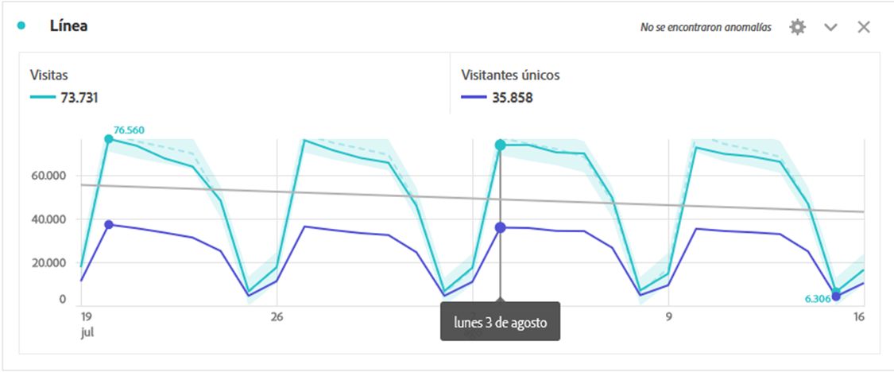
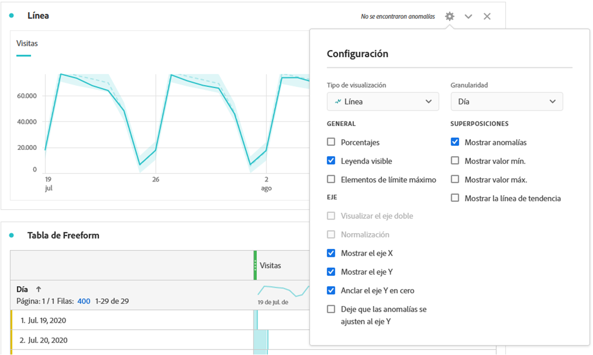
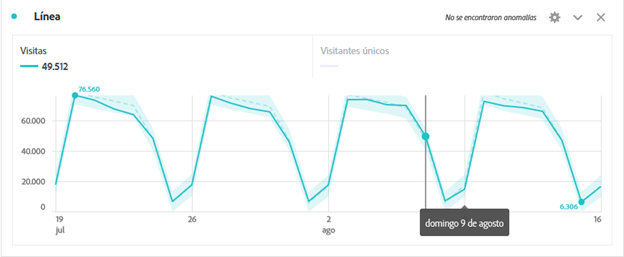
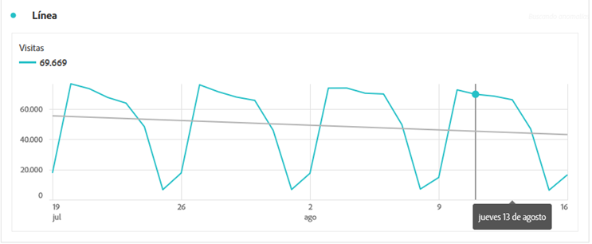

# Líneas

La visualización de línea representa las métricas con una línea para mostrar cómo cambian los valores con el paso del tiempo. Un gráfico de líneas solo se puede usar cuando se utiliza el tiempo como dimensión.

Haga clic en el icono del engranaje en la parte superior derecha de la Visualización de líneas para acceder a la [**Configuración de la visualización**](freeform-analysis-visualizations.md) disponible. La configuración se clasifica en:

* **General**: Configuración común en los tipos de visualización
* **Eje**: Configuración que afecta al eje x o y de la visualización de líneas
* **Superposiciones**: Opciones para añadir contexto adicional a la serie que se muestra en la visualización de líneas.

## Cambiar la granularidad

Un menú desplegable de granularidad en la [configuración de visualización](freeform-analysis-visualizations.md) le permite cambiar una visualización de tendencias (p. ej., una línea o una barra) de diaria a semanal, mensual, etc. La granularidad también se actualiza en la tabla del origen de datos.

## Mostrar mínimo o máximo

En **[!UICONTROL Configuración de la visualización]** > **[!UICONTROL Superposiciones]** > **[!UICONTROL Mostrar mín/máx]**, puede superponer una etiqueta de valor mínimo y máximo para resaltar rápidamente los picos y las bajas de una métrica. Nota: Los valores mínimo y máximo se derivan de los puntos de datos visibles en la visualización, no del conjunto completo de valores dentro de una dimensión.

## Mostrar superposición de la línea de tendencia

Under **[!UICONTROL Visualization Settings]** > **[!UICONTROL Overlays]** > **[!UICONTROL Show trendline]**, you can choose to add a regression or moving average trendline to your line series. Las líneas de tendencia ayudan a mostrar un patrón más claro en los datos.

>[!TIP]
>
>Recomendamos que las líneas de tendencia se apliquen a los datos que no incluyan datos actuales (parciales) o futuras, ya que éstas distorsionarán la línea de tendencia. Sin embargo, si necesita incluir fechas futuras, elimine ceros de los datos para evitar el sesgo de esos días. Para ello, vaya a la tabla del origen de datos de la visualización y elija la columna de métrica. A continuación, vaya a Configuración [!UICONTROL de] columna y marque **[!UICONTROL Interpretar cero como ningún valor]**).

Todas las líneas de tendencia del modelo de regresión se ajustan con los mínimos cuadrados ordinarios:

| Modelo | Descripción |
| --- | --- |
| Lineal | Crea una línea recta de mejor ajuste para conjuntos de datos lineales simples y resulta útil cuando los datos aumentan o disminuyen a una velocidad constante. Ecuación: `y = a + b * x` |
| Logarítmica | Crea una línea curva que se adapta mejor y resulta útil cuando la velocidad de cambio de los datos aumenta o disminuye rápidamente y luego se nivela. Una línea de tendencia logarítmica puede utilizar valores negativos y positivos. Ecuación: `y = a + b * log(x)` |
| Exponencial | Crea una línea curva y resulta útil cuando los datos suben o bajan a tasas de crecimiento constantes. Esta opción no debe utilizarse si los datos contienen valores cero o negativos. Ecuación: `y = a + e^(b * x)` |
| Power | Crea una línea curva y resulta útil para conjuntos de datos que comparan mediciones que aumentan a una velocidad específica. Esta opción no debe utilizarse si los datos contienen valores cero o negativos. Ecuación: `y = a * x^b` |
| Valores cuadráticos | Busca el mejor ajuste para un conjunto de datos con forma de parábola (cóncava arriba o abajo). Ecuación: `y = a + b * x + c * x^2` |
| Promedio móvil | Crea una línea de tendencia suave basada en un conjunto de promedios. Algunos ejemplos son: promedio móvil de 7 días o promedio móvil de 4 semanas. También conocido como promedio móvil, un promedio móvil calcula el promedio de un rango anterior, lo utiliza como punto de datos de línea de tendencia y luego se mueve al período siguiente para repetirse. La entrada &#39;Períodos&#39; define el intervalo para calcular el promedio entre |
