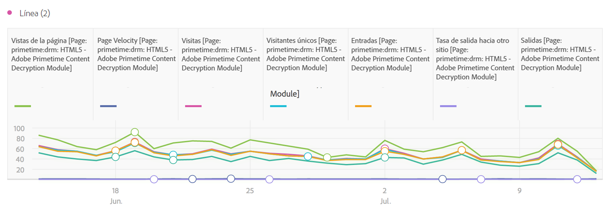
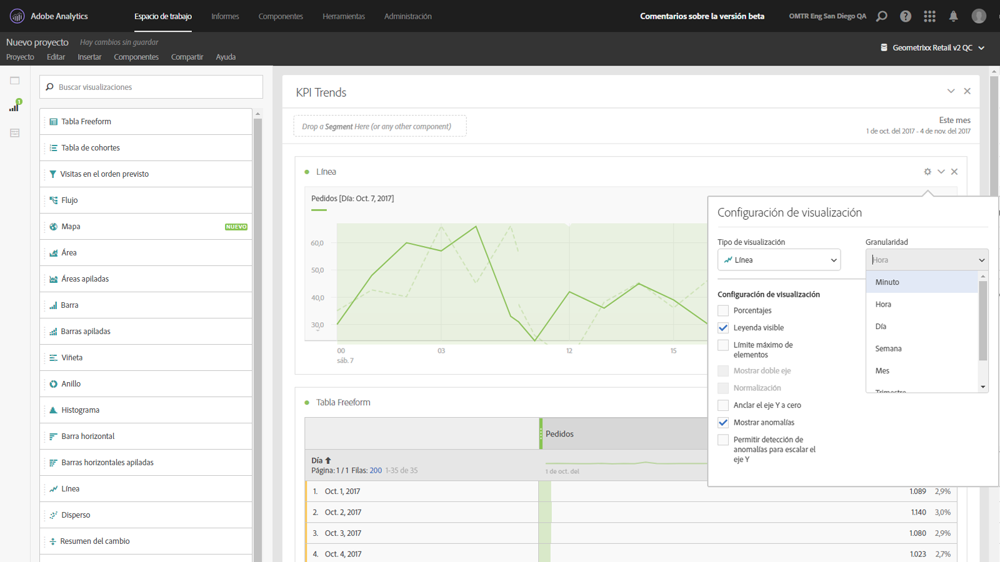

# Líneas

Esta visualización representa las métricas con una línea para mostrar cómo cambian los valores con el paso del tiempo. Un gráfico de líneas solo se puede usar cuando se utiliza el tiempo como dimensión.

Un menú desplegable de granularidad en la [configuración de visualización](../../../analyze/analysis-workspace/visualizations/freeform-analysis-visualizations.md#section_D3BB5042A92245D8BF6BCF072C66624B) le permite cambiar una visualización de tendencias (p. ej., una línea o una barra) de diaria a semanal, mensual, etc.

