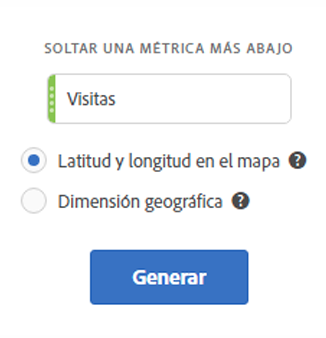

# Mapa {#map}

<!-- markdownlint-disable MD034 -->

<!-- markdownlint-disable MD034 -->

>[!CONTEXTUALHELP]
>id="workspace_map_button"
>title="Mapa"
>abstract="Esta visualización representa las métricas superponiéndolas en un mapa. Esto resulta útil para identificar datos en diferentes regiones geográficas."

<!-- markdownlint-enable MD034 -->

<!-- markdownlint-disable MD034 -->

>[!CONTEXTUALHELP]
>id="workspace_map_bubbles"
>title="Burbujas"
>abstract="Trazar eventos con burbujas."

<!-- markdownlint-enable MD034 -->

<!-- markdownlint-disable MD034 -->

>[!CONTEXTUALHELP]
>id="workspace_map_heatmap"
>title="Mapa de calor"
>abstract="Trazar eventos con un mapa de calor."

<!-- markdownlint-enable MD034 -->

>[!BEGINSHADEBOX]

*Este artículo documenta la visualización de mapas en **Adobe Analytics**. Actualmente no hay ninguna visualización de mapas disponible en **Customer Journey Analytics**.*

>[!ENDSHADEBOX]

## Información general {#section_19F740FAF08D47B1AF1EF239A74FC75C}

La visualización de mapas en Analysis Workspace

* Permite crear un mapa visual de cualquier métrica (incluidas las métricas calculadas).
* Resulta útil para identificar y comparar datos de métricas entre distintas regiones geográficas.
* Admite dos fuentes de datos: latitud/longitud para el uso desde dispositivos móviles o dimensión geográfica para el uso en web.
* Admite exportación de PDF.
* Aprovecha WebGL para la visualización de gráficos. Si sus controladores gráficos no admiten la representación WebGL, es posible que deba actualizarlos.

A continuación, se muestra un vídeo introductorio:

>[!VIDEO](https://video.tv.adobe.com/v/23559/?quality=12)

## Creación de una visualización de mapas {#section_61BBFA3A7BFD48DA8D305A69D9416299}

1. En la lista de visualizaciones, arrastre **[!UICONTROL Mapa]** a un panel de forma libre:

   

1. Arrastre una métrica desde la lista de métricas (incluidas métricas calculadas).
1. Especifique la fuente de datos que desea utilizar. (Este cuadro de diálogo aparece únicamente si tiene habilitado el seguimiento de la ubicación para datos de aplicaciones móviles).

| Configuración | Descripción |
| --- | --- |
| [!UICONTROL Latitud/Longitud móvil] | Esta opción representa los datos de las aplicaciones móviles. Solo verá esta opción si la ha habilitado para su conjunto de informes en [!UICONTROL Analytics] > [!UICONTROL Administración] > [!UICONTROL Grupos de informes] > (seleccione el grupo de informes)> [!UICONTROL Editar configuración] >  [!UICONTROL Administración móvil] > [!UICONTROL Activar el seguimiento de ubicación]. Esta es la configuración predeterminada (si el seguimiento de la ubicación está habilitado). |
| [!UICONTROL Dimensión geográfica] | Esta opción representa los datos de segmentación geográfica según la ubicación de los visitantes, en función de su dirección IP. Estos datos se transforman en [!UICONTROL País], [!UICONTROL Región] y [!UICONTROL Ciudad]. Tenga en cuenta que no se desciende al nivel del código postal ni DMA. Casi todos los grupos de informes tienen habilitada esta dimensión. Si no es así en su caso, póngase en contacto con el Servicio de atención al cliente de Adobe para habilitar los informes geográficos. |

1. Haga clic en **[!UICONTROL Generar]**.

   Lo recibirá la vista Mundo, con un mapa de burbujas similar a este.

   

1. Ahora puede

   * **Hacer zoom** en este mapa para ampliar determinadas áreas haciendo doble clic en el mapa o utilizando la rueda de desplazamiento. El mapa se amplía o se reduce según dónde haya colocado el cursor. La dimensión requerida (país > estado > ciudad) se actualiza automáticamente según la interacción con el nivel de zoom.
   * **Comparar** dos o más visualizaciones de mapas en el mismo proyecto colocándolas una al lado de la otra.
   * **Mostrar comparaciones entre períodos (por ejemplo, año tras año)**:

      * Mostrar números negativos: por ejemplo, si planea crear una métrica año tras año, el mapa puede mostrar -33 % en Nueva York.
      * En las métricas de tipo porcentual, la agrupación reúne los porcentajes según la media.
      * Esquema de colores verde/rojo: positivo/negativo

   * **Girar** el mapa en 2D o 3D manteniendo presionada la tecla [!UICONTROL Ctrl] y desplazando el mapa.

   * **Alternar** entre las distintas vistas, como el mapa de calor, empleando las [configuraciones](/help/analyze/analysis-workspace/visualizations/map-visualization.md#section_5F89C620A6AA42BC8E0955478B3A427E) descritas más adelante. La visualización de burbujas es la configuración predeterminada.

1. **Guardar** el proyecto para guardar la configuración completa del mapa (coordenadas, zoom, rotación).
1. La tabla improvisada, bajo la visualización, puede rellenarse arrastrando a ella dimensiones de localización y métricas desde el carril izquierdo:

   

## Configuración de visualización de mapas {#section_5F89C620A6AA42BC8E0955478B3A427E}

Hay 2 conjuntos de configuraciones para el mapa:

El **icono de llave inglesa** en la parte superior recupera el cuadro de diálogo inicial, donde puede cambiar la métrica y la fuente de datos:

Al hacer clic en el **icono de engranaje**, se muestra esta configuración de visualización:

| Configuración | Descripción |
|--- |--- |
| Burbujas | Representa los eventos mediante burbujas. Un gráfico de burbujas es un gráfico multivariable a medio camino entre un diagrama de dispersión y un gráfico de superficie proporcional. Esta es la vista predeterminada. |
| Mapa de calor | Representa los eventos mediante un mapa de calor. Se trata de una representación gráfica de datos que muestra como colores los valores individuales contenidos en una matriz. |
| Estilos: tema de color | Muestra el esquema de colores para el mapa de calor y las burbujas. Puede elegir entre Coral, Rojos, Verdes o Azules. El valor predeterminado es Coral. |
| Estilos: estilo de mapa | Puede elegir entre Básico, Calles, Brillante, Claro, Oscuro y Satélite. |
| Radio de clúster | Agrupa los puntos de datos que se hallan dentro de un radio de píxeles definido. El valor predeterminado es 50. |
| Valor máximo personalizado | Le permite alterar el umbral para el valor máximo del mapa. Al ajustar este valor, se ajusta la escala de los valores (color y tamaño) de las burbujas/mapa de calor en relación con el valor máximo personalizado establecido. |

## Creación de un mapa de calor de partición de tiempo

A continuación, se muestra un vídeo sobre este tema:

>[!VIDEO](https://video.tv.adobe.com/v/26991/?quality=12)
