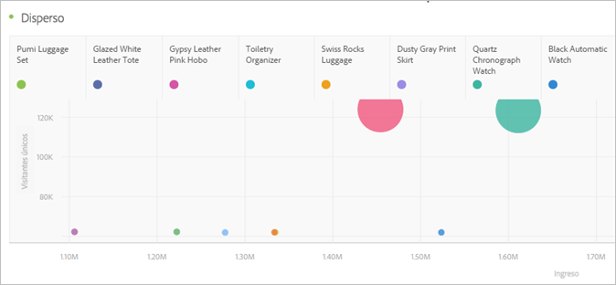

# Diagrama de dispersión

La visualización de diagrama de puntos muestra la relación entre los elementos de dimensión y hasta tres métricas. Requiere tres componentes y admite la visualización de hasta cuatro componentes.

* El componente de fila (normalmente una dimensión) representa cada punto del gráfico. Las distintas filas se muestran como puntos de color diferentes.
* La columna situada más a la izquierda (normalmente, una métrica) representa la posición del punto en el eje Y (vertical).
* La segunda columna representa la posición del punto en el eje X (horizontal).
* La tercera columna determina el radio del punto.
* La visualización de diagrama de puntos ignora todas las columnas subsiguientes de una tabla improvisada.

