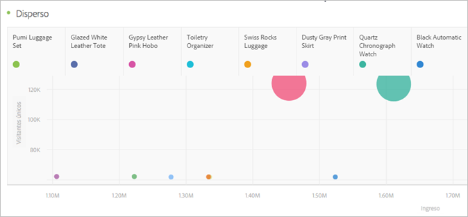

# Puntos {#scatter}

<!-- markdownlint-disable MD034 -->

>[!CONTEXTUALHELP]
>id="workspace_scatter_button"
>title="Puntos"
>abstract="Cree una visualización de dispersión que muestre la relación entre los elementos de dimensión y hasta tres métricas."

<!-- markdownlint-enable MD034 -->

>[!BEGINSHADEBOX]

_Este artículo documenta la visualización de dispersión en_  _**Adobe Analytics**._ _Ver [Dispersión](https://experienceleague.adobe.com/es/docs/analytics-platform/using/cja-workspace/visualizations/scatterplot) para la_  _**Customer Journey Analytics** versión de este artículo._

>[!ENDSHADEBOX]

La visualización  **[!UICONTROL Scatter]** le ayuda a identificar correlaciones y patrones entre distintas métricas de los datos. La visualización muestra la relación entre los elementos de dimensión y hasta tres métricas. Requiere tres componentes y admite la visualización de hasta cuatro componentes.

* El componente de fila (normalmente una dimensión) representa cada punto del gráfico. Las filas diferentes se muestran como puntos de color diferentes.
* La columna situada más a la izquierda (normalmente una métrica) representa la posición del punto en el eje Y (vertical).
* La segunda columna representa la posición del punto en el eje X (horizontal).
* La tercera columna determina el radio del punto.
* La visualización del diagrama de dispersión ignora todas las columnas subsiguientes de una tabla de forma libre.

>[!BEGINSHADEBOX]

Consulte  [Visualización de diagrama de puntos](https://experienceleague.adobe.com/en/docs/analytics-learn/tutorials/analysis-workspace/visualizations/scatterplot-visualization){target="_blank"} para ver un vídeo de demostración.

>[!ENDSHADEBOX]

>[!NOTE]
>
>Cuando [configura la leyenda para que sea visible](/help/analyze/analysis-workspace/visualizations/freeform-analysis-visualizations.md#settings) en el dispersión, la leyenda solo se muestra cuando el origen de datos contiene un número limitado de elementos de dimensión (seleccionados).

>[!MORELIKETHIS]
>
>[Agregar una visualización a un panel](/help/analyze/analysis-workspace/visualizations/freeform-analysis-visualizations.md#add-visualizations-to-a-panel)
>[Configuración de la visualización](/help/analyze/analysis-workspace/visualizations/freeform-analysis-visualizations.md#settings)
>[Menú contextual de visualización](/help/analyze/analysis-workspace/visualizations/freeform-analysis-visualizations.md#context-menu)
>
