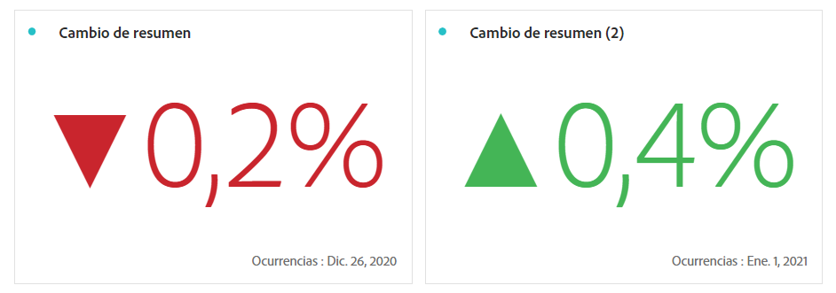

# [!UICONTROL Número de resumen] y [!UICONTROL Cambio de resumen]

_Este artículo documenta las visualizaciones Número de resumen y Cambio de resumen en_  _**Adobe Analytics**._ _Consulte [Número de resumen y Cambio de resumen](https://experienceleague.adobe.com/es/docs/analytics-platform/using/cja-workspace/visualizations/summary-number-change)  para la versión_  _**Customer Journey Analytics** de este artículo._

>[!BEGINSHADEBOX]

Consulte  [Visualización de Número de resumen y Cambio de resumen](https://video.tv.adobe.com/v/3416887/?quality=12&captions=spa){target="_blank"} para ver un vídeo de demostración.

>[!ENDSHADEBOX]

## Visualización del [!UICONTROL Número de resumen] {#summary-number}

<!-- markdownlint-disable MD034 -->

>[!CONTEXTUALHELP]
>id="workspace_summarynumber_button"
>title="Número de resumen"
>abstract="Cree una visualización que muestre los totales y subtotales."

<!-- markdownlint-enable MD034 -->

Utilice la visualización de  **[!UICONTROL Cambio de resumen]** para mostrar el delta (cambio) entre dos números. <!-- This is applicable for AA, not CJA: The green and red color of the Summary Change can be controlled through [custom event polarity](https://experienceleague.adobe.com/docs/analytics/admin/admin-tools/success-events/success-event.html?lang=es) or a calculated metric's [Show Upward Trend As](https://experienceleague.adobe.com/docs/analytics/components/calculated-metrics/calcmetric-workflow/cm-build-metrics.html?lang=es) option.-->

<!--
The green and red color of the Summary Change can be controlled through [custom event polarity](https://experienceleague.adobe.com/docs/analytics/admin/admin/c-manage-report-suites/c-edit-report-suites/conversion-var-admin/c-success-events/success-event.md) or a calculated metric's [Show Upward Trend As](https://experienceleague.adobe.com/docs/analytics/components/calculated-metrics/calcmetric-workflow/cm-build-metrics.html?lang=es) option.
-->

Esta visualización se comporta de las siguientes maneras:

* Si no se selecciona ninguna celda, compara los valores de las dos primeras celdas de la columna.
* Si se selecciona una celda, muestra 0, ya que compara el valor de celda con ella misma.
* Si se seleccionan dos celdas, la primera celda seleccionada se toma como numerador y la segunda como denominador.
* Si se seleccionan más de dos celdas, solo se tienen en cuenta las dos primeras para la comparación.
* Si se selecciona un intervalo de celdas, se compara la primera celda con la última seleccionada en el intervalo.
* Si se selecciona la columna, se compara el primer valor consigo mismo, lo que da como resultado un cambio de 0.

Como parte de la configuración de visualización, hay **[!UICONTROL opciones de Cambio de resumen]** específicas disponibles.

| Opción | Definición |
|--- |--- |
| **[!UICONTROL Mostrar el cambio de porcentaje]** | Muestra el cambio porcentual entre los 2 números. |
| **[!UICONTROL Mostrar diferencia en bruto]** | Muestra la diferencia en bruto entre los 2 números. También puede abreviar valores y mostrar hasta 3 decimales con esta opción. |
| **[!UICONTROL Valor abreviado]** | Seleccione **[!UICONTROL Abreviar valor]** para abreviar de forma inteligente el valor cambiado. Cuando esta opción esté seleccionada, introduzca un número para definir la cantidad de abreviatura. Por ejemplo: <table><tr><td>**Valor original**</td><td>**Valor de abreviatura**</td><td>**Resultado**</td></tr><tr><td>12.011.141,25 $</td><td>No seleccionado</td><td  align="right">12.011.141,25 $</td></tr><tr><td>12.011.141,25 $</td><td>Seleccionado, establecido en `0`</td><td align="right">12 mills. $</td></tr><tr><td>12.011.141,25 $</td><td> Seleccionado, establecido en `1`</td><td  align="right">12,0 mills. $</td></tr><tr><td>12.011.141,25 $</td><td>Seleccionado, establecido en `2`</td><td align="right">12,01 mills. $</td></tr><tr><td>12.011.141,25 $</td><td>Seleccionado, establecido en `3`</td><td align="right">12,011 mills. $</td></tr></table> |

>[!MORELIKETHIS]
>
>[Añadir una visualización a un panel](/help/analyze/analysis-workspace/visualizations/freeform-analysis-visualizations.md#add-visualizations-to-a-panel)
>[Configuración de visualización](/help/analyze/analysis-workspace/visualizations/freeform-analysis-visualizations.md#settings)
>[Menú contextual de visualización ](/help/analyze/analysis-workspace/visualizations/freeform-analysis-visualizations.md#context-menu)
>
