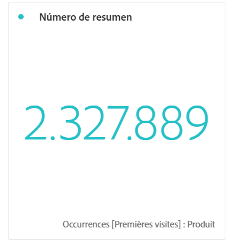

# Número de resumen y cambio de resumen

## Visualización Número de resumen

* Selecciona el total de la columna en caso de que no se haya seleccionado ninguna celda.
* Si se selecciona una única celda, se muestra el resumen de esta.
* Si se selecciona más de una celda, se muestra la primera celda seleccionada.
* Si se selecciona la columna, se usa el valor de la primera celda de la columna.

## Visualización de cambio de resumen

* Si no se selecciona ninguna celda, compara los valores de las dos primeras celdas de la columna.
* Si se selecciona una celda, muestra 0, ya que compara el valor de celda con ella misma.
* Si se seleccionan dos celdas, la primera celda seleccionada se toma como numerador y la segunda como denominador.
* Si se seleccionan más de dos celdas, solo se tienen en cuenta las dos primeras para la comparación.
* Si se selecciona un intervalo de celdas, se compara la primera celda con la última seleccionada en el intervalo.
* Si se selecciona la columna, se compara el primer valor consigo mismo, lo que da como resultado un cambio de 0.
* El color verde y rojo del cambio de resumen se puede controlar mediante:

   * [Polaridad de evento personalizada](https://marketing.adobe.com/resources/help/en_US/reference/success_event.html).
   * Opción [Mostrar tendencia ascendente como](https://marketing.adobe.com/resources/help/en_US/analytics/calcmetrics/cm_build_metrics.html) de una métrica calculada.

## Summary Change settings {#section_2581AC0107634FB4990AB8347E5897AA}

Haga clic en el icono de engranaje situado junto a la visualización para configurar los ajustes de resumen:

| Configuración | Definición |
|--- |--- |
| Porcentajes | Use porcentajes en lugar de números en bruto. |
| Leyenda visible | Muestra las métricas utilizadas. |
| Opciones de número de resumen: abreviar valor | Puede seleccionar de 0 a 3 decimales para los valores abreviados. |
| Opciones de cambio de resumen: mostrar cambio de porcentaje | Muestra el cambio, en porcentaje, entre los 2 números. |
| Opciones de cambio de resumen: mostrar diferencia en bruto | Muestra la diferencia en bruto entre los 2 números. |