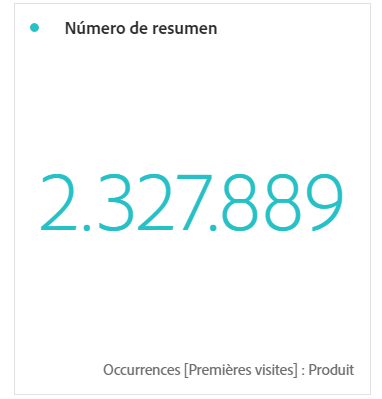
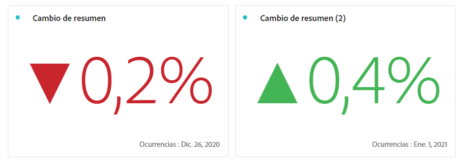

# Número de resumen y cambio

>[!BEGINSHADEBOX]

_Este artículo documenta las visualizaciones Número de resumen y Cambio de resumen en_  _**Adobe Analytics**._ _Vea [Número de resumen y Cambio de resumen](https://experienceleague.adobe.com/es/docs/analytics-platform/using/cja-workspace/visualizations/summary-number-change) para la_  _**versión de Customer Journey Analytics** de este artículo._

>[!ENDSHADEBOX]

>[!BEGINSHADEBOX]

Consulte  [Visualización Número de resumen y Cambio de resumen](https://experienceleague.adobe.com/en/docs/analytics-learn/tutorials/analysis-workspace/visualizations/summary-number-and-summary-change-visualizations-2021){target="_blank"} para ver un vídeo de demostración.

>[!ENDSHADEBOX]

## Número de resumen {#summary-number}

<!-- markdownlint-disable MD034 -->

>[!CONTEXTUALHELP]
>id="workspace_summarynumber_button"
>title="Número de resumen"
>abstract="Cree una visualización que muestre los totales y subtotales."

<!-- markdownlint-enable MD034 -->

Utilice la visualización  **[!UICONTROL Número de resumen]** para resaltar un número elevado que sea importante en un proyecto. Esta visualización se comporta de las siguientes maneras, utilizando la fuente de datos asociada:

* Selecciona el total de la columna en caso de que no se haya seleccionado ninguna celda.
* Si se selecciona una única celda, se muestra el resumen de esta.
* Si se selecciona más de una celda, se muestra la primera celda seleccionada.
* Si se selecciona la columna, se usa el valor de la primera celda de la columna.

Como parte de la configuración de visualización, hay disponibles opciones específicas de Número de resumen.

| Opción | Definición |
|--- |--- |
| **[!UICONTROL Valor abreviado]** | Seleccione **[!UICONTROL Abreviar valor]** para abreviar de forma inteligente el valor numérico. Cuando esta opción esté seleccionada, introduzca un número para definir la cantidad de abreviatura. Por ejemplo: <table><tr><td>**Valor original**</td><td>**Valor de abreviatura**</td><td>**Resultado**</td></tr><tr><td>$12,011,141.25</td><td>No seleccionado</td><td  align="right">$12,011,141.25</td></tr><tr><td>$12,011,141.25</td><td>Seleccionado, establecido en `0`</td><td align="right">12 mills. USD</td></tr><tr><td>$12,011,141.25</td><td> Seleccionado, establecido en `1`</td><td  align="right">12,0 mills. USD</td></tr><tr><td>$12,011,141.25</td><td>Seleccionado, establecido en `2`</td><td align="right">12,01 mills. USD</td></tr><tr><td>$12,011,141.25</td><td>Seleccionado, establecido en `3`</td><td align="right">12,011 mills. USD</td></tr></table> |
| **[!UICONTROL Valor de resumen por]** | Elija mostrar el máximo, el mínimo, la media, la mediana o la suma para una selección de datos. |

## Cambio de resumen {#summary-change}

<!-- markdownlint-disable MD034 -->

>[!CONTEXTUALHELP]
>id="workspace_summarychange_button"
>title="Cambio de resumen"
>abstract="Cree una visualización que muestre el delta (cambio) entre dos números"

<!-- markdownlint-enable MD034 -->

Utilice la visualización  **[!UICONTROL Cambio de resumen]** para mostrar el delta (cambio) entre dos números. <!-- This is applicable for AA, not CJA: The green and red color of the Summary Change can be controlled through [custom event polarity](/help/admin/tools/success-events/success-event.md) or a calculated metric's [Show Upward Trend As](/help/components/calculated-metrics/workflow/cm-build-metrics.md) option.-->

<!--
The green and red color of the Summary Change can be controlled through [custom event polarity](/help/admin/tools/manage-rs/edit-settings/conversion-var-admin/c-success-events/success-event.md.md) or a calculated metric's [Show Upward Trend As](/help/components/calculated-metrics/calcmetric-workflow/cm-build-metrics.md) option.
-->

Esta visualización se comporta de las siguientes maneras:

* Si no se selecciona ninguna celda, compara los valores de las dos primeras celdas de la columna.
* Si se selecciona una celda, muestra 0, ya que compara el valor de celda con ella misma.
* Si se seleccionan dos celdas, la primera celda seleccionada se toma como numerador y la segunda como denominador.
* Si se seleccionan más de dos celdas, solo se tienen en cuenta las dos primeras para la comparación.
* Si se selecciona un intervalo de celdas, se compara la primera celda con la última seleccionada en el intervalo.
* Si se selecciona la columna, se compara el primer valor consigo mismo, lo que da como resultado un cambio de 0.

Como parte de la configuración de visualización, hay **[!UICONTROL opciones de Cambio de resumen]** específicas disponibles.

| Opción | Definición |
|--- |--- |
| **[!UICONTROL Mostrar el porcentaje de cambio]** | Muestra el cambio porcentual entre los 2 números. |
| **[!UICONTROL Mostrar diferencia en bruto]** | Muestra la diferencia en bruto entre los 2 números. También puede abreviar valores y mostrar hasta 3 decimales con esta opción. |
| **[!UICONTROL Valor abreviado]** | Seleccione **[!UICONTROL Abreviar valor]** para abreviar de forma inteligente el valor cambiado. Cuando esta opción esté seleccionada, introduzca un número para definir la cantidad de abreviatura. Por ejemplo: <table><tr><td>**Valor original**</td><td>**Valor de abreviatura**</td><td>**Resultado**</td></tr><tr><td>$12,011,141.25</td><td>No seleccionado</td><td  align="right">$12,011,141.25</td></tr><tr><td>$12,011,141.25</td><td>Seleccionado, establecido en `0`</td><td align="right">12 mills. USD</td></tr><tr><td>$12,011,141.25</td><td> Seleccionado, establecido en `1`</td><td  align="right">12,0 mills. USD</td></tr><tr><td>$12,011,141.25</td><td>Seleccionado, establecido en `2`</td><td align="right">12,01 mills. USD</td></tr><tr><td>$12,011,141.25</td><td>Seleccionado, establecido en `3`</td><td align="right">12,011 mills. USD</td></tr></table> |

>[!MORELIKETHIS]
>
>[Agregar una visualización a un panel](/help/analyze/analysis-workspace/visualizations/freeform-analysis-visualizations.md#add-visualizations-to-a-panel)
>[Configuración de la visualización](/help/analyze/analysis-workspace/visualizations/freeform-analysis-visualizations.md#settings)
>[Menú contextual de visualización](/help/analyze/analysis-workspace/visualizations/freeform-analysis-visualizations.md#context-menu)
>
