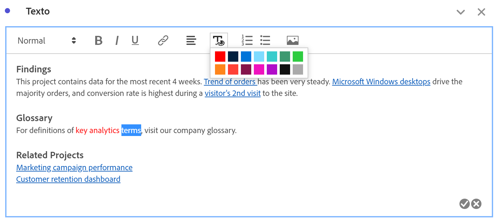
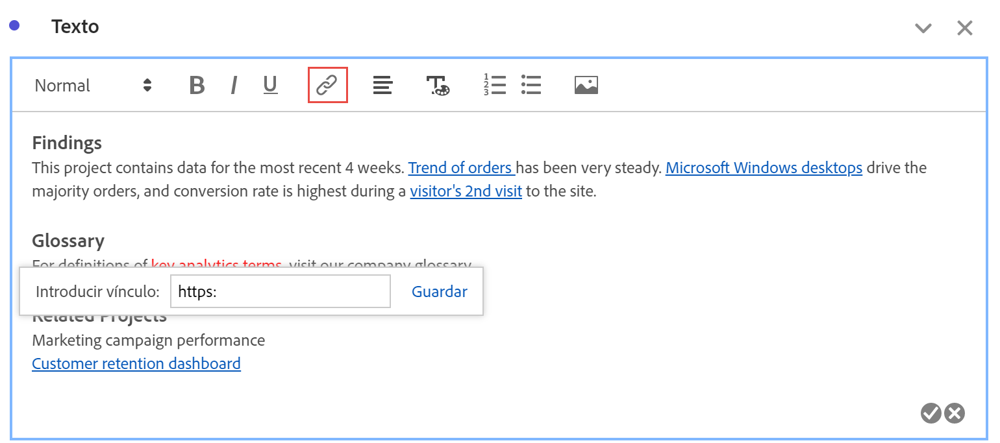
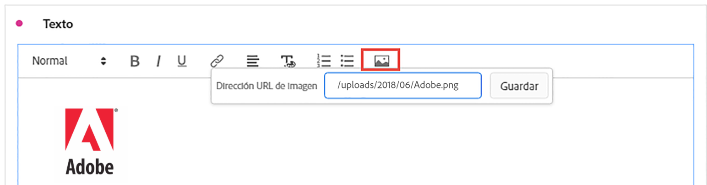

# Texto {#text-visualization}

>[!CONTEXTUALHELP]
>id="workspace_text_button"
>title="Texto"
>abstract="Añada una visualización de texto enriquecido definida por el usuario al proyecto."

<!-- markdownlint-enable MD034 -->

>[!BEGINSHADEBOX]

_Este artículo documenta la visualización de texto en_  _&#x200B;**Adobe Analytics**._ _Consulte [Texto](https://experienceleague.adobe.com/es/docs/analytics-platform/using/cja-workspace/visualizations/text)  para la versión_  _&#x200B;**Customer Journey Analytics** de este artículo._

>[!ENDSHADEBOX]

Puede
Para añadir texto enriquecido definido por el usuario a su proyecto de Workspace, puede usar una visualización  **[!UICONTROL Texto]** o usar descripciones para una visualización y un panel.

## Usar

Puede utilizar la visualización Texto de las siguientes maneras:

1. Añada una visualización  **[!UICONTROL Texto]**. Consulte [Añadir una visualización a un panel](freeform-analysis-visualizations.md#add-visualizations-to-a-panel)

1. En un panel o una visualización, en el menú contextual, seleccione **[!UICONTROL Editar descripción]**.

   Seleccione  cuando termine de editar la descripción, seleccione  para cancelar.

También puede cambiar el formato del texto, añadir hipervínculos e imágenes.

## Ajuste del formato {#format}

Al editar el cuadro de texto o la descripción, puede ajustar el tamaño de fuente (niveles de encabezado), el color, el estilo (negrita, cursiva, subrayado) y la alineación del texto seleccionado. También puede añadir listas numeradas y con viñetas.

## Adición de hipervínculos {#hyperlinks}

Para añadir un hipervínculo, resalte el texto y seleccione  en el menú. Puede utilizar hipervínculos para proporcionar más ayuda a los destinatarios del proyecto. Los hipervínculos pueden vincularse a sitios web externos, páginas de documentación, [proyectos, paneles o visualizaciones de Workspace](/help/analyze/analysis-workspace/curate-share/shareable-links.md), etc.

## Adición de imágenes {#images}

Para agregar una imagen al proyecto, selecciona  en el menú, especifica una URL de imagen en **[!UICONTROL URL de imagen]** (por ejemplo `https://www.adobe.com/uploads/2018/06/Adobe.png`) y selecciona **[!UICONTROL Guardar]**.

La dirección URL de la imagen debe ser de acceso público, comenzar por `https` y tener el formato `.png`, `.jpeg`, `.jpg` o `.gif`. Se admiten imágenes estáticas y animadas.

Tenga en cuenta que no se admite la inserción de arrastrar y soltar en una imagen.

