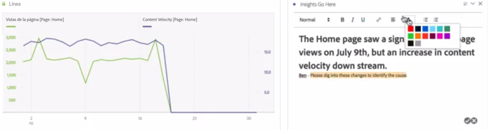

# Texto

Le permite agregar texto definido por el usuario al Workspace.

Puede cambiar los ajustes de fuente (negrita, cursiva, etc.) y agregar hipervínculos en visualizaciones de cuadros de texto y descripciones de paneles/visualizaciones.

## Change font settings {#section_32727EE03FD04A8EB1D1B387DCAF6537}

Al arrastrar una visualización de texto a un panel y agregar texto, puede aplicar formato al texto. Para ello, agregue niveles de encabezado, aplique negrita, cursiva o subrayado al texto y cambie el color del texto, entre otras acciones.

## Add hyperlinks {#section_D55B857188A74A06B49006DF3511DC7C}

Resalte el texto y haga clic en el icono de hipervínculo en el menú de formato para agregar hipervínculos.
