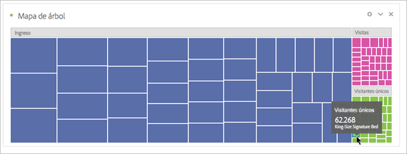

# Gráfico de rectángulos

Muestra datos de forma jerárquica (con estructura de árbol) como un conjunto de rectángulos anidados.

Cada rama del árbol es un rectángulo determinado, el cual está en mosaico con rectángulos menores que representan ramas secundarias.

Cuando el color y el tamaño de las dimensiones son correlativos en cierta manera con la estructura de árbol, a menudo se pueden observar patrones que serían difíciles de percibir de otra forma, como por ejemplo, si cierto color es particularmente relevante. Una segunda ventaja de los gráficos de rectángulos es que, por su construcción, hacen un uso eficiente del espacio.
