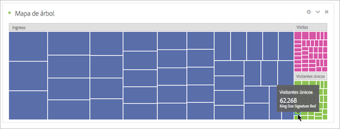

# [!UICONTROL Gráfico de rectángulos] {#treemap}

<!-- markdownlint-disable MD034 -->

>[!CONTEXTUALHELP]
>id="workspace_treemap_button"
>title="Gráfico de rectángulos"
>abstract="Cree una visualización de diagrama para mostrar datos jerárquicos (con estructura de árbol) con rectángulos anidados."

<!-- markdownlint-enable MD034 -->

>[!BEGINSHADEBOX]

_Este artículo documenta la visualización del gráfico de rectángulos en_  _**Adobe Analytics**._ _Vea [Gráfico de rectángulos](https://experienceleague.adobe.com/es/docs/analytics-platform/using/cja-workspace/visualizations/treemap) para la_  _**Customer Journey Analytics** versión de este artículo._

>[!ENDSHADEBOX]

Utilice una visualización **[!UICONTROL Gráfico de rectángulos]** para mostrar datos jerárquicos (con estructura de árbol) como un conjunto de rectángulos anidados.

Cada rama del árbol es un rectángulo determinado, el cual está en mosaico con rectángulos menores que representan ramas secundarias.

Con un gráfico de rectángulos, puede ver patrones que serían difíciles de identificar de otras maneras. Con el color y el tamaño de las dimensiones puede descubrir cómo se correlacionan las dimensiones y si una dimensión determinada es especialmente relevante. Una segunda ventaja de los gráficos de rectángulos es que, por su construcción, hacen un uso eficiente del espacio.

>[!BEGINSHADEBOX]

Consulte  [Visualización de gráfico de rectángulos](https://experienceleague.adobe.com/en/docs/analytics-learn/tutorials/analysis-workspace/visualizations/treemap-visualization){target="_blank"} para ver un vídeo de demostración.

>[!ENDSHADEBOX]

>[!MORELIKETHIS]
>
>[Agregar una visualización a un panel](/help/analyze/analysis-workspace/visualizations/freeform-analysis-visualizations.md#add-visualizations-to-a-panel)
>[Configuración de la visualización](/help/analyze/analysis-workspace/visualizations/freeform-analysis-visualizations.md#settings)
>[Menú contextual de visualización](/help/analyze/analysis-workspace/visualizations/freeform-analysis-visualizations.md#context-menu)
>
