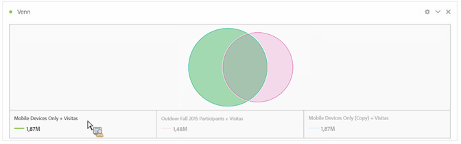
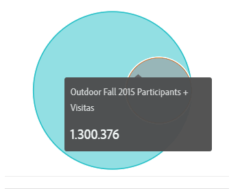
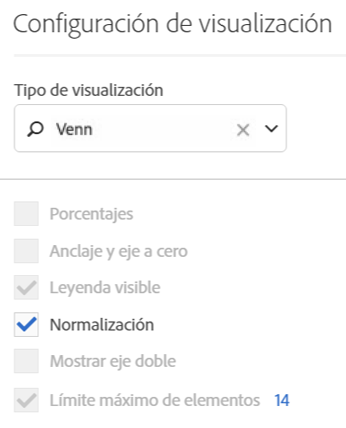

# Venn

La visualización Venn le permite arrastrar hasta tres segmentos (de Componentes) y una métrica para elaborar un diagrama de Venn.

Así pues, puede situarse encima de los segmentos para conocer mejor los porcentajes, etc.

To turn the Venn diagram into a Freeform table, click the colored dot next to the **[!UICONTROL Venn]** header and select **[!UICONTROL Manage Data Sources]** &gt; **[!UICONTROL Available Data Sources]** &gt; **[!UICONTROL Freeform Table]**.

Para normalizar el diagrama de Venn (obtener su tamaño) vaya al icono de su Configuración de visualización y seleccione **[!UICONTROL Normalización]**.

