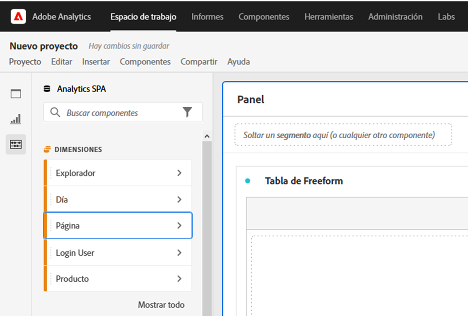
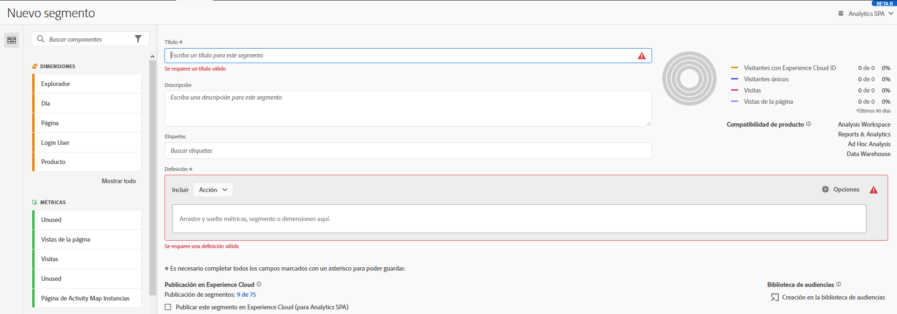

# Accesibilidad en Analysis Workspace

Obtenga información acerca de la compatibilidad con la accesibilidad en [!UICONTROL Analysis Workspace], la herramienta de análisis más importante para Customer Journey Analytics.

La accesibilidad se refiere a hacer que personas con discapacidades visuales, auditivas, cognitivas, motoras y de otro tipo puedan utilizar un producto. Algunos ejemplos de funciones de accesibilidad para productos de software incluyen:

* compatibilidad con lectores de pantalla,
* equivalentes de texto para gráficos,
* métodos abreviados de teclado
* cambio de colores de visualización a alto contraste,
* y más

[!UICONTROL Analysis Workspace] proporciona algunas herramientas de accesibilidad, entre ellas:

## Navegación por teclado

La navegación en [!UICONTROL Analysis Workspace] funciona desde arriba a abajo e izquierda a derecha. Los siguientes elementos de navegación facilitan la accesibilidad:

* La tecla **[!UICONTROL Pestaña]** habilita accesos directos de referencia, moviéndose entre secciones más grandes dentro de Workspace. En el panel izquierdo, **[!UICONTROL Pestaña]** también te permite pasar de una opción arrastrable a la siguiente.
* ◀︎ y ▶︎ se mueven entre elementos individuales después de que la tecla **[!UICONTROL Tab]** haya resaltado un elemento.
* La clave **[!UICONTROL F6]** se desplaza al primer panel del proyecto y se mueve entre las visualizaciones de ese panel. A continuación, se desplaza al siguiente panel del proyecto y se repite.
* Aplicamos indicadores de enfoque para que los usuarios de este tipo de teclados tengan una clara indicación de qué elemento de la interfaz de usuario está seleccionado actualmente. El indicador es un borde azul para el panel seleccionado. Y fondo gris para la funcionalidad seleccionada recientemente y la selección dentro de la funcionalidad. En el ejemplo, [!UICONTROL Componentes] y la dimensión Página se han seleccionado recientemente.

  

### Navegación por teclado para la barra de menús

1. Use el tabulador hasta que haya llegado a la barra de menús.
1. Utiliza las teclas de flecha para desplazarte entre los menús y los elementos de menú.
1. Pulsa **[!UICONTROL Intro]** para abrir un menú o seleccionar un elemento de menú.
1. Usa **[!UICONTROL Esc]** para cerrar un menú.

### Navegación por teclado para interacciones de arrastrar y soltar

[!UICONTROL Analysis Workspace] es una interfaz de usuario de arrastrar y soltar. Sin embargo, los usuarios pueden agregar componentes mediante el teclado:

1. Ir a un componente en el panel izquierdo.
1. Pulsa **[!UICONTROL Intro]** para seleccionar.
1. Utilice las teclas de flecha para desplazarse hasta el área en la que desea soltar el componente.
1. Pulsa **[!UICONTROL Intro]** para colocar el componente.

### Métodos abreviados de teclado (teclas de acceso directo)

[!UICONTROL Analysis Workspace] ofrece un completo conjunto de [métodos abreviados de teclado](/help/analyze/analysis-workspace/build-workspace-project/fa-shortcut-keys.md) para lograr un flujo de trabajo más fluido. 

## Compatibilidad con lectores de pantalla y ampliadores de pantalla

Un lector de pantalla lee el texto que aparece en la pantalla del equipo. También lee información no textual, como etiquetas de botones o descripciones de imágenes en la aplicación.

## Paletas de color y contraste

[!UICONTROL Analysis Workspace] se esfuerza por lograr la conformidad con WCAG 2.1 AA, incluyendo sus requisitos para el contraste de color.

Además, los usuarios pueden establecer su propia paleta de colores preferida para un proyecto en **[!UICONTROL Proyecto]** > **[!UICONTROL Ajustes del proyecto]** > [Paleta de color del proyecto](/help/analyze/analysis-workspace/build-workspace-project/color-palettes.md).

## Validación requerida

Al crear un componente, una visualización o un panel, los campos obligatorios se validan al guardar. Si un campo requerido no supera la validación, se delineará en rojo con un icono de error. Una descripción por escrito explica lo que debe corregirse.

## Compatibilidad con las funciones de accesibilidad del sistema operativo

Analysis Workspace admite funciones de accesibilidad integradas de MS Windows y macOS, como modo de alto contraste, teclas adhesivas y teclas de filtro/teclas lentas. También proporciona información sobre la interfaz de usuario del sistema operativo para habilitar la interacción con tecnologías de asistencia, incluidos lectores de pantalla como VoiceOver para macOS y NVDA en Windows.

<!--

# Accessibility in Analysis Workspace

Learn about accessibility support in [!UICONTROL Analysis Workspace], the premier analysis tool for Adobe Analytics. 

Accessibility refers to making products usable for people with visual, auditory, cognitive, motor, and other disabilities. Examples of accessibility features for software products include screen reader support, text equivalents for graphics, keyboard shortcuts, change of display colors to high contrast, and so on. 

[!UICONTROL Analysis Workspace] provides some tools that make it accessible to use, including:

## Navigate [!UICONTROL Workspace] using the keyboard

Navigation in [!UICONTROL Analysis Workspace] works top > down, and left > right. The following navigational elements facilitate accessibility:

* The `Tab` key enables landmark shortcuts, moving between larger sections within Workspace. In the left rail, `Tab` also enables you to move from one draggable option to the next.
* The `left/right arrows` move between individual elements after `Tab` has highlighted it. 
* The `F6` navigates to the first panel in the project and  moves between the visualizations within that panel. Then, it moves to the next panel in the project and repeats. 
* We apply focus indicators so that sighted keyboard users have a clear indication of which UI element currently has focus. The indicator is a blue border around the selected element.

    

### Keyboard navigation for the menu bar 

1. Tab until you have reached the menu bar.
1. Use left/right arrow keys to navigate to the menu you want.
1. Press `Enter` to select the menu and show its options.
1. Use up/down arrow keys to navigate to the menu option you want.
1. Press `Enter` to select the option.

### Keyboard navigation for drag & drop interactions 

[!UICONTROL Analysis Workspace] is a drag & drop user interface. However, users can add components using the keyboard instead:

1. Tab to a component in the left rail.
1. Press `Enter` to select.
1. Use arrow keys to navigate to the area where you want to drop the component.
1. Press `Enter` to place the component.

### Keyboard shortcuts (hotkeys) 

[!UICONTROL Analysis Workspace] offers a rich set of [keyboard shortcuts](https://experienceleague.adobe.com/docs/analytics/analyze/analysis-workspace/build-workspace-project/fa-shortcut-keys.html?lang=es) for a more seamless workflow. Some common shortcuts for navigation, analysis creation, and insight democratization are listed below. 

#### Navigation

| Shortcut | Action |
| --- | --- |
| `[Alt + Shift + 1 / 2 / 3]` | Jump to different rails: [!UICONTROL Panels], [!UICONTROL Visualizations], or [!UICONTROL Components] | 
| `[Alt + Left / Right]` | Navigate between panels |
| `[Alt + M]` | Collapse/expand all panels |
| `[Alt + Ctrl + M]` | Collapse/expand active panel |
| `[Ctrl + /]` | Search left rail |

#### Analysis creation

| Shortcut | Action |
| --- | --- |
| `[Alt + 1]` | New freeform table |
| `[Ctrl + Shift + C]` | New calculated metric |
| `[Ctrl + Shift + D]` | New date range |
| `[Ctrl + Shift + E]` | New segment |
| `[Ctrl + Z]` | Undo |
| `[Component drag + Shift]` | Create a drop-down filter |

#### Democratization

| Shortcut | Action |
| --- | --- |
| `[Ctrl + S]` | Save |
| `[Ctrl + Shift + G]` | Curate |
| `[Ctrl + G]` | Share |
| `[Alt + Shift + S]` | Schedule |
| `[Alt + L]` | Get link to project |
| `[Ctrl + Shift + B]` | Download PDF |

## Support for screen readers and screen magnifiers

A screen reader reads text that appears on the computer screen. It also reads non-textual information, such as button labels or image descriptions in the application, provided in accessibility tags or attributes.  

## Color palettes & contrast  

[!UICONTROL Analysis Workspace] strives for WCAG 2.1 AA conformance, including requirements for color contrast. 

In addition, users can set their own preferred color palette for a project under **[!UICONTROL Project]** > **[!UICONTROL Project settings]** > [Project color palette](https://experienceleague.adobe.com/docs/analytics/analyze/analysis-workspace/build-workspace-project/color-palettes.html?lang=es). 

## Required field validation in component builders 

When building a component, required fields are validated when you save. If a required field does not pass validation, it will be outlined in red with an error icon. A written description appears of the issue that needs to be fixed.  

Once a component is fully validated, pressing `Save` closes the builder. 

## Support for operating system accessibility features  

Analysis Workspace supports built-in MS Windows and macOS accessibility features like high-contrast mode, sticky keys, and slow keys/filter keys. It also provides information about the user interface to the operating system to enable interaction with assistive technologies, including screen readers such as VoiceOver for macOS and NVDA on Windows.

-->