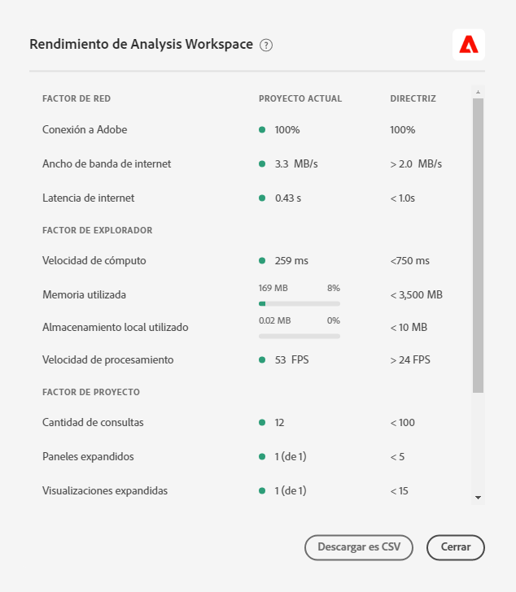

# Optimizar rendimiento de Analysis Workspace

Varios factores pueden influir en el rendimiento de un proyecto dentro de Analysis Workspace. Es importante saber cuáles son esos colaboradores antes de que se cree un proyecto para que se pueda planificar y construir el proyecto de la manera más óptima. Esta página incluye una lista de factores que afectarán al rendimiento y las optimizaciones que puede realizar para garantizar un rendimiento máximo en Analysis Workspace.

>[!IMPORTANT]
>
>La página Rendimiento de Analysis Workspace está en versión limitada. [Más información](https://docs.adobe.com/content/help/es-ES/analytics/landing/an-releases.html)

## Ayuda > Rendimiento en Analysis Workspace

En **[!UICONTROL Analysis Workspace > Ayuda > Rendimiento]**, puede ver los factores que afectan al rendimiento del proyecto, incluidos los factores de red, explorador y proyecto. Para obtener los resultados más precisos, permita que el proyecto se cargue completamente antes de abrir la página Rendimiento.
* La columna Proyecto actual muestra los resultados del proyecto actual y el entorno del usuario.
* La columna Directriz muestra el umbral recomendado por el Adobe para cada factor.

Además, puede **descargar como CSV** el contenido de rendimiento para compartirlo fácilmente con el Servicio de atención al cliente de Adobe o con sus equipos informáticos internos.

>[!NOTE]
>
>La información de la página Rendimiento varía cada vez que se abre el modal, ya que los factores están sujetos a cambios. Además, el Adobe seguirá perfeccionando las directrices proporcionadas a medida que se disponga de más datos.

## Factores de red

Ayuda > Los factores de red de rendimiento incluyen:

| Factor | Definición | Influido por | Optimización |
| --- | --- | --- | --- |
| Conexión a Adobe | Adobe envía 10 llamadas de prueba cuando se abre la página de rendimiento. Representa el porcentaje de las llamadas al Adobe que tienen éxito. | Los problemas de Adobe o de red local afectarán este factor. | Consulte status.adobe.com para comprobar si hay algún problema de servicio conocido. A continuación, valide la conexión de red local. |
| Ancho de banda de internet | Disponible solo para Google Chrome. La estimación del ancho de banda del navegador en su ubicación. La guía es de 2,0 MB/s. | Su conexión de red local afectará este factor. | Valide la conexión de red local. |
| Latencia de internet | Adobe envía 10 llamadas de prueba cuando se abre la página de rendimiento. Esto representa la cantidad de tiempo promedio que se tarda en devolver cada solicitud para ir al Adobe. Dicho de forma más sencilla, es una medida de la velocidad de Internet entre su ubicación y su Adobe. La directriz es &lt; 1 segundo. | Los problemas de red local, muchas fichas de navegador abiertas o problemas de Adobe afectarán a este factor. | Consulte status.adobe.com para comprobar si hay algún problema de servicio conocido. A continuación, valide la conexión de red local y cierre las fichas del explorador que no se utilicen. |

## Factores del explorador

Ayuda > Los factores del navegador de rendimiento incluyen:

| Factor | Definición | Influido por | Optimización |
| --- | --- | --- | --- |
| Velocidad de cómputo | La velocidad con la que el equipo realiza una prueba de procesamiento. La guía es &lt; 750 ms. | Su hardware y sus programas simultáneos impactarán en este factor. | Abra el Administrador de Tareas (PC) o el Monitor de Actividad (Mac) del equipo para determinar si se puede cerrar algún programa. A continuación, cierre las fichas del explorador que no se hayan utilizado u otros programas.   Si estas acciones no ayudan, comente los detalles de hardware con su equipo de TI. |
| Memoria utilizada | Disponible solo para Google Chrome. Cada ficha Espacio de trabajo de un navegador Google Chrome comparte 4 GB de memoria en total. Representa el porcentaje de esa asignación de memoria que está consumiendo el proyecto actual. La guía es de 3500 MB, que es el punto en el que Workspace comenzará a mostrar errores de memoria. | Trabajar en varias fichas o descargar 50000 filas de datos contribuirá a aumentar el uso de la memoria. | Si recibe un error de memoria, cierre otras fichas de Workspace y/o ejecute 50000 descargas de filas una a la vez. |
| Almacenamiento local utilizado | Datos almacenados localmente en el equipo para su uso en el explorador. Cada origen (por ejemplo, experience.adobe.com) tiene una asignación de 10 MB. | Analysis Workspace utiliza el almacenamiento local para varias funciones, como almacenar proyectos guardados automáticamente (existentes), ajustes del usuario y indicadores de características. | Para garantizar que las funciones de Analysis Workspace no se interrumpan, borre el almacenamiento local del dominio experience.adobe.com. |
| Velocidad de procesamiento | FPS significa Marcos por segundo, que es la cantidad de veces por segundo que el navegador dibuja la página en la pantalla. 24 FPS es comúnmente lo que el ojo humano puede observar; si FPS es menor que eso, observará problemas de procesamiento en Workspace. | FPS se ve afectado por la multitarea en muchos proyectos de Workspace a la vez y por el tamaño del proyecto que se está viendo. Otros programas que se ejecutan en el equipo pueden tener un impacto, como flujo continuo, escáneres de fondo, etc. Además, su hardware afectará este factor. | Abra el Administrador de Tareas (PC) o el Monitor de Actividad (Mac) del equipo para determinar si se puede cerrar algún programa. A continuación, cierre las fichas del explorador que no se hayan utilizado u otros programas.   Si estas acciones no ayudan, comente los detalles de hardware con su equipo de TI. |

## Factores de proyecto

La Ayuda > Factores del proyecto de rendimiento incluyen:

| Factor | Definición | Optimización |
| --- | --- | --- |
| Cantidad de consultas | El número total de consultas (solicitudes) realizadas a Adobe para recuperar datos que se muestran en el proyecto. Las consultas incluyen solicitudes de clasificación para tablas, detección de anomalías, minigráficos, componentes mostrados en el carril izquierdo, etc. Excluye paneles contraídos y visualizaciones. La directriz es 100. | Simplifique el proyecto siempre que sea posible dividiendo los datos en varios proyectos que cumplan un propósito específico o un grupo de partes interesadas. Utilice las etiquetas para organizar los proyectos en temáticas y utilice la vinculación  directa para crear una tabla de contenido interna que permita a los interesados encontrar con más facilidad lo que necesitan. |
| Paneles ampliados (de paneles totales) | Número de paneles ampliados del número total de paneles del proyecto. La directriz es 5. | Después de realizar los pasos necesarios para simplificar el proyecto, contraiga los paneles del proyecto que no necesitan visualizarse durante la carga. Cuando se abra el proyecto, solo se procesarán los paneles expandidos. Los paneles contraídos no se procesarán hasta que el usuario los expanda. |
| Visualizaciones ampliadas (de visualizaciones totales) | Número de tablas y visualizaciones expandidas del total del proyecto. Excluye las fuentes de datos ocultas. La directriz es 15. | Después de realizar los pasos necesarios para simplificar el proyecto, contraiga las visualizaciones del proyecto que no necesitan visualizarse durante la carga. Asigne prioridad a las imágenes más importantes para el consumidor del informe y, si es necesario, divida las visualizaciones de apoyo en un panel o proyecto independiente y más detallado. |
| Cantidad de celdas de forma libre | El número total de celdas de tabla improvisada en el proyecto, calculadas mediante filas * columnas en todas las tablas. Excluye las fuentes de datos ocultas. La directriz es 4.000. | Reduzca el número de columnas de la tabla a sólo los puntos de datos más relevantes. Reduzca el número de filas de la tabla ajustando el número de filas mostradas, aplicando un filtro de tabla o aplicando un segmento. |
| Componentes disponibles | Número total de componentes recuperados en el carril izquierdo del proyecto, en todos los grupos de informes del proyecto. La directriz es de 2000. | Hable con el administrador del producto sobre la creación de un grupo de informes virtuales seleccionado que tenga un conjunto de componentes más personalizado. |
| Componentes utilizados | Número total de componentes utilizados en el proyecto. La directriz es 100. | El número de componentes usados no influye directamente en el rendimiento. Sin embargo, la complejidad de esos componentes contribuirá a la ejecución del proyecto. Consulte las optimizaciones en la sección &quot;Factores adicionales&quot; a continuación. |
| El intervalo de fecha más largo | Este factor muestra el intervalo de fechas más largo utilizado en el proyecto. La directriz es de 1 año. | Siempre que sea posible, no incorpore más datos de los que necesita. Reduzca el calendario del panel a las fechas relevantes para la análisis o utilice componentes de intervalo de fechas (componentes púrpura) en las tablas improvisadas. Los intervalos de fechas utilizados en una tabla anulan el intervalo de fechas del panel. Por ejemplo, puede agregar el mes pasado, la semana pasada y ayer a las columnas de la tabla para solicitar esos intervalos de datos específicos. Para obtener más información acerca del trabajo con intervalos de fechas en Analysis Workspace, consulte [este vídeo](https://docs.adobe.com/content/help/en/analytics-learn/tutorials/analysis-workspace/calendar-and-date-ranges/date-ranges-and-calendar-in-analysis-workspace.html).   Además, minimice el número de comparaciones año tras año utilizadas en el proyecto. Cuando se calcula una comparación año tras año, se analizan los 13 meses completos de datos entre los meses de interés. Esto tiene el mismo impacto que cambiar el intervalo de fechas del panel a los últimos 13 meses. |

## Factores adicionales

Otros factores que no se incluyen en Ayuda > Rendimiento son:

| Factor | Definición | Influido por | Optimización |
| --- | --- | --- | --- |
| Complejidad de segmento | Los segmentos intrincados pueden tener un impacto significativo en el desempeño del proyecto. | Los factores que añaden complejidad a un segmento (en orden descendente de impacto) son: <ul><li>Los operadores de “contiene”, “contiene cualquiera de”, “coincide”, “comienza con” o “termina con” </li><li>Segmentación secuencial, sobre todo cuando se utilizan restricciones de dimensión (Dentro/Después) </li><li>Número de elementos de dimensiones únicas dentro de las dimensiones utilizadas en el segmento (por ejemplo, Página = “A” cuando la Página tiene 10 elementos únicos será más rápido que Página = “A” cuando la Página tiene 100000 elementos únicos) </li><li>Número de dimensiones diferentes utilizadas (por ejemplo, Página = “Inicio” y Página = “Resultados de búsqueda”&#39; será más rápido que eVar 1 = “rojo” y eVar 2 = “azul”&#39;)</li><li>Muchos operadores O (en lugar de Y)</li><li>Contenedores anidados que varían en ámbito (por ejemplo, Visita (hit) en el interior de la “Visita” dentro de “Visitante”)</li></ul> | Aunque algunos de los factores de complejidad no se pueden evitar, busque oportunidades para reducir la complejidad de los segmentos. En general, cuanto más específico pueda ser con sus criterios de segmento, mejor. Por ejemplo:<ul><li>Con los contenedores, el uso de un solo contenedor en la parte superior del segmento será más rápido que una serie de contenedores anidados</li><li>Con los operadores, “es igual a” será más rápido que “contiene” y “es igual a cualquiera de” será más rápido que “contiene cualquiera de”</li><li>Con muchos criterios, los operadores Y serán más rápidos que varios operadores O.</li></ul> Busque oportunidades para reducir muchas afirmaciones OR en una sola afirmación &quot;es igual a cualquiera de&quot;.  [Las clasificaciones](/help/components/classifications/c-classifications.md) también pueden ayudar a consolidar muchos valores en grupos concisos desde los que puede crear segmentos. La segmentación en grupos de clasificación proporciona beneficios de rendimiento sobre los segmentos con muchas condiciones “O”, o criterios “contiene”. |
| Complejidad de la visualización (segmentos, métricas, filtros) | El tipo de visualización agregado (p. ej., abandonos o tabla improvisada) no tiene demasiada influencia por sí mismo en el rendimiento de un proyecto. Lo que afecta al tiempo de procesamiento es la complejidad de la visualización. | Entre los factores que aumentan la complejidad de una visualización están:<ul><li>Intervalo de datos solicitado</li><li>El número de segmentos aplicados; por ejemplo, los segmentos utilizados como columnas de una tabla improvisada.</li><li>Uso de segmentos complejos</li><li>[Filas o columnas de elementos manuales en tablas improvisada](https://docs.adobe.com/content/help/es-ES/analytics/analyze/analysis-workspace/build-workspace-project/column-row-settings/manual-vs-dynamic-rows.html)</li><li>Los filtros aplicados a las filas de una tabla improvisada.</li><li>El número de métricas incluidas, en especial las métricas calculadas que utilizan segmentos.</li></ul> | Si ha notado que sus proyectos no se cargan tan rápido como le gustaría, pruebe a sustituir algunos segmentos por eVars y filtros, si es posible.  Si se encuentra utilizando continuamente segmentos y métricas calculadas para puntos de datos que son importantes para su negocio, considere la posibilidad de mejorar la implementación para capturar estos puntos de datos más directamente. El uso de un administrador de etiquetas como Adobe Experience Platform Launch y las reglas de procesamiento de Adobe puede hacer que los cambios de implementación sean rápidos y fáciles de implementar. |
| Tamaño del conjunto de informes | Cantidad de datos recopilados en el grupo de informes. | - | Consulte con su equipo de implementación o con un experto en Adobe para determinar si se pueden realizar mejoras en la implementación para mejorar la experiencia general en Adobe Analytics. |

## Mensajes de error comunes

Puede encontrar errores al interactuar con Analysis Workspace que también influirán en el rendimiento. A continuación se enumeran los tipos de error más comunes, por qué se producen y las optimizaciones que se pueden realizar.

| Mensaje de error | ¿Por qué ocurre esto? | Optimización |
| --- | --- | --- |
| [!UICONTROL Está grupo de informes está experimentando una creación de informes inusualmente alta. Inténtelo de nuevo más tarde.] | Su organización está intentando ejecutar demasiadas solicitudes simultáneas en un grupo de informes específico. Los factores que contribuyen a este error son las solicitudes de API, los proyectos programados, los informes programados, las alertas programadas y los usuarios simultáneos que realizan solicitudes de informes. | Distribuya las solicitudes y programaciones del grupo de informes de forma más uniforme durante todo el día. |
| [!UICONTROL Se ha producido un error del sistema. Registre una solicitud del Servicio de atención al cliente en Ayuda > Enviar ticket de asistencia técnica e incluya su código de error.] | Adobe está experimentando un problema que debe resolverse. | Envíe el código de error al Servicio de atención al cliente. |
| [!UICONTROL La solicitud es demasiado compleja.] | La solicitud de informe es demasiado grande y no se puede ejecutar. Los contribuyentes a este error son los tiempos de espera debido al tamaño de la solicitud, demasiados elementos coincidentes en un segmento o filtro de búsqueda, demasiadas métricas incluidas, combinaciones incompatibles de dimensiones y métricas, etc. | Simplifique la solicitud eliminando algunas columnas o filas de la tabla, o considere la posibilidad de dividir la tabla en solicitudes independientes. |
| [!UICONTROL Uno de los segmentos o la búsqueda en esta visualización contiene una búsqueda de texto que arrojó demasiados resultados.] | Los criterios del segmento o el filtro del informe son demasiado amplios. | Reduzca los criterios de texto de búsqueda y vuelva a intentar la solicitud. |
| [!UICONTROL Actualmente, esta dimensión no admite modelos de atribución no predeterminados.] | No se admite la atribución no predeterminada para la dimensión que está utilizando. | Replace the dimension in your table with one that is compatible with [Attribution IQ](../attribution/overview.md). |
| [!UICONTROL Su solicitud falló como resultado de demasiadas columnas o filas preconfiguradas.] | La tabla tiene demasiadas celdas improvisadas (fila * columnas). | Elimine columnas o filas de la tabla, o bien considere la posibilidad de dividir la tabla en solicitudes independientes. |
